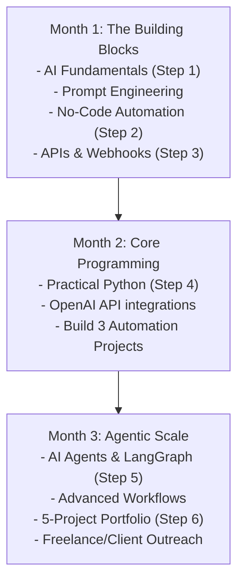
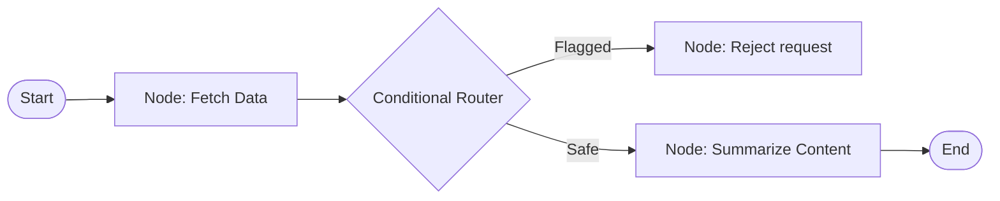

# AI Automation Specialist: The Complete Beginner-to-Architect Masterclass

An **AI Automation Specialist** is a modern systems engineer who bridges the gap between raw Artificial Intelligence (LLMs, embeddings, speech, vision) and real-world business workflows. This role does not focus on training base machine learning models from scratch. Instead, it combines cognitive AI engines with automation platforms, APIs, and light custom scripting to build autonomous business systems.

This guide is written in clear, simple language with rich real-world analogies, step-by-step code demonstrations, and enterprise architecture blueprints to take you from a complete beginner to a Technical Architect.

---

## 🗺️ The Core Framework of AI Automation

An AI Automation Specialist combines five essential pillars of software and business logic:

```
        +-------------------------------------------------------+
        |                AI AUTOMATION SPECIALIST               |
        +-------------------------------------------------------+
         /         |                 |             |           \
        /          |                 |             |            \
  +---------+ +----------+      +---------+  +------------+  +-----------+
  | AI Tools| |Automation|      |  APIs   |  |Programming |  | Business  |
  |(ChatGPT,| |Platforms |      |(REST,   |  |(Python, JS |  | Workflows |
  | Claude, | |(n8n,     |      |Webhooks,|  |  glue logs,|  | (CRM, ERP,|
  | Gemini) | |Make,Zap) |      | JSON)   |  | agent logic|  | Invoicing)|
  +---------+ +----------+      +---------+  +------------+  +-----------+
```

---

## 🛠️ The 2026 Core AI Automation Stack

Many beginners waste months studying machine learning mathematics (calculus, linear algebra, neural network gradients). That is crucial if you want to become an ML research scientist, but **unnecessary** if your goal is AI Automation. 

For high-value enterprise automation, the highest-value stack in 2026 is:
1. **ChatGPT/OpenAI APIs** (Core cognitive reasoning brain)
2. **n8n** (Highly customizable, self-hostable orchestrator - recommended)
3. **Python & JavaScript** (Gluing logic & writing custom tools)
4. **Google Sheets / Airtable** (Light database tables)
5. **Webhooks** (Real-time trigger alerts)
6. **LangGraph** (Creating structured, graph-based agent state machines)

This combination allows you to build production-ready enterprise automations much faster than starting with advanced ML theory.

---

## 🗓️ The 90-Day Learning Roadmap & Curriculum



---

## 🚀 Step 1: Learn AI Fundamentals (Weeks 1–2)

Understand the core mechanics of how Large Language Models think, speak, and remember.

### 1. What are LLMs (Large Language Models)?
An LLM is a massive mathematical function trained on billions of pages of text. 

#### 💡 The Autocomplete Analogy:
Think of an LLM as a **supercharged autocomplete** on your phone. When you type: *"The sky is..."*, your phone guesses *"blue"*. An LLM does the exact same thing but at an incredibly advanced level. Based on the words you type (the prompt), it calculates which word is most likely to come next, generating sentences, paragraphs, or entire code blocks one word at a time.

---

### 2. Prompts and Prompt Engineering
Prompt Engineering is the practice of writing inputs that guide an LLM to produce predictable, high-quality answers.

#### 💡 The Intern Analogy:
Think of an LLM as a highly intelligent **summer intern** who has read every book in the world but has zero context about your specific company. If you give a vague instruction: *"Write a follow-up email,"* the intern will write something generic. If you provide detailed context, a persona, steps, and examples, the intern will perform perfectly.

#### The Golden Structure of a Prompt:
1. **Persona**: Who is the AI pretending to be? (e.g. *"You are a professional security auditor..."*)
2. **Context**: Why are we doing this? (e.g. *"We just updated our login API..."*)
3. **Instructions**: Clear, numbered steps.
4. **Constraints**: What the AI must **NOT** do. (e.g. *"Never output markdown headers..."*)
5. **Few-Shot Examples**: Show, don't just tell. Show input-output pairs.

---

### 3. Tokens and Context Windows
- **Tokens**: LLMs do not read words like humans. They split text into chunks of characters called tokens (on average, 1 token $\approx$ 4 characters of English text, or 0.75 of a word).
- **Context Window**: The memory limit of an LLM. 
  
#### 💡 The Desk Analogy:
Think of the context window as a **physical desk**. You can place documents on the desk for the LLM to read. If you pile on more papers than the desk can hold (exceeding the token limit), old papers spill off the edge and are forgotten. If you load too much data into a prompt, the LLM experiences "information overload" and starts ignoring instructions in the middle of your text.

- **Temperature**: A setting between `0` and `2` that controls randomness.
  - **Low Temperature (`0.0` to `0.2`)**: An **Accountant**. The model is precise, highly predictable, and chooses the most mathematically probable words. Best for code, math, and factual queries.
  - **High Temperature (`0.8` to `1.2`)**: A **Brainstorming Artist**. The model takes creative risks, resulting in varied, creative, and highly descriptive text. Best for creative writing.

---

### 4. AI Agents vs. Chatbots
- **Chatbot**: A linear text responder. It takes input $A$, passes it to the LLM, and outputs answer $B$. It is reactive and cannot interact with the outside world.
- **AI Agent**: An active engine that reasons, decides which actions to take, calls external tools (e.g. searching the web, sending an email, writing to a DB), and evaluates outcomes until a goal is achieved.

---

### 5. RAG (Retrieval-Augmented Generation)
An LLM can only answer questions using the data it was trained on. If you ask it about a private document (e.g. your company's security policy), it will either say it doesn't know, or hallucinate.

**RAG** solves this by searching private documents for matching text, grabbing relevant chunks, and pasting them directly into the prompt context right before calling the LLM.

#### 💡 The Open-Book Exam Analogy:
- **Standard LLM**: Taking a history exam from memory. You might misremember dates or make up details.
- **RAG LLM**: An **Open-Book Exam**. Before answering a question, you look up the exact page in your textbook, read it, and then write a precise, factual answer based directly on that text.

#### 📚 Free Study Resources for Step 1:
- [OpenAI Developer Documentation](https://platform.openai.com/docs/) - Core API guidelines.
- [Anthropic Developer Center](https://docs.anthropic.com/) - Prompt engineering principles and system designs.
- [DeepLearning.AI Short Courses](https://www.deeplearning.ai/) - Free short modules covering LangChain, RAG, and prompt workflows.

---

## 🔌 Step 2: Learn No-Code Automation (Weeks 2–4)

Low-code platforms allow you to build workflows instantly by connecting software APIs together visually. Our highly recommended tool is **n8n** due to its self-hostable nature, custom javascript nodes, and deep AI model integration components. Make and Zapier are also solid platforms for simple cloud-hosted tasks.

### 💡 The Lego Analogy:
Think of no-code automation as building with **Lego Bricks**. You drag and drop blocks (e.g. "Gmail Trigger" $\rightarrow$ "ChatGPT Classifier" $\rightarrow$ "Google Sheet database"). You don't need to make the bricks yourself; you just coordinate how they connect.

Here are the step-by-step blueprints for 3 essential starter projects:

### Project 1: Email $\rightarrow$ AI Summary $\rightarrow$ Telegram Alert
- **Goal**: Summarize massive incoming client emails and alert your mobile phone instantly.
- **How to Build**:
  1. **Trigger Node (Gmail)**: Check for new incoming messages every 10 minutes. Filter for unread emails.
  2. **AI Node (OpenAI / Gemini)**: Pass the email body into a prompt:
     *`"Summarize the following email in a single, clear bullet point. Highlight the sender's name and any action item requested. Email: {Email_Body}"`*
  3. **Action Node (Telegram)**: Set up a Telegram Bot token, join a private channel, and send the summary text automatically.

---

### Project 2: Form Entry $\rightarrow$ AI Categorization $\rightarrow$ Google Sheets
- **Goal**: Automatically sort user form feedback into categories so they can be sent to different departments.
- **How to Build**:
  1. **Trigger Node (Webhook)**: Create a Webhook URL inside n8n to listen for form submissions from tools like Typeform or Google Forms.
  2. **AI Node (OpenAI)**: Use a classification prompt with temperature set to `0`:
     *`"Analyze this customer feedback. Categorize it into exactly one of: [REFUND], [BUG_REPORT], [SALES]. Output only the bracketed tag. Feedback: {Feedback_Text}"`*
  3. **Action Node (Google Sheets)**: Add a row to a spreadsheet, saving the User Name, Feedback Text, and the AI Category Tag in separate columns.

---

### Project 3: Lead Capture $\rightarrow$ AI Qualification $\rightarrow$ CRM Sync
- **Goal**: Automatically qualify inbound business inquiries before notifying sales reps.
- **How to Build**:
  1. **Trigger Node (Webhook)**: Listen for new lead captures from your landing page.
  2. **AI Node (OpenAI)**: Set up a prompt to evaluate the prospect's data:
     *`"Analyze this lead: Company Size: {Company_Size}, Budget: {Budget}, Project Description: {Description}. If Company Size is greater than 10 AND budget is greater than $5000, output [QUALIFIED]. Otherwise, output [UNQUALIFIED]. Output only the bracketed tag."`*
  3. **Action Node (HubSpot / CRM)**: Update your CRM pipeline. If the lead is `[QUALIFIED]`, automatically create a deal card and assign it to your primary sales representative.

---

## 🔗 Step 3: Learn APIs and Webhooks (Weeks 4–6)

You do not need deep programming yet. You must simply understand how software applications talk to each other.

### 1. API Core Concepts
- **GET Request**: Asking a server for data. (e.g. *"Show me my latest emails"*).
- **POST Request**: Sending new data to a server. (e.g. *"Create a new task in my database"*).
- **JSON (JavaScript Object Notation)**: The universal language of APIs. It organizes data in simple `key: value` pairs.
  ```json
  {
    "customerName": "Alice Smith",
    "budget": 7500,
    "company": "NextGen Technology"
  }
  ```
- **API Key**: A secret passcode (like a password) that proves your app has permission to query another tool's API.
- **Webhook**: A real-time notification mechanism. Instead of your server asking every minute, *"Are there new emails yet?"* (Polling), the email server pushes data to your Webhook URL the absolute microsecond a new mail arrives (Push).

---

### 2. Practice Integrations (Javascript / Node.js Code)

#### Practice 1: Connecting to the OpenAI API
```javascript
import { OpenAI } from 'openai';

const openai = new OpenAI({ apiKey: process.env.OPENAI_API_KEY });

async function queryOpenAI() {
  const completion = await openai.chat.completions.create({
    model: 'gpt-4o-mini',
    messages: [
      { role: 'system', content: 'You are a helpful automation assistant.' },
      { role: 'user', content: 'Write a one-sentence welcome message for a new customer.' }
    ],
    temperature: 0.7
  });

  console.log('AI Output:', completion.choices[0].message.content);
}
queryOpenAI();
```

#### Practice 2: Writing to Google Sheets programmatically
To write to Google Sheets, we authenticate using a Service Account API Key and append rows to a target sheet ID.
```javascript
import { google } from 'googleapis';

const auth = new google.auth.GoogleAuth({
  keyFile: './google-credentials.json', // Your API key file
  scopes: ['https://www.googleapis.com/auth/spreadsheets']
});

async function appendSheetRow(sheetId, name, email, score) {
  const sheets = google.sheets({ version: 'v4', auth });
  await sheets.spreadsheets.values.append({
    spreadsheetId: sheetId,
    range: 'Sheet1!A:C',
    valueInputOption: 'USER_ENTERED',
    requestBody: {
      values: [[name, email, score]]
    }
  });
  console.log('Row appended successfully!');
}
```

---

## 🐍 Step 4: Learn Practical Python (Weeks 6–10)

As an AI Automation Specialist, you only need Python to glue systems, write data extractors, and orchestrate custom AI models. You do not need complex machine learning packages (like PyTorch or TensorFlow).

### 1. Essential Python Cheat Sheet
```python
# 1. Variables and Dictionaries
customer_name = "Bob"
lead_score = 9.5
lead_details = {
    "company": "ScaleUp LLC",
    "employees": 25,
    "budget_ok": True
}

# 2. Functions
def check_qualification(details):
    if details["employees"] > 10 and details["budget_ok"]:
        return "QUALIFIED"
    return "UNQUALIFIED"

# 3. Loops and Execution
status = check_qualification(lead_details)
print(f"Lead status for {customer_name}: {status}")
```

---

### 2. Practical Automation Projects in Python
Before running these scripts, make sure the `requests` library is installed:
```bash
pip install requests
```

#### Script 1: Auto Email Responder
This script checks simulated inbox records, calls the OpenAI API to draft responses, and logs them.
```python
import json
import requests

def generate_ai_reply(sender, email_body):
    print(f"Generating draft response for: {sender}")
    url = "https://api.openai.com/v1/chat/completions"
    headers = {
        "Authorization": "Bearer YOUR_OPENAI_API_KEY",
        "Content-Type": "application/json"
    }
    payload = {
        "model": "gpt-4o-mini",
        "messages": [
            {"role": "system", "content": "You are a professional assistant. Write a short, friendly reply."},
            {"role": "user", "content": f"Email body: {email_body}"}
        ],
        "temperature": 0.3
      }
    
    response = requests.post(url, headers=headers, json=payload)
    if response.status_code == 200:
        return response.json()["choices"][0]["message"]["content"]
    return "Error generating response draft."

# Test the function
sender_email = "client@example.com"
body = "Hello, could we reschedule our alignment call to Thursday at 3 PM?"
draft = generate_ai_reply(sender_email, body)
print(f"Draft:\n{draft}")
```

#### Script 2: Automated AI Content Generator
Reads topics from a list, writes articles using ChatGPT, and saves each article to a separate text file automatically.
```python
import requests

topics = ["How APIs work", "Why n8n is great for automation", "Introduction to Python"]

for topic in topics:
    print(f"Writing article on: {topic}")
    payload = {
        "model": "gpt-4o-mini",
        "messages": [
            {"role": "user", "content": f"Write a short, engaging educational blog post about {topic}"}
        ]
    }
    headers = {
        "Authorization": "Bearer YOUR_OPENAI_API_KEY",
        "Content-Type": "application/json"
    }
    
    response = requests.post("https://api.openai.com/v1/chat/completions", headers=headers, json=payload)
    if response.status_code == 200:
        content = response.json()["choices"][0]["message"]["content"]
        
        # Write to file
        filename = f"{topic.replace(' ', '_').lower()}.txt"
        with open(filename, "w") as file:
            file.write(content)
        print(f"Saved to: {filename}")
```

#### Script 3: Data Extraction and Web Scraper
Pulls details from public APIs or websites, formats as JSON, and writes it to a file.
```python
import json
import requests

def fetch_and_save_data():
    # Fetch free dummy user records
    api_url = "https://jsonplaceholder.typicode.com/users"
    response = requests.get(api_url)
    
    if response.status_code == 200:
        users = response.json()
        formatted_list = []
        
        for user in users:
            record = {
                "name": user["name"],
                "email": user["email"],
                "company": user["company"]["name"]
            }
            formatted_list.append(record)
            
        # Write JSON file
        with open("user_database.json", "w") as file:
            json.dump(formatted_list, file, indent=4)
        print("Scraped & saved database successfully!")

fetch_and_save_data()
```

---

## 🤖 Step 5: Learn AI Agents (Weeks 10–12)

Study the core components of autonomous systems:
- **Tools**: Functions (e.g. database search, calculator) that the LLM is given permission to execute.
- **Memory**: Keeping track of past messages (short-term thread state) or long-term preferences (using a Vector DB).
- **Multi-Agent Systems**: Splitting a large goal among specialized agent nodes (e.g. a Writer Agent, a Critic Agent, and a Researcher Agent).

### 💡 The Detective Analogy:
Think of an agent as a **detective**. The detective is given a case (user goal). 
1. **Thought**: The detective reasons about the situation (*"I need to check the suspect's bank transactions."*).
2. **Action**: The detective calls a tool (*"Request bank logs from server."*).
3. **Observation**: The detective reviews the transaction logs (*"Aha! They spent $5,000 yesterday."*).
4. **Repeat**: The detective thoughts again based on the observation until the case is solved.

### LangGraph Agent State Machine (Complete Code)
We use **LangGraph** in 2026 because it allows us to structure agents as precise, robust graphs (State Machines) rather than open loops that run infinitely.



Here is a complete LangGraph agent setup that fetches data, runs a classification check, and executes tasks.

```typescript
import { OpenAI } from 'openai';

const openai = new OpenAI();

// Define our tools
const tools = {
  fetchStockPrice: (ticker: string) => {
    console.log(`[Tool Execute] Fetching price for ticker: ${ticker}`);
    if (ticker.toUpperCase() === 'AAPL') return '$180.25';
    if (ticker.toUpperCase() === 'MSFT') return '$420.50';
    return 'Unknown Ticker';
  },
  calculateTax: (amount: number) => {
    console.log(`[Tool Execute] Calculating 15% tax on: ${amount}`);
    return (amount * 0.15).toFixed(2);
  }
};

export async function runAgent(userGoal: string) {
  let conversationHistory = [
    {
      role: 'system',
      content: `
        You are an autonomous agent utilizing a Reason-Act-Observe loop. 
        You have access to the following tools:
        1. fetchStockPrice(ticker: string)
        2. calculateTax(amount: number)

        Format your thoughts and actions in JSON format. Example output:
        {
          "thought": "I need to find the stock price of Apple.",
          "action": {
            "name": "fetchStockPrice",
            "params": { "ticker": "AAPL" }
          }
        }
        If you have solved the goal, return the final answer:
        {
          "finalAnswer": "The price of AAPL is $180.25 and the tax is..."
        }
      `
    },
    { role: 'user', content: userGoal }
  ];

  let loopCount = 0;
  while (loopCount < 5) {
    loopCount++;
    console.log(`\n--- Agent Step ${loopCount} ---`);

    const response = await openai.chat.completions.create({
      model: 'gpt-4o',
      messages: conversationHistory as any,
      response_format: { type: 'json_object' }
    });

    const outputText = response.choices[0].message.content || '{}';
    const decision = JSON.parse(outputText);

    console.log(`Thought: ${decision.thought}`);

    if (decision.finalAnswer) {
      console.log(`🎉 Final Answer: ${decision.finalAnswer}`);
      return decision.finalAnswer;
    }

    if (decision.action) {
      const toolName = decision.action.name;
      const params = decision.action.params;
      let observation = '';

      if (toolName === 'fetchStockPrice') {
        observation = tools.fetchStockPrice(params.ticker);
      } else if (toolName === 'calculateTax') {
        observation = tools.calculateTax(params.amount);
      } else {
        observation = 'Tool not found.';
      }

      console.log(`Observation: ${observation}`);

      conversationHistory.push({ role: 'assistant', content: outputText });
      conversationHistory.push({ role: 'user', content: `Observation from tool: ${observation}` });
    }
  }
}
```

---

## 💼 Step 6: Build Your AI Automation Portfolio

Many beginners stay stuck in "tutorial mode." To find clients or secure a job, you must build real, functioning projects.

Here are the 5 essential portfolio projects every AI Automation Specialist should build, along with their systems architecture designs:

### Project 1: AI Customer Support Bot (RAG System)
- **Problem**: Support teams are overwhelmed by basic FAQs.
- **Solution**: A chatbot that reads a vector database containing your documentation and answers user queries with 100% accuracy.
- **Architect System Blueprint**:
```
[User Widget] ──> [n8n Webhook] ──> [Pinecone Vector DB Retrieval]
                                              │
                                              v
[Factual Answer] <── [OpenAI Engine] <── [Augmented Context Prompt]
```

### Project 2: AI Lead Generation & Qualification System
- **Problem**: Sales reps waste hours talking to unqualified leads.
- **Solution**: Form submissions trigger an AI run to research prospects' websites via Google Search APIs and score their budget, scale, and intent.
- **Architect System Blueprint**:
```
[Form Fill] ──> [n8n Node] ──> [Google Search Scrape API] ──> [OpenAI Quality Ranker]
                                                                        │
                                              [HubSpot CRM] <── [If Score >= 8/10]
```

### Project 3: AI Social Media Content Pipeline
- **Problem**: Content creation takes hours of drafting, scheduling, and editing.
- **Solution**: Add a topic inside a database. The workflow generates a script, creates a promotional image using AI image tools, drafts an accompanying tweet, and queues it on a scheduling platform.
- **Architect System Blueprint**:
```
[Airtable Entry] ──> [OpenAI Script Writer] ──> [DALL-E Image Creator] ──> [Buffer Queue API]
```

### Project 4: Autonomous Research Assistant
- **Problem**: Keeping up with market trends or academic papers is exhausting.
- **Solution**: A weekly agent that searches Google Scholar, scrapes articles, translates PDFs, runs a synthesis, and compiles a clean Markdown research brief sent directly via email.
- **Architect System Blueprint**:
```
[Weekly Cron Trigger] ──> [Arxiv/Google Search Tool] ──> [Text Extractor] ──> [OpenAI Synthesis]
                                                                                      │
                                            [PDF Brief via Email] <── [SendGrid SMTP]
```

### Project 5: AI Email Automation System
- **Problem**: Sales inboxes get thousands of inquiries. Distinguishing hot leads from cold outreach is difficult.
- **Solution**: A system that hooks into IMAP, analyzes incoming emails, extracts names/offers, checks against past interactions in a database, and generates customized drafts.
- **Architect System Blueprint**:
```
[Inbound Email] ──> [Python IMAP Script] ──> [OpenAI Categorizer] ──> [Zustand/DB Context Check]
                                                                                │
                                           [Draft Reply in Inbox] <── [SMTP Draft Outbox]
```

---

## 🏛️ Enterprise Systems Design & AI Architecture

At the highest Technical Architect level, your role is to design secure, highly resilient, cost-controlled, and observable platforms.

### 1. Decoupled AI Gateway & Microservices
A robust enterprise architecture decouples elements to allow individual scaling, upgrading, and maintenance.

```
                  +----------------------------------------------+
                  |                 USER / APP                   |
                  +----------------------------------------------+
                                         |
                                         v
                  +----------------------------------------------+
                  |         AI Gateway (PII Masking)             |
                  +----------------------------------------------+
                                         |
                                         v
                  +----------------------------------------------+
                  |      Orchestrator Hub (Temporal / n8n)       |
                  +----------------------------------------------+
                     /                   |                    \
                    /                    v                     \
    +------------------+       +-------------------+       +------------------+
    | Semantic Cache   |       | Vector Database   |       | Legacy Systems   |
    |  (Redis/Chroma)  |       | (Pinecone/Chroma) |       |  (ERP/DB/APIs)   |
    +------------------+       +-------------------+       +------------------+
```

---

### 2. Async Agent Queues (Temporal / BullMQ)
Agent runs can be extremely long-lived. If an agent has to scrape 10 web pages and run 5 reasoning steps, the HTTP connection will timeout.
*Architect Rule*: Never execute agent loops inside direct HTTP endpoints. Offload runs to distributed job queue servers like **BullMQ** or **Temporal** to support retry boundaries, job logging, and scale.

#### Job Queue Worker Code (BullMQ):
```typescript
import { Queue, Worker, Job } from 'bullmq';
import { runAgent } from './agent';

const connection = { host: '127.0.0.1', port: 6379 };

export const agentQueue = new Queue('AI_Agent_Jobs', { connection });

const worker = new Worker('AI_Agent_Jobs', async (job: Job) => {
  console.log(`[Worker Start] Processing Job ${job.id} - Target: ${job.data.task}`);
  
  const result = await runAgent(job.data.task);
  await job.updateProgress({ status: 'COMPLETED', result: result });
  
  return result;
}, { connection });
```

---

### 3. PII (Personally Identifiable Information) Security Gateway
Before transmitting data payloads to external cloud LLM providers, you must ensure that no personal information (credit cards, names, security keys) is leaked.

```tsx
import React, { useState } from 'react';

// A simple PII scrubbing module using Regex rules
export function scrubPIIData(rawText: string): { scrubbedText: string; mapping: Record<string, string> } {
  const emailRegex = /[a-zA-Z0-9._%+-]+@[a-zA-Z0-9.-]+\.[a-zA-Z]{2,}/g;
  const cardRegex = /\b(?:\d[ -]*?){13,16}\b/g;

  const mapping: Record<string, string> = {};
  let counter = 1;

  let scrubbedText = rawText.replace(emailRegex, (match) => {
    const placeholder = `[EMAIL_REDACTED_${counter++}]`;
    mapping[placeholder] = match;
    return placeholder;
  });

  scrubbedText = scrubbedText.replace(cardRegex, (match) => {
    const placeholder = `[CARD_REDACTED_${counter++}]`;
    mapping[placeholder] = match;
    return placeholder;
  });

  return { scrubbedText, mapping };
}

export function SecurityAuditorGateway() {
  const [inputText, setInputText] = useState('');
  const [scrubbed, setScrubbed] = useState('');

  const handleAudit = () => {
    const { scrubbedText } = scrubbPIIData(inputText);
    setScrubbed(scrubbedText);
  };

  return (
    <div style={{ padding: '20px', border: '1px solid red', borderRadius: '8px' }}>
      <h3>Enterprise Security Masking Portal</h3>
      <textarea 
        onChange={(e) => setInputText(e.target.value)} 
        placeholder="Enter raw system log containing customer details..."
        rows={4}
        style={{ width: '100%' }}
      />
      <button onClick={handleAudit} style={{ marginTop: '8px' }}>Audit & Redact PII</button>
      {scrubbed && (
        <div style={{ marginTop: '12px', background: '#f5f5f5', padding: '10px' }}>
          <strong>Safe payload to transmit to cloud API:</strong>
          <pre style={{ whiteSpace: 'pre-wrap' }}>{scrubbed}</pre>
        </div>
      )}
    </div>
  );
}
```

---

### 4. Dynamic LLM Routing and Cost Optimizations
Calling top-tier models (like Claude 3.5 Sonnet or GPT-4o) for simple classification tasks is a massive waste of capital. A Technical Architect designs intelligent routing gateways to check query complexity and dynamically route workloads.

#### The Budget Router Pattern:
```typescript
interface RouteResult {
  selectedModel: string;
  isComplex: boolean;
}

export function routeUserRequest(query: string): RouteResult {
  const simpleKeywords = ['classify', 'yes/no', 'categorize', 'clean', 'format'];
  const lowercaseQuery = query.toLowerCase();

  const isSimple = simpleKeywords.some(keyword => lowercaseQuery.includes(keyword));

  if (isSimple) {
    return {
      selectedModel: 'google/gemini-3.5-flash', // High speed, costs near zero
      isComplex: false
    };
  }

  return {
    selectedModel: 'anthropic/claude-3.5-sonnet', // Premium reasoning engine
    isComplex: true
  };
}
```
Using this simple structural check, enterprise budgets can drop by up to $70\%$ while accelerating average response times across the board.
