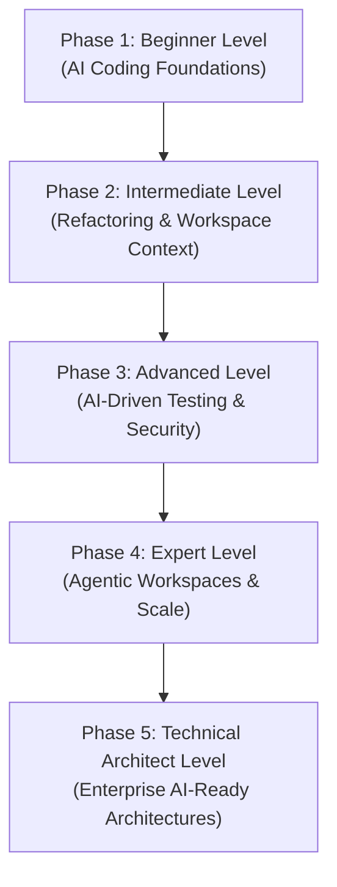

# AI-Driven Development: The Complete Beginner-to-Architect Masterclass

**AI-Driven Development (ADD)** is a modern software engineering methodology where developers leverage AI coding assistants (like Cursor, GitHub Copilot, Gemini Antigravity, and Claude) at every stage of the software development lifecycle (SDLC) to design, build, refactor, test, and debug applications. 

Rather than wasting hours typing boilerplate code, an AI-driven developer focuses on orchestrating intent, setting system constraints, designing architectures, and auditing code for safety and quality.

This guide is written in clear, simple language with rich real-world analogies, step-by-step code modernizations, concrete testing scripts, and enterprise review workflows to take you from a beginner to a high-level Technical Architect.

---

## 🗺️ The Zero-to-Architect Roadmap



| Phase | Target Role | Key Focus Area | Capstone Project |
| :--- | :--- | :--- | :--- |
| **Phase 1: Beginner** | AI-Assisted Coder | Autocomplete behaviors, chat interfaces, prompt structures. | Semantic HTML/CSS Dashboard Wireframe (Built in 30 mins) |
| **Phase 2: Intermediate** | Productive Engineer | Workspace context indexing (`@` references), code refactoring, debugging loops. | Legacy JavaScript to modern Typed TypeScript Refactor |
| **Phase 3: Advanced** | Test & Security Engineer | Scaffolding Vitest and Playwright test suites, security vulnerability scanning. | Automated Testing and Vulnerability Audit Harness |
| **Phase 4: Expert** | Autonomous developer | Orchestrating terminal agents, multi-file scope updates, code quality guardrails. | Multi-File Authentication Flow (Built via agent in 30 mins) |
| **Phase 5: Architect** | AI-Driven Systems Architect | Codebases structured for "AI-Readiness", automated PR bots, licensing compliance. | Enterprise Codebase Guidelines & Automated PR Review Bot |

---

## 🚀 Phase 1: Beginner Level (AI Coding Foundations)

### 1. What is AI-Driven Development?

#### 💡 The Pilot & Autopilot Analogy:
Imagine flying a modern commercial airplane. 
- In the old days, pilots had to manually adjust every lever, keep their hands constantly on the yoke, and check hundreds of analog dial values manually.
- Today, pilots use **Autopilot**. The autopilot is incredibly fast at doing mechanical work (maintaining altitude, adjusting speed, coordinating cabin pressure). The pilot doesn't sit back and sleep; their job shifts to **higher-level command**. They set the destination, coordinate with air traffic control, monitor weather radar, and make crucial course-correction decisions. The pilot steers the ship; the autopilot manages the engine room.

Similarly, **AI-Driven Development** means you are the Pilot. The AI is the Autopilot. You write system constraints, define the core logic, and review the code, while the AI instantly writes the boring, repetitive typing structures.

---

### 2. Understanding the Tooling Tiers
To utilize AI coding, you must understand the three distinct interfaces built into modern editors (like Cursor or VS Code):

1. **Inline Autocomplete (Ghost Text)**: An AI engine predicting the very next line of code *as you type*. Best for completing repetitive patterns, closing brackets, or writing basic functions.
2. **Interactive Chat (Sidebar)**: A chat window where you ask the AI questions about your codebase, ask for styling advice, or request code modifications. Best for explanations and localized code creation.
3. **Workspace Agents (Agentic Mode)**: Advanced autonomous assistants that have permission to read files, run terminal commands, execute compilers, analyze errors, and rewrite multiple files simultaneously to achieve a high-level goal.

---

### 3. The SPEC Prompting Pattern
Writing vague coding prompts results in buggy, half-finished code. Always structure coding requests using the **SPEC Pattern**:

- **S - Scope/Context**: What files or languages are we using? (e.g. *"We are writing a React component in TypeScript using Tailwind CSS..."*)
- **P - Primary Goal**: What should this code actually do? (e.g. *"Create a shopping cart drawer..."*)
- **E - Exact Steps**: Clear, numbered implementation steps.
- **C - Constraints**: What should the AI **avoid** doing? (e.g. *"Do not use any third-party libraries; use vanilla Tailwind. Keep the drawer hidden by default."*)

---

## 🛠️ Phase 2: Intermediate Level (Refactoring & Workspace Context)

At this level, you learn how to feed correct context to the AI to refactor legacy code bases safely.

### 1. Feeding Context to AI (Workspace Indexing)
AI models have no eyes. If you ask: *"Fix my login bug,"* the model cannot search your files unless you tell it where to look. Modern AI-editors use **Workspace Indexing** (vector databases mapping your local repository). 
You must explicitly point the AI to correct context using **Symbol References**:
- Use `@file` (or drag files into chat) to inject specific files.
- Use `@folder` to index entire directories.
- Use `@workspace` to search your entire project index for symbol references.

---

### 2. Modernizing Legacy Code: Refactoring Javascript to TypeScript
A key task of an intermediate engineer is converting legacy, unoptimized JavaScript code into highly stable, well-typed TypeScript using AI.

#### ❌ BEFORE: Unoptimized legacy JavaScript (`dbHelper.js`)
This code has zero type safety. It has no validation, and we have no idea what structure `userData` expects, leading to crashes in production.
```javascript
// dbHelper.js
function saveUser(db, userData) {
  if (!userData.email) {
    console.log("No email provided!");
    return;
  }
  
  const record = {
    name: userData.name,
    email: userData.email,
    joined: new Date()
  };
  
  return db.collection("users").insert(record);
}
module.exports = { saveUser };
```

#### ⚙️ The Refactoring Prompt:
*`"Refactor @dbHelper.js into clean, modern TypeScript. Define strict interfaces for UserData and DatabaseConnection. Ensure robust error handling and input validation. Convert to ES modules (export/import) and make sure everything is fully typed."`*

####  AFTER: Refactored clean TypeScript (`dbHelper.ts`)
```typescript
// dbHelper.ts
export interface UserData {
  name: string;
  email: string;
  role?: 'admin' | 'user';
}

export interface DatabaseCollection<T> {
  insert(record: T): Promise<T>;
}

export interface DatabaseConnection {
  collection<T>(name: string): DatabaseCollection<T>;
}

export interface SavedUserRecord extends UserData {
  joinedAt: Date;
}

/**
 * Safely inserts a new user record into the database collection.
 * Throws an error if required inputs are invalid.
 */
export async function saveUser(
  db: DatabaseConnection,
  userData: UserData
): Promise<SavedUserRecord> {
  // 1. Robust Input Validation
  if (!userData.email || !userData.email.includes('@')) {
    throw new Error('Database Insertion Failed: A valid email address must be provided.');
  }
  if (!userData.name || userData.name.trim() === '') {
    throw new Error('Database Insertion Failed: User name cannot be empty.');
  }

  // 2. Structured, Typed Record Compilation
  const record: SavedUserRecord = {
    name: userData.name.trim(),
    email: userData.email.toLowerCase().trim(),
    role: userData.role || 'user',
    joinedAt: new Date()
  };

  try {
    const collection = db.collection<SavedUserRecord>('users');
    return await collection.insert(record);
  } catch (error: any) {
    console.error('[Database Error] Failed to execute insert query:', error);
    throw new Error(`Database Write Operation Failed: ${error.message}`);
  }
}
```

---

## ⚡ Phase 3: Advanced Level (AI-Driven Testing & Security)

At this level, you use AI to scaffold massive test suites and audit workspace code for security hazards.

### 1. Scaffolding Tests (The Mocking Boundary)
Writing unit tests is highly repetitive. AI is exceptional at generating test suites in seconds, but left unguarded, it will often generate fake, hallucinated database mocks that compile on paper but crash in your testing environment.

*Architect Rule*: When asking AI to generate tests, you must specify the **Mocking Boundary**. Define exactly what databases or APIs should be simulated using standard frameworks (e.g. `vi.mock` in Vitest).

#### Vitest Code Generated using AI Mocking Limits:
```typescript
import { describe, it, expect, vi, beforeEach } from 'vitest';
import { saveUser, DatabaseConnection, UserData } from './dbHelper';

// Setup Mock boundaries before execution
const mockInsert = vi.fn();
const mockDb = {
  collection: vi.fn().mockReturnValue({
    insert: mockInsert
  })
} as unknown as DatabaseConnection;

describe('Database saveUser Service', () => {
  beforeEach(() => {
    vi.clearAllMocks();
  });

  it('successfully creates and returns a saved user record when inputs are valid', async () => {
    const validUser: UserData = { name: 'Alice', email: 'alice@example.com' };
    mockInsert.mockResolvedValue({
      ...validUser,
      role: 'user',
      joinedAt: new Date()
    });

    const result = await saveUser(mockDb, validUser);

    expect(result.name).toBe('Alice');
    expect(result.email).toBe('alice@example.com');
    expect(mockInsert).toHaveBeenCalledTimes(1);
  });

  it('rejects insertion and throws an error if email is missing an @ symbol', async () => {
    const invalidUser: UserData = { name: 'Bob', email: 'bob-at-example.com' };

    await expect(saveUser(mockDb, invalidUser)).rejects.toThrow(
      /a valid email address must be provided/i
    );
    expect(mockInsert).not.toHaveBeenCalled();
  });
});
```

---

### 2. Workspace Security Audits with AI
You can leverage AI models to search your local codebase for security risks before committing code to public version control.

#### The Audit Prompt:
*`"Analyze the files in @src/services for security vulnerabilities. Check explicitly for: 1. Raw SQL concatenation (SQL injection risks). 2. Exposed API secrets or passwords hardcoded. 3. Input injection vectors (XSS risks). Report findings in a clean table detailing severity, location, and the mitigation fix."`*

---

## 🤖 Phase 4: Expert Level (Agentic Workspaces & Scale)

At this level, you orchestrate autonomous terminal coding agents (like Gemini Antigravity or Devin concepts) to build features across multiple files.

### 1. Multi-File Scope Orchestration
Traditional AI editors modify only one file at a time. Modern **Agentic Coding IDEs** can modify multiple files at once. 
To build complex features safely, you must structure instructions that touch the entire stack:

```
[Agent Trigger: Build Signup] ──> Modifies Model [dbSchema.ts]
                                 ├──> Modifies Logic [authController.ts]
                                 └──> Modifies Interface [RegistrationForm.tsx]
```

#### Step-by-Step Multi-File Agentic Instruction Template:
```markdown
We are building a secure User Registration flow. Orchestrate changes across the following scopes:

1. [Database]: Add a 'verificationToken' string field to the User schema inside @userSchema.ts.
2. [Controller]: Create a verifyEmail method inside @authController.ts that compares incoming query parameters to the DB token.
3. [Router]: Register a GET /auth/verify endpoint inside @authRoutes.ts that passes queries to our controller method.
4. [Compile & Verify]: Run 'npm run build' in the terminal. If compile errors arise, read the logs and edit files to resolve them automatically.
```

---

### 2. Guarding against "AI Code Bloat"
A major risk of AI-driven coding is **Code Bloat** (AI repeating functions, creating dead logic blocks, or writing redundant helpers). 
- *Architect Rule 1*: Force the AI to audit files for duplicate utilities before writing new helper functions.
- *Architect Rule 2*: Set up strict **ESLint and Prettier rules**. Execute formatting scripts instantly after AI writes code to maintain a clean codebase.

---

## 🏛️ Phase 5: Technical Architect Level (Enterprise AI-Ready Architectures)

As an Enterprise Systems Architect, your role is to design codebases that are optimized for AI collaboration and automate quality control.

### 1. Designing Codebases for "AI-Readiness"
When developers utilize AI coding tools, their speed is heavily bottlenecked by **how readable the codebase is to the LLM**. If your codebase is a giant tangle of tightly coupled, poorly typed objects, the AI's context window gets flooded, resulting in high bug counts.

To build an **AI-Ready Codebase**, enforce three architectural principles:

```
+-----------------------------------------------------------------------------------+
|                            AI-READY ARCHITECTURE PRINCIPLES                        |
+-----------------------------------------------------------------------------------+
|  1. DESTRUCTURING (Modular micro-services instead of massive monolithic classes)  |
|  2. EXPLICIT TYPING (Strict TypeScript interfaces let AI parse boundaries instantly) |
|  3. DECLARATIVE DATA (Clear, pure helper functions with zero hidden side-effects)  |
+-----------------------------------------------------------------------------------+
```

- **Deconstruction**: Break down massive classes into micro-services. AI performs 10x better when modifying small, focused single-responsibility files (files $<150$ lines of code).
- **Explicit Typings**: Use strict TypeScript definitions. When AI reads typed inputs/outputs, it immediately understands what data structures are available, preventing compiler hallucinations.
- **Declarative Operations**: Prefer pure functions with zero hidden side-effects.

---

### 2. Automated PR (Pull Request) Code Review Bots
Large-scale corporations automate their code auditing by deploying AI Review Bots inside Github Actions. Every time a developer pushes code, the AI reviews changes, scores complexity, verifies formatting rules, and flags security issues.

#### Complete GitHub Action AI Review Bot Configuration:
```yaml
# .github/workflows/ai-pr-reviewer.yml
name: AI Pull Request Reviewer

on:
  pull_request:
    types: [opened, synchronize]

jobs:
  review:
    runs-on: ubuntu-latest
    permissions:
      contents: read
      pull-requests: write

    steps:
      - name: Checkout Code
        uses: actions/checkout@v3
        with:
          fetch-depth: 0

      - name: Get PR Diff Changes
        id: get_diff
        run: |
          git diff origin/${{ github.base_ref }}...HEAD > pr_changes.diff
          echo "diff_path=pr_changes.diff" >> $GITHUB_ENV

      - name: Run AI Reviewer Engine
        uses: openai/actions/pr-review@main # Conceptual Enterprise PR Auditor Action
        env:
          OPENAI_API_KEY: ${{ secrets.OPENAI_API_KEY }}
          GITHUB_TOKEN: ${{ secrets.GITHUB_TOKEN }}
        with:
          diff_file: pr_changes.diff
          system_prompt: |
            You are a strict Enterprise Software Architect. 
            Review the incoming Git diff changes. Flag:
            1. Security threats (SQL injections, exposed private credentials).
            2. Redundant code structures or dead loops.
            3. Violations of strict ESLint/TypeScript style guides.
            Post clear comments directly on the PR lines detailing the fix.
```

---

### 3. IP Compliance & Repository Data Security
To safely run AI tools within enterprise corporations, you must enforce three strict safety standards:

1. **Suggest Public Code Blocking**: Configure all employee IDE tool licenses to "Block suggestions matching public code". This prevents your developers from inadvertently copying copywritten open-source code templates into your proprietary systems.
2. **Private Context Isolation**: Ensure that your AI vendor agreements explicitly state that **prompt data is never logged or used to train base models**. B2C free accounts are strictly forbidden; only B2B commercial API gateways and Enterprise IDE plans are permitted.
3. **Local Context Truncation**: Scrub all local databases of real user credentials. Ensure developers use simulated mock datasets in development, preventing the AI from uploading real PII records to cloud APIs.
