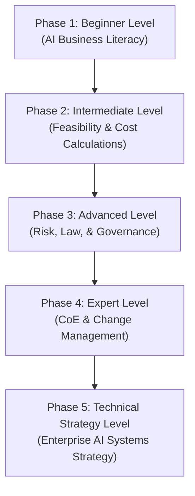

# AI Strategist: The Complete Beginner-to-Architect Masterclass

An **AI Strategist** is a senior transformational leader who designs and guides the artificial intelligence roadmap for a business. They bridge the gap between complex machine learning technologies and concrete business execution. Rather than writing code, they focus on calculating ROI, evaluating technical feasibility, managing security and regulatory risks, orchestrating cross-functional teams, and designing governance policies to safely scale AI within an enterprise.

This guide is written in clear, simple language with rich real-world analogies, step-by-step business audit frameworks, calculation formulas, and systems design principles to take you from a beginner to a high-level Enterprise AI Strategist.

---

## 🗺️ The Zero-to-Chief Strategist Roadmap



| Phase | Target Role | Key Focus Area | Capstone Project |
| :--- | :--- | :--- | :--- |
| **Phase 1: Beginner** | AI Strategy Analyst | Core AI terminology, identifying business value, customs tools setup. | Departmental AI Opportunity Audit (Time & Hours saved) |
| **Phase 2: Intermediate** | AI Business Consultant | Buy vs. Build matrices, Cost Calculation models, RAG vs. Fine-tuning trade-offs. | Corporate AI Feasibility Pitch & detailed ROI Case |
| **Phase 3: Advanced** | Risk & Compliance Officer | Data privacy laws (GDPR/HIPAA), prompt injections, security controls, EU AI Act. | Enterprise AI Governance & Safety Policy Blueprint |
| **Phase 4: Expert** | Director of AI Transformation | Center of Excellence (CoE) building, team upskilling matrix, KPI scorecards. | Corporate AI Transformation & Adoption Roadmap |
| **Phase 5: Architect** | Enterprise AI Strategist | Multi-cloud gate routing, vendor lock-in mitigation, scaling queues, DB stack selection. | Multi-Model Enterprise AI Infrastructure Proposal |

---

## 🚀 Phase 1: Beginner Level (AI Business Literacy)

### 1. What is an AI Strategist?
An AI Strategist acts as the critical bridge between engineering talent and corporate leadership.

#### 💡 The Translator Analogy:
Imagine two countries that need to conduct trade. One speaks only *High-Level Corporate Finance* (executives) and the other speaks only *Python and Mathematical Calculus* (engineers). If they try to speak directly, they will completely misunderstand each other. 
The **AI Strategist** acts as the **Language Translator**. They translate high-level business goals (e.g. *"We need to reduce customer churn by 15%"*) into precise technical directives (*"We need to build a regression model on customer interaction logs"*), and explain technical hurdles back to executives in simple profit-and-loss terms.

---

### 2. Simplifying the AI Taxonomy
To guide strategic conversations, you must understand core AI terms without getting bogged down in math:

```
+-------------------------------------------------------------+
| ARTIFICIAL INTELLIGENCE (Any smart machine)                |
|  +-------------------------------------------------------+  |
|  | MACHINE LEARNING (Learns from data patterns)          |  |
|  |  +-------------------------------------------------+  |  |
|  |  | DEEP LEARNING (Uses neural networks)            |  |  |
|  |  |  +-------------------------------------------+  |  |  |
|  |  |  | GENERATIVE AI (Creates fresh contents)    |  |  |  |
|  |  |  +-------------------------------------------+  |  |  |
|  |  +-------------------------------------------------+  |  |
|  +-------------------------------------------------------+  |
+-------------------------------------------------------------+
```

- **Artificial Intelligence (AI)**: The broad concept of machines acting "smart" (e.g., chess bots).
- **Machine Learning (ML)**: A subset of AI where software learns from historical patterns instead of rigid code rules (e.g., predicting house prices based on historical sales).
- **Deep Learning (DL)**: A subset of ML that uses layered software nodes called neural networks, mimicking the human brain (used for speech, vision, and complex translations).
- **Generative AI (GenAI)**: A branch of deep learning designed to *generate new content* (text, images, audio) based on training data patterns.
- **Natural Language Processing (NLP)**: The branch of AI focused on reading, writing, and understanding human languages (e.g. email sorting).
- **Computer Vision (CV)**: The branch of AI that processes and makes sense of images and videos (e.g. self-driving cars, quality check cameras).

---

### 3. Practical Custom AI Tooling
Before deploying large-scale custom models, an AI Strategist champions the roll-out of standard, low-cost conversational tools (such as **ChatGPT Team** or **Claude Projects**) to boost operational efficiency.
- **System Instructions**: Set rigid, corporate guidelines in custom workspaces (e.g. *"Do not analyze customer financials without standard legal disclaimers"*).
- **Knowledge Bases**: Uploading company playbooks directly to team workspaces so employees query static documentation instead of bothering colleagues.

---

### 4. Capstone Project: Departmental AI Opportunity Audit
A simple, structured framework to identify and calculate the business value of automating repetitive tasks in a customer support department.

#### The Audit Methodology:
1. **Identify the Task**: Log repetitive actions (e.g. responding to simple "where is my tracking number" tickets).
2. **Track the Time spent**: How many minutes does an employee spend on this task per occurrence?
3. **Calculate the Volume**: How many times does this task occur per month?
4. **Determine the Hour Cost**: What is the average fully-loaded hourly rate of employees performing this task?
5. **Estimate Automation Rate**: What percentage of these occurrences can realistically be answered by an LLM with 100% accuracy? (Typically 60-70% for basic FAQs).

#### Opportunity Audit Calculator Template:
$$\text{Monthly Hours Saved} = \left(\frac{\text{Minutes Per Occurrence}}{60}\right) \times \text{Monthly Volume} \times \text{AI Automation Rate}$$
$$\text{Monthly Cash Saved} = \text{Monthly Hours Saved} \times \text{Fully-Loaded Hourly Rate}$$

*Example Audit Scenario:*
- **Task**: Formatting raw customer feedback files into spreadsheet columns.
- **Minutes per occurrence**: 15 minutes.
- **Monthly Volume**: 200 occurrences.
- **Hourly rate**: \$30.
- **AI Automation Rate**: 90% (highly predictable structural cleanups).
- **Hours saved**: $(15/60) \times 200 \times 0.90 = \mathbf{45\text{ hours/month}}$.
- **Monthly Savings**: $45 \times \$30 = \mathbf{\$1,350\text{ saved/month}}$.

---

## 🛠️ Phase 2: Intermediate Level (AI Strategy & Cost Calculations)

At this level, you evaluate the commercial feasibility of projects and manage budgets.

### 1. The Buy vs. Build vs. Tune Decision Matrix
An AI Strategist must decide the fastest, most cost-effective path to solve a business problem:

```
                HIGH CAPABILITY / PROPRIETARY ADVANTAGE
                   +----------------------------------+
                   |  FINE-TUNE ADAPTERS              |  BUILD FROM SCRATCH
                   |  - Unique data formats           |  - Complete proprietary model
                   |  - Specific persona/language     |  - High cost, months to build
                   |  - Moderate cost, high speed     |  - Max competitive edge
                   +----------------------------------+----------------------------------+
                   |  BUY OUT-OF-THE-BOX SAAS         |  BUILD VIA APIs (RAG)
                   |  - Slack, Zoom, standard CRM AI  |  - Custom business logic
                   |  - Fast setup, predictable cost  |  - In-house data pipelines
                   |  - No competitive edge           |  - Low-to-moderate cost
                   +----------------------------------+----------------------------------+
                LOW CAPABILITY / STANDARD COMMODITY
```

- **Buy (SaaS Integration)**: If a tool already exists (e.g. using Zoom AI Companion to summarize meetings), **buy it**. You cannot build it cheaper or better in-house.
- **Build (APIs / RAG)**: If you need to integrate proprietary company databases with cognitive tools to make custom workflows, **build it** using high-quality APIs (OpenAI/Gemini) and vector databases.
- **Tune (Fine-Tuning)**: If an LLM needs to output extremely specific code schemas, custom formats, or highly technical jargon, **fine-tune** an open-source model using adapter weights.

---

### 2. Feasibility Evaluation (The Value-Complexity Quadrant)
Prioritize projects using a simple grid:

```
               HIGH VALUE
                  ^
                  |  [Quick Wins]                     [Strategic Pillars]
                  |  - High business return           |  - Massive strategic shift
                  |  - Low technical complexity       |  - High complexity, long timeline
                  |  - *Action: Do Immediately*       |  - *Action: Plan carefully*
                  |
                  |  [Ignore]                         [Money Pits]
                  |  - Low value                      |  - Low business return
                  |  - Low technical complexity       |  - High technical complexity
                  |  - *Action: Skip*                 |  - *Action: Reject*
                  +--------------------------------------------------------------> COMPLEXITY
                                                                     HIGH COMPLEXITY
```

---

### 3. RAG vs. Fine-Tuning Strategic Comparison
A critical business assessment choice:

| Dimension | RAG (Retrieval-Augmented Generation) | Fine-Tuning (Model Customization) |
| :--- | :--- | :--- |
| **💡 Analogy** | **Open-Book Exam**. Giving the student direct reference texts to read. | **Specialist Bootcamp**. Re-training the student's base knowledge. |
| **Best For** | Accessing dynamic, rapidly changing facts (prices, inventory, accounts). | Adjusting tone, format, output structure (JSON schemas, custom code). |
| **Cost** | Low setup, moderate runtime cost (extra tokens inside the prompt). | High upfront setup (GPU costs, data prep), low runtime cost. |
| **Knowledge Update** | Near-instant. You just update the database text. | Slow. Requires compiling data and re-training the model. |

---

### 4. Enterprise AI Cost Calculation
Before greenlighting a custom RAG chatbot project, you must calculate its ongoing API consumption costs.

#### Prompt Pricing Variables:
- Let $N$ be the estimated monthly user messages.
- Let $T_{\text{in}}$ be the average input tokens (User query + system instructions + vector context injected).
- Let $T_{\text{out}}$ be the average output tokens (The AI's answer).
- Let $P_{\text{in}}$ be the API cost per 1 million input tokens.
- Let $P_{\text{out}}$ be the API cost per 1 million output tokens.

#### The Cost Formula:
$$\text{Monthly Cost} = N \times \left( \left( \frac{T_{\text{in}}}{1,000,000} \times P_{\text{in}} \right) + \left( \frac{T_{\text{out}}}{1,000,000} \times P_{\text{out}} \right) \right)$$

*Example Financial Case:*
- **Monthly Messages ($N$)**: 100,000 queries.
- **Input Tokens ($T_{\text{in}}$)**: 3,000 tokens (due to large RAG context).
- **Output Tokens ($T_{\text{out}}$)**: 300 tokens (short answers).
- **API Model**: `gpt-4o-mini` ($P_{\text{in}} = \$0.150$, $P_{\text{out}} = \$0.600$).

$$\text{Input Cost} = 100,000 \times \left( \frac{3,000}{1,000,000} \times 0.150 \right) = \$45.00$$
$$\text{Output Cost} = 100,000 \times \left( \frac{300}{1,000,000} \times 0.600 \right) = \$18.00$$
$$\text{Total Monthly API Cost} = \$45.00 + \$18.00 = \mathbf{\$63.00}$$
*(Extremely affordable compared to hiring additional full-time representatives!)*

---

## 🚀 Phase 3: Advanced Level (AI Governance, Ethics, & Risks)

At this level, you manage security, legal liability, and compliance boundaries.

### 1. Identifying Enterprise AI Risks
An AI Strategist must secure corporate systems against four primary vulnerabilities:

1. **Hallucinations**: The model confidently generates false data. 
   - *Risk*: A support bot gives inaccurate contract refund instructions, legally binding the firm.
   - *Mitigation*: Restrict temperature to `0.0`, implement strict RAG context boundaries, and add fallback warnings.
2. **Data Leakage**: Sensitive customer information or secrets are uploaded to public AI models.
   - *Risk*: Employee pastes a financial spreadsheet into a public LLM; the model provider uses it to train future versions, exposing private data to competitors.
   - *Mitigation*: Enforce enterprise-tier commercial API agreements (which legally block training on prompt history) or utilize localized/private hosting models.
3. **Intellectual Property & Copyright**: LLMs trained on scraped web data may output copywritten graphics or code snippets.
   - *Risk*: Your brand's marketing engine publishes an AI-generated image containing copywritten trademarks.
   - *Mitigation*: Ensure your team uses models with clear copyright indemnity clauses (e.g. Adobe Firefly, commercial OpenAI enterprise tiers).
4. **Model Bias & Fairness**: AI reflects historical biases present in its training datasets.
   - *Risk*: An automated resume screening AI systematically rejects resumes containing specific address zip codes due to biased historic hiring records.
   - *Mitigation*: Run bias audits on datasets and ensure humans handle final, high-impact career/hiring decisions.

---

### 2. Legal Standards & Frameworks
- **EU AI Act**: The world's first comprehensive legal AI framework. It categorizes AI systems based on risk level:
  - *Unacceptable Risk*: Systems that manipulate human behavior or grade social credit (strictly banned).
  - *High Risk*: Hiring bots, banking credit assessment engines, medical devices (subject to strict data checks, validation, and human review).
  - *General Purpose AI (GPAI)*: Standard models like ChatGPT. Must provide transparency about training data.
- **GDPR & HIPAA Compliance**: Under GDPR, citizens have the "Right to be Forgotten" (requesting their data be deleted). Since you cannot easily extract specific data points from inside a trained neural network, developers must never fine-tune models directly on personal user data. Mask or filter all personal details before handling queries.

---

### 3. Human-in-the-Loop (HITL) Integration
Avoid complete automation for high-impact enterprise scenarios. Establish a review gateway where the AI drafts proposals, and a qualified staff member reviews and approves them before final execution.

```
[Incoming Complex Claim] ──> [AI Draft Engine] ──> [Review Dashboard] ──> [Staff Approval] ──> [Send]
```

---

## 🚀 Phase 4: Expert Level (AI Change Management & Transformation)

Deploying technology is easy; changing human habits is the real challenge.

### 1. The AI Center of Excellence (CoE) Structure
A CoE is a cross-functional committee tasked with safely steering the company's AI initiatives.

```
                           +--------------------------------------+
                           |          AI Center of Excellence     |
                           +--------------------------------------+
                            /          |                 |        \
                           /           v                 v         \
       +--------------------+  +---------------+  +-------------+  +--------------------+
       | Executive Sponsor  |  | AI Strategist |  | AI Architect|  | Risk & Legal Lead  |
       |  (Funding & Vision)|  | (ROI & Org)   |  | (Engineering|  | (GDPR & Compliance)|
       +--------------------+  +---------------+  +-------------+  +--------------------+
```

---

### 2. Tackling Employee Anxiety
When AI is rolled out, employees immediately worry: *"Is this technology going to replace my job?"* This fear leads to passive resistance, where staff actively avoid or sabotage new tools.

#### 💡 The Excel Analogy:
In the 1980s, when digital spreadsheet software (like Lotus 1-2-3 and Microsoft Excel) arrived, corporate accountants and ledger-book keepers held massive protests, claiming the software would put them all out of work.
In reality, Excel did not destroy the accounting profession. Instead, it **leveraged** it. It eliminated hours of manual pen-and-paper math. An accountant who historically managed 5 client files could suddenly manage 50! 
Similarly, Generative AI is not a replacement for human workers; it is a **super-leveraged tool**. The message to your staff must be clear: *"You will not be replaced by AI. You will be replaced by another professional who knows how to utilize AI to produce 5x more work."*

---

### 3. Team Upskilling Matrix
Do not host generic, one-size-fits-all AI seminars. Customize your corporate upskilling pathways based on specific department needs:

```
+------------------+------------------------------------------+------------------------------------------+
| Department       | Standard Prompt Competency               | Core Automation Objective                |
+------------------+------------------------------------------+------------------------------------------+
| Marketing        | - Creative writing variations            | Auto-generating drafts, SEO briefs, and  |
|                  | - Dynamic tone adaptation                | scheduling social assets via n8n queues. |
+------------------+------------------------------------------+------------------------------------------+
| Customer Support | - Empathetic customer tone blueprints   | Automated triage and FAQ draft generation|
|                  | - Resolving customer complaints safely   | with human-in-the-loop validation gates. |
+------------------+------------------------------------------+------------------------------------------+
| Legal & HR       | - High-precision structure audits        | Automated compliance tracking, template  |
|                  | - Regulatory checklist evaluations       | parsing, and policy document searches.   |
+------------------+------------------------------------------+------------------------------------------+
```

---

## 🏛️ Phase 5: Technical Strategy Level (Enterprise System Design)

As a high-level systems planner, you design multi-vendor architectures that protect corporate operations from cost spikes and vendor lock-in.

### 1. Vendor Lock-In Mitigation
If your entire software architecture is tightly coupled to a single AI provider's API (e.g. OpenAI's direct SDKs), you are at extreme corporate risk:
- What if that provider experiences a 2-hour server outage? (Your business stops completely).
- What if they increase token pricing by 50%? (Your profit margins vanish).

#### 💡 The Multi-Cloud Router Analogy:
Think of an electrical grid. If your home has only one electrical hookup to a local power plant and it goes dark, your lights turn off. A resilient technical strategy designs a **swappable smart router**. The router sits in front of all appliances. If power line A goes dark, the router automatically switches incoming power to line B (e.g. hot-swapping from OpenAI to Anthropic) in milliseconds without any appliance inside the house flickering.

```
                             +----------------------------------------+
                             |           CLIENT APPLICATION           |
                             +----------------------------------------+
                                                 |
                                                 v
                             +----------------------------------------+
                             |       Unified Gateway & LLM Router     |
                             +----------------------------------------+
                                        /                  \
                            [Route API A]                 [Route API B]
                                      /                      \
                      +-------------------+              +-------------------+
                      |   OpenAI Models   |              |  Anthropic Models |
                      |    (Primary)      |              |   (Auto-Fallback) |
                      +-------------------+              +-------------------+
```

---

### 2. Budget-Optimized Gateway Design (Flash vs. Reasoning)
Enterprise gateways must automatically evaluate user queries and dynamically route them to the most cost-effective model, saving up to $70\%$ on monthly operational fees.

#### JavaScript Enterprise Gateway Implementation:
```typescript
import { OpenAI } from 'openai';

const openai = new OpenAI();

interface RoutedCompletionResponse {
  modelUsed: string;
  response: string;
  costEstimate: number;
}

export class SmartAIGateway {
  // Price per 1 Million Tokens
  private pricing: Record<string, { in: number; out: number }> = {
    'gemini-flash': { in: 0.075, out: 0.300 }, // Ultra-cheap model
    'gpt-4o':       { in: 5.000, out: 15.000 }  // High-reasoning model
  };

  private determineComplexity(query: string): boolean {
    // Audit query for markers of complex logic, math, or translation
    const complexKeywords = ['analyze', 'optimize', 'debug', 'architect', 'calculate', 'translate'];
    const lowercaseQuery = query.toLowerCase();

    return complexKeywords.some(keyword => lowercaseQuery.includes(keyword));
  }

  async runCompletion(query: string): Promise<RoutedCompletionResponse> {
    const isComplex = this.determineComplexity(query);
    const selectedModel = isComplex ? 'gpt-4o' : 'gemini-flash';

    console.log(`[Router Action] Routing query to: ${selectedModel} (Complexity: ${isComplex})`);

    const response = await openai.chat.completions.create({
      model: selectedModel,
      messages: [{ role: 'user', content: query }],
      temperature: 0.2
    });

    const text = response.choices[0].message.content || '';
    const inputTokens = response.usage?.prompt_tokens || 0;
    const outputTokens = response.usage?.completion_tokens || 0;

    // Calculate exact pricing
    const modelRates = this.pricing[selectedModel];
    const costEstimate = 
      ((inputTokens / 1000000) * modelRates.in) + 
      ((outputTokens / 1000000) * modelRates.out);

    return {
      modelUsed: selectedModel,
      response: text,
      costEstimate: parseFloat(costEstimate.toFixed(6))
    };
  }
}
```

---

### 3. Enterprise Infrastructure Selection Matrix
How to evaluate tools when designing your scalable backend stack:

```
+--------------------+----------------------------------------+----------------------------------------+
| Component Type     | Enterprise Selection Options           | Key Architect Strategic Assessment     |
+--------------------+----------------------------------------+----------------------------------------+
| Vector Store       | - Pinecone (SaaS Cloud-native)         | Select Pinecone for instant scaling    |
|                    | - pgvector (PostgreSQL extension)      | or pgvector to keep vector embeddings  |
|                    |                                        | inside existing secure databases.      |
+--------------------+----------------------------------------+----------------------------------------+
| Orchestration      | - n8n (Fast API visual integrations)   | Select n8n for rapid workflow shipping |
|                    | - LangGraph (Structured state graphs)  | and LangGraph for complex, multi-agent |
|                    |                                        | conversational loops with memory.      |
+--------------------+----------------------------------------+----------------------------------------+
| Model Hosting      | - Azure OpenAI (Private cloud RAG)     | Select Azure for enterprise HIPAA/GDPR |
|                    | - Local hosting (Ollama/vLLM servers)   | compliance, or local vLLM to bypass all|
|                    |                                        | external third-party internet APIs.    |
+--------------------+----------------------------------------+----------------------------------------+
```
