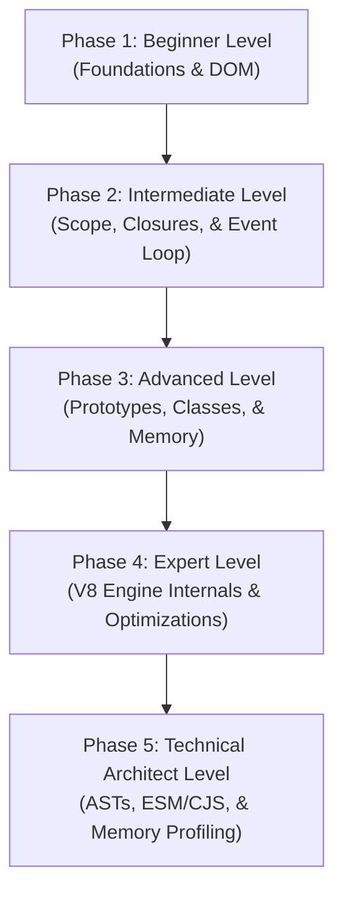

# JavaScript: The Complete Beginner-to-Architect Masterclass

**JavaScript (JS)** is the core programming engine of the modern web. It has evolved from a simple scripting language for adding basic animations into a highly performant, asynchronous compilation language running massive enterprise web frontends, backend servers (Node.js/Bun), and mobile apps.

Rather than just memorizing syntax, a professional developer must understand how JavaScript handles memory, compiles code, runs asynchronous tasks via the Event Loop, and executes within browser compiler engines like Google's V8.

This guide is written in clear, simple language with rich real-world analogies, step-by-step memory models, concrete Event Loop logs, and compiler-level optimizations to take you from a beginner to a high-level JS Systems Architect.

---

## 🗺️ The JavaScript Systems Roadmap



| Phase | Target Role | Key Focus Area | Capstone Project |
| :--- | :--- | :--- | :--- |
| **Phase 1: Beginner** | Junior Developer | Primitive vs. Reference variables, logic loops, basic DOM events. | Vanilla JS Interactive Calculator |
| **Phase 2: Intermediate** | Frontend Engineer | Block scopes, Lexical Closures, asynchronous Event Loop, Promise queues. | Resilient Async API Weather Dashboard |
| **Phase 3: Advanced** | Software Engineer | Prototypal inheritance, ES6 OOP classes, Stack/Heap memory allocation. | Custom OOP Reactive State Store Class |
| **Phase 4: Expert** | Performance Engineer | V8 compilation engines, Ignition/TurboFan JIT steps, Debouncers & Throttlers. | High-Performance Event Debounce & Throttle Suite |
| **Phase 5: Architect** | Systems Architect | CommonJS vs. ESM runtimes, AST manipulation, tracking memory leaks. | Custom AST Console Log Stripper build script |

---

## 🚀 Phase 1: Beginner Level (Foundations & DOM)

### 1. What is JavaScript?

#### 💡 The Cooking Recipe Analogy:
Think of your computer as a kitchen, and a JavaScript file as a **Cooking Recipe**. 
- **The Compiler / Interpreter**: Reads the recipe ingredients at the top of the card (parsing variables), prepares the tools (initializing memory), and plans the steps.
- **The Execution Engine**: Executes the instructions one line at a time (*"Chop the onions"* $\rightarrow$ *"Heat the pan"* $\rightarrow$ *"Stir for 5 minutes"*). If you skip a step, or put in a completely incorrect ingredient, the dish is ruined (program crashes).

---

### 2. Primitive vs. Reference Values
Understanding how JavaScript stores data in memory is crucial:

- **Primitive Types (Number, String, Boolean, null, undefined, Symbol, BigInt)**: The values are immutable and extremely small. They are stored directly on the stack. When you assign one variable to another, JavaScript **copies the actual value**.
- **Reference Types (Objects, Arrays, Functions)**: These data shapes can grow to massive sizes. They are stored in a larger memory space called the Heap. The variable itself holds only a small **memory address pointer** (reference) pointing to where that data lives on the heap.

```
STACK MEMORY (Fast & Simple)                    HEAP MEMORY (Flexible & Large)
+------------------------+                      +------------------------+
| age = 25 (Value)       |                      |                        |
| userPtr = ------------+---------------------->| { name: 'Alice',       |
+------------------------+                      |   role: 'admin' }      |
                                                +------------------------+
```

#### The Pointer Trap in Code:
```javascript
// Primitive values are copied by value:
let x = 10;
let y = x; // y gets a copy of 10
y = 20;
console.log(x); // Output: 10 (x is completely unaffected)

// Reference values are copied by memory address:
let userA = { name: 'Alice' };
let userB = userA; // userB gets the SAME memory address pointer!

userB.name = 'Bob'; // Mutating userB changes the data on the Heap
console.log(userA.name); // Output: 'Bob'! (userA points to the same heap object)
```

---

### 3. The Reassignment Trap: Pass-by-Value of Reference
A common source of confusion is whether JavaScript is "pass-by-value" or "pass-by-reference". 

> [!IMPORTANT]
> **JavaScript is strictly pass-by-value.** 
> However, for reference types, the **value** being passed or copied is the **memory pointer** itself. This has critical consequences when you reassign a variable vs. mutate its properties.

#### Code Demonstration of the Trap:
```javascript
function modifyAccount(accountObj, balanceNum) {
  // 1. Mutating a property inside the object:
  // Since 'accountObj' is a copy of the pointer, it points to the same heap object.
  accountObj.status = 'active'; 

  // 2. Reassigning the pointer:
  // This overwrites our local 'accountObj' variable with a NEW memory pointer.
  // It completely severs the link to the original object. The caller's variable is untouched!
  accountObj = { status: 'suspended', balance: 0 }; 

  // 3. Reassigning a primitive:
  // 'balanceNum' is a copy of a primitive value. Changing it has zero effect outside.
  balanceNum = 99999;
}

const myAccount = { status: 'pending', balance: 100 };
let myBalance = 100;

modifyAccount(myAccount, myBalance);

console.log(myAccount.status);  // Output: 'active' (Mutation was successful!)
console.log(myAccount.balance); // Output: 100 (Unchanged! The reassignment did not affect myAccount)
console.log(myBalance);         // Output: 100 (Primitive copy was unaffected)
```

---

### 4. Variable Hoisting & Lexical Environments (The TDZ)
Hoisting is often summarized as "moving variables to the top of the file." Under the hood, this is a compiler side effect. 

When your JavaScript runs, the engine compiles the code in two distinct phases:
1. **Compilation Phase**: The engine parses the code, sets up the **Lexical Environment** scope, and registers all variable and function declarations.
2. **Execution Phase**: The engine runs the code line-by-line, assigning values and executing functions.

```
       [ COMPILATION PHASE ]                         [ EXECUTION PHASE ]
 Parses declarations, registers scopes         Executes code line-by-line
      var x   -> initialized: undefined             x = 10 -> assigns 10
      let y   -> registered in TDZ                  y = 20 -> exits TDZ, assigns 20
      function f() -> fully registered in memory
```

#### Declaration Hoisting Lifecycle:
- **`var` Declarations**: Hoisted and instantly initialized to `undefined`. You can access a `var` variable before its assignment without a crash.
- **`function` Declarations**: Hoisted and **fully registered** with their actual body. You can call a function declaration before writing it in the file.
- **`let` & `const` Declarations**: Hoisted but **not initialized**. They are placed in the **Temporal Dead Zone (TDZ)**—a strict, inaccessible state. Any attempt to read or write to them before the actual line of declaration runs throws a `ReferenceError`.

#### Programmatic TDZ Demonstration:
```javascript
// Function declarations can be called before declaration
greet(); // Output: "Hello World"

function greet() {
  console.log("Hello World");
}

// var variables are hoisted as undefined
console.log(a); // Output: undefined
var a = 5;

// let/const variables throw ReferenceError due to the TDZ
try {
  console.log(b); // Throws ReferenceError!
  let b = 10;
} catch (error) {
  console.error(error.name); // "ReferenceError"
}
```

---

### 5. Type Coercion and Strict Equality
JavaScript is dynamically typed. This flexibility leads to **Type Coercion**, where the runtime automatically converts values from one type to another during operations.

- **Loose Equality (`==`)**: Compares values after coercing their types according to the complex ECMAScript Abstract Equality Comparison Algorithm. This leads to infamous, non-transitive anomalies.
- **Strict Equality (`===`)**: Compares both the **type** and the **value** directly. No coercion takes place.

#### Coercion anomalies:
```javascript
console.log(0 == false);   // true (coerced)
console.log("" == 0);      // true (coerced)
console.log(null == undefined); // true (special rule)
console.log(null === undefined); // false (different types)

// The famous array-to-number anomaly:
console.log([] == 0); // true!
// Why? [] is coerced to primitive -> "" -> coerced to number -> 0.
```

#### Controlling Coercion: Object-to-Primitive conversion
When you compare or add objects, JavaScript invokes three internal methods to reduce them to primitive values: `Symbol.toPrimitive`, `valueOf`, and `toString`.

```javascript
const wallet = {
  cash: 50,
  // Custom conversion handler
  [Symbol.toPrimitive](hint) {
    if (hint === 'number') return this.cash;
    return `Wallet with $${this.cash}`;
  }
};

console.log(wallet + 10); // Output: 60 (coerced to number hint -> returns 50)
console.log(`State: ${wallet}`); // Output: "State: Wallet with $50" (string hint)
```

---

### 6. The DOM (Document Object Model)
The DOM is an object tree structure representing your website's visual HTML pages. JavaScript uses browser-provided Web API bindings to select, modify, and listen to visual page nodes.

```javascript
// 1. Select a visual DOM node
const button = document.querySelector('#action-btn');
const outputSpan = document.querySelector('.result-display');

// 2. Bind a click event listener
button.addEventListener('click', (event) => {
  console.log('Button clicked! Target:', event.target);
  
  // 3. Modify text and styling on-screen
  outputSpan.textContent = 'Transaction processed successfully!';
  outputSpan.style.color = 'green';
});
```

---

## 🛠️ Phase 2: Intermediate Level (Asynchronous JS & Scope)

At this level, you master closures, runtime bind bindings, functional design patterns, and the browser's asynchronous task scheduling engine.

### 1. Scope & Closures

#### 💡 The Backpack Analogy:
When you write a nested function inside a parent function, the child function has access to variables defined in the parent function. 
When the parent function finishes executing and returns, its variables would normally be deleted from memory. However, the returning child function keeps access to those variables. 
Think of a **Closure** as a **Backpack** that a function carries around. The function packs up all the variables present in its birth environment (its lexical scope) and carries them wherever it goes!

#### Code Demonstration of Private State:
```javascript
function createBankVault(owner) {
  // A private variable locked inside the closure backpack
  let balance = 0;

  return {
    deposit: function(amount) {
      balance += amount; // Accesses 'balance' from parent birth scope
      return `User ${owner} deposited $${amount}. Balance: $${balance}`;
    },
    getBalance: function() {
      return balance;
    }
  };
}

const myVault = createBankVault('Alice');
console.log(myVault.deposit(100)); // Output: Balance: 100
console.log(myVault.deposit(50));  // Output: Balance: 150
console.log(myVault.balance);      // Output: undefined (Secure, private variable!)
```

#### Functional Programming: Currying & Composition
Closures allow advanced functional patterns like **Currying** (converting a function that takes multiple arguments into a chain of single-argument functions) and **Composition** (piping the output of one function as the input of another).

```javascript
// A. Curried addition
const add = (a) => (b) => (c) => a + b + c;
console.log(add(1)(2)(3)); // Output: 6

// Reusable curried multiplier helper
const multiply = (factor) => (num) => num * factor;
const double = multiply(2);
const triple = multiply(3);

console.log(double(10)); // 20
console.log(triple(10)); // 30

// B. Composition helper (Pipe)
const pipe = (...fns) => (x) => fns.reduce((value, fn) => fn(value), x);

const addOne = (n) => n + 1;
const square = (n) => n * n;

const addAndSquare = pipe(addOne, square);
console.log(addAndSquare(4)); // Output: 25 (4 + 1 = 5 -> 5^2 = 25)
```

---

### 2. Explicit `this` Control: Designing Polyfills
JavaScript provides three methods to explicitly bind the context of `this`: `call`, `apply`, and `bind`. 

| Method | Execution | Argument Format | Return Type |
| :--- | :--- | :--- | :--- |
| `call` | Invokes instantly | Comma-separated list | Function return value |
| `apply` | Invokes instantly | Array of arguments | Function return value |
| `bind` | Prepares for later | Comma-separated list | Brand new bound function |

#### 🛠️ Professional Architect Polyfill implementations:
To truly master JavaScript's internal runtime execution, let's write custom polyfills from scratch on `Function.prototype` without using built-in helper methods.

```javascript
// 1. Polyfill for call()
Function.prototype.myCall = function (context, ...args) {
  // If no context is passed, fall back to global window/globalThis
  context = context || globalThis;

  // Use a unique Symbol key to prevent overwriting existing properties
  const fnSymbol = Symbol('fn');
  
  // Assign 'this' (the target function instance) as a property of the context
  context[fnSymbol] = this;

  // Execute the function inside the context scope and capture the result
  const result = context[fnSymbol](...args);

  // Clean up the temporary property to prevent memory leaks
  delete context[fnSymbol];

  return result;
};

// 2. Polyfill for apply()
Function.prototype.myApply = function (context, argsArray = []) {
  context = context || globalThis;
  const fnSymbol = Symbol('fn');
  context[fnSymbol] = this;

  // Pass array items using the spread operator
  const result = context[fnSymbol](...argsArray);
  
  delete context[fnSymbol];
  return result;
};

// 3. Polyfill for bind()
Function.prototype.myBind = function (context, ...boundArgs) {
  const originalFunction = this;

  return function (...executionArgs) {
    // Combine arguments passed at binding time with arguments passed at execution time
    return originalFunction.myCall(context, ...boundArgs, ...executionArgs);
  };
};

// Verification:
const dev = { name: 'Knl' };
function greet(greeting, punctuation) {
  return `${greeting}, ${this.name}${punctuation}`;
}

console.log(greet.myCall(dev, 'Hello', '!')); // Output: "Hello, Knl!"
console.log(greet.myApply(dev, ['Hi', '.']));  // Output: "Hi, Knl."

const boundGreet = greet.myBind(dev, 'Hey');
console.log(boundGreet('?')); // Output: "Hey, Knl?"
```

---

### 3. The Event Loop & Async Scheduling Engine
JavaScript is single-threaded (executes one line of code at a time). To support massive concurrent requests, it offloads heavy non-blocking I/O operations (timers, files, network calls) to the browser background runtime.

The **Event Loop** is the active coordinator that prioritizes execution across four distinct zones:

```
+-------------------------------------------------------------------------------+
|                                THE EVENT LOOP                                 |
+-------------------------------------------------------------------------------+
|  1. CALL STACK: Executes active code frames synchronously.                    |
|  2. WEB APIs:   Offloads async tasks (setTimeout, fetch, events) to backgrounds. |
|  3. MICROTASK QUEUE: High-priority queue strictly for Promise resolutions,    |
|                      queueMicrotask(), and MutationObserver.                  |
|  4. MACROTASK QUEUE: Low-priority queue for timers (setTimeout), network      |
|                      callbacks, and DOM rendering ticks.                      |
+-------------------------------------------------------------------------------+
```

#### The Strict Microtask Priority Rule:
The Call Stack executes all synchronous code first. 
Once the Call Stack is empty, the Event Loop checks the **Microtask Queue** and executes **ALL** pending microtasks. Crucially, if a microtask schedules *another* microtask, it will also execute inside the same tick. The Event Loop will remain locked until the Microtask Queue is **completely empty** before it will check or execute a single task from the **Macrotask Queue**.

#### 🧪 Predict the Output Log:
```javascript
console.log('1: Sync Start');

setTimeout(() => {
  console.log('2: Timeout Macrotask');
}, 0);

Promise.resolve()
  .then(() => {
    console.log('3: Promise Microtask A');
    // Inject a secondary microtask dynamically
    queueMicrotask(() => console.log('4: Dynamic Microtask B'));
  });

console.log('5: Sync End');
```

#### Chronological Execution Steps:
1. `console.log('1: Sync Start')` runs immediately on the Call Stack.
2. `setTimeout` is pushed to Web APIs. Its callback is placed in the **Macrotask Queue** instantly.
3. `Promise.resolve` resolves instantly. Its `.then()` callback is placed in the **Microtask Queue**.
4. `console.log('5: Sync End')` runs on the Call Stack.
5. The Call Stack is now **empty**.
6. The Event Loop halts macrotask execution and prioritizes the **Microtask Queue**:
   - It runs the first microtask, logging `'3: Promise Microtask A'`.
   - `queueMicrotask` dynamically inserts a new callback at the tail of the Microtask Queue.
   - The queue is not empty yet! It executes the dynamic callback, logging `'4: Dynamic Microtask B'`.
7. The Microtask Queue is now **completely empty**.
8. The Event Loop pulls the next item from the **Macrotask Queue**, logging `'2: Timeout Macrotask'`.

#### ⚠️ Async/Await Under the Hood
The `async/await` syntax is syntactical sugar over Promises. When the runtime encounters an `await` expression, it executes the target promise, pauses synchronous execution of that specific function block, and schedules the remaining lines of the function as a **Microtask** to be executed when the promise resolves.

```javascript
async function executeTask() {
  console.log("A: Inside Async");
  await Promise.resolve(); // Pauses, yields execution, places next line in microtask queue
  console.log("B: Post-Await Microtask");
}

console.log("1: Start");
executeTask();
console.log("2: End");

// Output:
// 1: Start
// A: Inside Async
// 2: End
// B: Post-Await Microtask
```

---

### 4. Arrow Functions vs. Regular Functions (`this` binding)
A massive source of confusion in JavaScript is the keyword `this`.
- **Regular Functions**: Bind `this` **dynamically** at runtime based on *how* the function is called.
  - Called as object method (`obj.method()`): `this` is `obj`.
  - Called as simple function (`method()`): `this` is `globalThis` (or `undefined` in strict mode).
- **Arrow Functions**: Do not have their own `this` binding, `arguments` object, or `new` capability. They bind `this` **lexically** (inheriting it from their parent container scope where they were declared).

```javascript
const user = {
  name: 'Alice',
  
  // Regular Function
  greetRegular: function() {
    console.log(`Hello, my name is ${this.name}`); // 'this' points to user object
  },

  // Arrow Function
  greetArrow: () => {
    console.log(`Hello, my name is ${this.name}`); // 'this' inherits global window scope (undefined!)
  }
};
```

---

## ⚡ Phase 3: Advanced Level (Prototypes, Classes, & Memory)

### 1. Prototypal Inheritance

#### 💡 The Ancestral DNA Analogy:
Imagine you have unique physical traits (properties). If someone looks at your eyes, they see your eye color. If they ask about your family's history, but you don't know it, you ask your parents. If they don't know it, they ask their parents (grandparents). You trace DNA traits up the **family tree** until you either find the answer or hit the original ancestral root (`null`).

In JavaScript, every object has an internal link (`[[Prototype]]`, exposed in modern browsers as `__proto__` or accessed securely via `Object.getPrototypeOf`) pointing to its "parent" prototype object. When you read a property or call a method on an object, JavaScript checks if it exists on the local instance. If not, it traverses up the **Prototype Chain** until it finds the property or hits `Object.prototype.__proto__` which resolves to `null`.

```
[Object: myUser] ──__proto__──> [User.prototype] ──__proto__──> [Object.prototype] ──__proto__──> null
```

#### Under the Hood: Object.create vs Class extends
Before the ES6 `class` keyword was introduced, developers mapped inheritance manually. Modern class syntax is purely **syntactic sugar** over prototypal inheritance.

```javascript
// A. Manual Prototypal Linkage (Pre-ES6)
const animal = {
  eats: true,
  walk() {
    return "Animal walking...";
  }
};

const dog = Object.create(animal); // Creates a new object with 'animal' as its prototype
dog.bark = function() { return "Woof!"; };

console.log(dog.eats); // Output: true (Found on prototype chain!)
console.log(Object.getPrototypeOf(dog) === animal); // true

// B. ES6 Class Prototypal Sugar
class AnimalClass {
  constructor() { this.eats = true; }
  walk() { return "Animal walking..."; }
}

class DogClass extends AnimalClass {
  bark() { return "Woof!"; }
}

const myDog = new DogClass();
// Under the hood, JS compiler sets: 
// Object.getPrototypeOf(DogClass.prototype) === AnimalClass.prototype
console.log(myDog.walk()); // Output: "Animal walking..."
```

---

### 2. Stack vs. Heap Allocation & Garbage Collection
Memory management in JavaScript is automatic, relying on two distinct physical structures:

- **Stack Allocation**: Extremely fast, rigid, fixed-size memory blocks managed in LIFO (Last In, First Out) order. Used for active function execution frames and primitive variables. Stack frames are immediately discarded when a function completes its execution.
- **Heap Allocation**: Unstructured, flexible memory space. Used for storing massive, dynamic reference objects (arrays, functions, objects). Heap variables don't self-destruct. The engine relies on a **Garbage Collector (GC)** to clean them.

#### The GC Mark-and-Sweep Algorithm:
To free unused memory, modern engines start at the root node (typically the global `window` or `globalThis` object) and recursively traverse all references. Any object on the heap that is **unreachable** (no active pointer leads to it from a root node) is marked for deletion and swept away.

#### V8 Generational Garbage Collection:
To optimize performance, V8 splits heap memory into two generations:
1. **Young Generation (New Space)**:
   - Holds newly allocated objects. Most objects die young.
   - Divided into two equal-sized semispaces: **To-Space** and **From-Space**.
   - V8 uses the ultra-fast **Scavenge Algorithm**: New allocations go to the Active To-Space. During GC, active (live) objects are copied to the From-Space, and the inactive To-Space is swept clean. The semispaces then swap roles.
2. **Old Generation (Old Space)**:
   - Holds objects that survived multiple Scavenge cycles in the New Space.
   - Managed via the **Mark-Sweep-Compact Algorithm**: Since old space is large, V8 avoids copying. It marks live objects, sweeps away unreachable ones, and defragments (compacts) memory gaps to prevent allocation failures.

#### Weak References: WeakMap and WeakSet
Regular objects stored in a standard `Map` or `Set` are kept alive in memory as long as the map is active, blocking GC. Modern JavaScript provides `WeakMap` and `WeakSet` to store **weak references**.

> [!TIP]
> Keys in a `WeakMap` must be objects, and they do not prevent garbage collection. If an object key has no other active references in the application, V8 will garbage-collect it and automatically purge the key-value entry from the `WeakMap` to prevent memory leaks.

```javascript
// A. Standard Map holds references, blocking GC:
let keyObj = { id: 999 };
const standardMap = new Map();
standardMap.set(keyObj, 'metadata');

keyObj = null; // Sever the primary reference
// Even though keyObj is null, the object is STILL trapped in standardMap!
// It will NEVER be garbage-collected!

// B. WeakMap allows garbage collection:
let weakKey = { id: 101 };
const weakMap = new WeakMap();
weakMap.set(weakKey, 'session_cache');

weakKey = null; // Sever the primary reference
// V8 detects no active pointers. At the next GC cycle, 
// the object is swept from heap, and the entry is cleared from weakMap automatically!
```

---

### 3. Capstone Project: Custom Reactive State Store Class
Let's build a lightweight reactive state manager using ES6 Classes, private fields, and prototype subscription boundaries.

```typescript
type Listener = () => void;

export class ReactiveStore<T extends object> {
  // Private field prefix '#' protects state from direct mutations
  #state: T;
  #listeners: Set<Listener>;

  constructor(initialState: T) {
    this.#state = new Proxy(initialState, {
      set: (target, prop, value) => {
        Reflect.set(target, prop, value);
        // Trigger all active subscriptions when state is updated
        this.#notify();
        return true;
      }
    });
    this.#listeners = new Set();
  }

  // Getter to return read-only copy of state
  get state(): T {
    return this.#state;
  }

  // Subscribe to changes
  subscribe(listener: Listener): () => void {
    this.#listeners.add(listener);
    // Unsubscribe helper
    return () => {
      this.#listeners.delete(listener);
    };
  }

  #notify() {
    this.#listeners.forEach(listener => listener());
  }
}

// Test Class usage
const appStore = new ReactiveStore({ count: 0 });
const unsub = appStore.subscribe(() => {
  console.log('[App State Changed] Counter is now:', appStore.state.count);
});

appStore.state.count = 1; // Output: [App State Changed] Counter is now: 1
unsub();
```

---

## 🧬 Phase 4: Expert Level (V8 Engine & Optimization)

### 1. V8 Just-In-Time (JIT) Compilation
Google Chrome and Node.js execute code using the **V8 Engine**. V8 compiles JavaScript directly into native machine code at runtime for high performance.

```
                  +----------------------------------------------+
                  |              JAVASCRIPT CODE                 |
                  +----------------------------------------------+
                                         |
                                         v
                  +----------------------------------------------+
                  |         Ignition Bytecode Interpreter        |
                  +----------------------------------------------+
                                     /        \
                    (Optimizes hot paths)      (De-optimizes on shape drift)
                                   /            \
                                  v              v
                  +----------------------------------------------+
                  |           TurboFan JIT Compiler              |
                  |            (Fast Machine Code)               |
                  +----------------------------------------------+
```

1. **Parser & AST**: The parser reads raw JavaScript text, converting it to tokens, and builds an **Abstract Syntax Tree (AST)**.
2. **Ignition Interpreter**: Reads the AST and quickly generates lightweight bytecode to start execution instantly.
3. **TurboFan JIT Compiler**: Monitors active execution. If a specific function runs frequently (a "hot path") with the exact same data shapes, TurboFan compiles it into highly optimized **native machine code**.
4. **Hidden Classes (Shapes)**: JavaScript has no static class offsets in memory. To solve property lookup latencies, V8 dynamically generates internal **Hidden Classes (Shapes)**. Objects initialized with the exact same keys in the exact same order share the same hidden class.
5. **Inline Caching (IC)**: V8 caches the memory offsets of object properties inside hot function calls. If your function is **Monomorphic** (always receives objects sharing the exact same shape), V8 bypasses property dictionary lookups entirely and reads raw memory offsets, executing in nanoseconds.

#### ⚠️ The Shape Drift (Polymorphic De-optimization) Trap:
If you initialize objects with varying shapes, or dynamically add/delete keys at runtime, your functions become **Polymorphic** or **Megamorphic**. V8 has to discard optimized machine code (De-optimization) and fall back to slow dictionary lookups.

```javascript
// Monomorphic: Objects share identical Hidden Class shape
function calculateTotal(order) {
  return order.price * 1.1; // Hot path optimized by TurboFan!
}

const orderA = { price: 10 }; // Shape: [price]
const orderB = { price: 20 }; // Shape: [price] - Shared!
calculateTotal(orderA);
calculateTotal(orderB); // ⚡ Fast Monomorphic call!

// Shape Drift: Different property initialization order
const orderC = { discount: 5, price: 30 }; // Shape: [discount, price]
const orderD = { price: 40, discount: 5 }; // Shape: [price, discount] - De-optimized!

// In V8, orderC and orderD have DIFFERENT Hidden Classes!
// Passing them to the same hot function forces a Polymorphic bailout.
```

---

### 2. High-Performance Event Debounce & Throttle
- **Debounce**: Delays function execution until $X$ milliseconds have passed since the user stopped triggering the event (e.g. search box typing).
- **Throttle**: Enforces a maximum execution frequency (e.g. firing scroll events at most once every 100ms).

#### High-Performance Code Suite:
```typescript
// Custom Debounce: Caches execution calls until typing pauses
export function debounce<Args extends any[]>(
  fn: (...args: Args) => void,
  delay: number
): (...args: Args) => void {
  let timerId: ReturnType<typeof setTimeout> | null = null;

  return (...args: Args) => {
    if (timerId) clearTimeout(timerId);
    
    timerId = setTimeout(() => {
      fn(...args);
      timerId = null;
    }, delay);
  };
}

// Custom Throttle: Restricts callback frequency
export function throttle<Args extends any[]>(
  fn: (...args: Args) => void,
  limit: number
): (...args: Args) => void {
  let inThrottle = false;

  return (...args: Args) => {
    if (!inThrottle) {
      fn(...args);
      inThrottle = true;
      setTimeout(() => {
        inThrottle = false;
      }, limit);
    }
  };
}
```

---

## 🏛️ Phase 5: Technical Architect Level (Enterprise JS Platforms)

### 1. ESM (ECMAScript Modules) vs. CommonJS (CJS)
Enterprise systems migrate to ESM because it supports static analysis.

- **CommonJS (`require`)**: Node.js legacy default. Imports are dynamic, executed synchronously at runtime. You cannot easily tree-shake (remove unused code) because exports can change on the fly depending on runtime conditions.
- **ESM (`import/export`)**: The modern ES6 standard. Statically analyzed at compile time. Allows modern bundlers (Vite, Rollup) to parse the module tree, detect dead code, and strip unused exports entirely from the production bundle.

---

### 2. Abstract Syntax Trees (AST) & Compilers
When Vite, Babel, SWC, or ESLint processes your code, they parse your raw text files into a nested JSON object map called an **Abstract Syntax Tree (AST)**.

#### Input Text Code:
```javascript
const z = x + y;
```

#### AST Compiled Tree Representation (Simplified):
```json
{
  "type": "VariableDeclaration",
  "kind": "const",
  "declarations": [{
    "type": "VariableDeclarator",
    "id": { "type": "Identifier", "name": "z" },
    "init": {
      "type": "BinaryExpression",
      "operator": "+",
      "left": { "type": "Identifier", "name": "x" },
      "right": { "type": "Identifier", "name": "y" }
    }
  }]
}
```

By writing AST Transformer plugins (e.g. using Babel or Esbuild), architects can automatically rewrite code structures, strip development console logs, or optimize production code before shipping bundles.

---

### 3. Memory Leak Audit & Profiling
Memory leaks happen when references to unreachable objects are maintained, blocking the Garbage Collector from freeing heap memory.

#### Core Leak Vectors:
1. **Detached DOM Nodes**: Removing an HTML element from the screen but keeping a reference to it in a active JavaScript variable.
2. **Accidental Global Variables**: Storing values on the global `window` object by forgetting variable declaration keywords.
3. **Forgotten Timers**: Creating a `setInterval` loop that references scope states but never calling `clearInterval`.

```
             [ active DOM Tree ]   ─── Element removed from screen!
                      |
             [ JavaScript State ]  ─── Still holds pointer in active array variable!
                      |
                      v
             [ DETACHED DOM NODE ] ─── Trapped in Heap Memory! (Garbage Collector cannot sweep)
```

#### Step-by-Step Heap Profiling Audit:
1. Open Chrome DevTools $\rightarrow$ Select **Memory Tab**.
2. Take a **Heap Snapshot** when the app loads.
3. Perform the target user action (e.g. open and close a modal 10 times).
4. Take a second **Heap Snapshot**.
5. Compare the two snapshots using the **Comparison view** dropdown.
6. Search for `HTMLDivElement` or `Detached`. If instances increase, locate the **Retainer Chain** path at the bottom of the screen to identify which JavaScript variable is trapping the element references!
