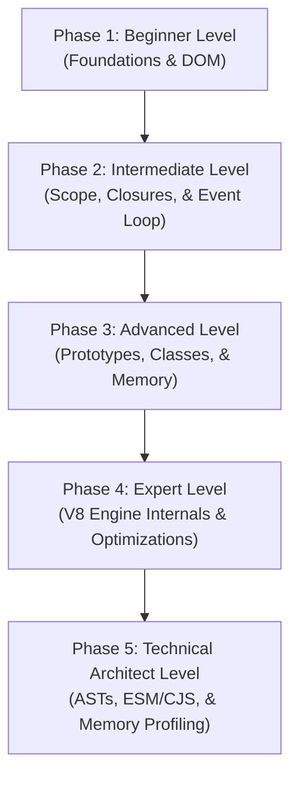

# JavaScript: The Complete Beginner-to-Architect Masterclass

**JavaScript (JS)** is the core programming engine of the modern web. It has evolved from a simple scripting language for adding basic animations into a highly performant, asynchronous compilation language running massive enterprise web frontends, backend servers (Node.js/Bun), and mobile apps.

Rather than just memorizing syntax, a professional developer must understand how JavaScript handles memory, compiles code, runs asynchronous tasks via the Event Loop, and executes within browser compiler engines like Google's V8.

This guide is written in clear, simple language with rich real-world analogies, step-by-step memory models, concrete Event Loop logs, and compiler-level optimizations to take you from a beginner to a high-level JS Systems Architect.

---

## 🗺️ The JavaScript Systems Roadmap



| Phase | Target Role | Key Focus Area | Capstone Project |
| :--- | :--- | :--- | :--- |
| **Phase 1: Beginner** | Junior Developer | Primitive vs. Reference variables, logic loops, basic DOM events. | Vanilla JS Interactive Calculator |
| **Phase 2: Intermediate** | Frontend Engineer | Block scopes, Lexical Closures, asynchronous Event Loop, Promise queues. | Resilient Async API Weather Dashboard |
| **Phase 3: Advanced** | Software Engineer | Prototypal inheritance, ES6 OOP classes, Stack/Heap memory allocation. | Custom OOP Reactive State Store Class |
| **Phase 4: Expert** | Performance Engineer | V8 compilation engines, Ignition/TurboFan JIT steps, Debouncers & Throttlers. | High-Performance Event Debounce & Throttle Suite |
| **Phase 5: Architect** | Systems Architect | CommonJS vs. ESM runtimes, AST manipulation, tracking memory leaks. | Custom AST Console Log Stripper build script |

---

## 🚀 Phase 1: Beginner Level (Foundations & DOM)

### 1. What is JavaScript?

#### 💡 The Cooking Recipe Analogy:
Think of your computer as a kitchen, and a JavaScript file as a **Cooking Recipe**. 
- **The Compiler / Interpreter**: Reads the recipe ingredients at the top of the card (parsing variables), prepares the tools (initializing memory), and plans the steps.
- **The Execution Engine**: Executes the instructions one line at a time (*"Chop the onions"* $\rightarrow$ *"Heat the pan"* $\rightarrow$ *"Stir for 5 minutes"*). If you skip a step, or put in a completely incorrect ingredient, the dish is ruined (program crashes).

---

### 2. Primitive vs. Reference Values
Understanding how JavaScript stores data in memory is crucial:

- **Primitive Types (Number, String, Boolean, null, undefined, Symbol)**: The values are extremely small. They are stored directly on the stack. When you assign one variable to another, JavaScript **copies the actual value**.
- **Reference Types (Objects, Arrays, Functions)**: These data shapes can grow to massive sizes. They are stored in a larger memory space called the Heap. The variable itself holds only a small **memory address pointer** pointing to where that data lives on the heap.

```
STACK MEMORY (Fast & Simple)                    HEAP MEMORY (Flexible & Large)
+------------------------+                      +------------------------+
| age = 25 (Value)       |                      |                        |
| userPtr = ------------+---------------------->| { name: 'Alice',       |
+------------------------+                      |   role: 'admin' }      |
                                                +------------------------+
```

#### The Pointer Trap in Code:
```javascript
// Primitive values are copied by value:
let x = 10;
let y = x; // y gets a copy of 10
y = 20;
console.log(x); // Output: 10 (x is completely unaffected)

// Reference values are copied by memory address:
let userA = { name: 'Alice' };
let userB = userA; // userB gets the SAME memory address pointer!

userB.name = 'Bob'; // Mutating userB changes the data on the Heap
console.log(userA.name); // Output: 'Bob'! (userA points to the same heap object)
```

---

### 3. The DOM (Document Object Model)
The DOM is a tree structure representing your website HTML pages. JavaScript uses browser bindings to select, modify, and listen to visual page nodes.

```javascript
// 1. Select a visual DOM node
const button = document.querySelector('#action-btn');
const outputSpan = document.querySelector('.result-display');

// 2. Bind a click event listener
button.addEventListener('click', (event) => {
  console.log('Button clicked! Target:', event.target);
  
  // 3. Modify text on-screen
  outputSpan.textContent = 'Transaction processed successfully!';
  outputSpan.style.color = 'green';
});
```

---

## 🛠️ Phase 2: Intermediate Level (Asynchronous JS & Scope)

At this level, you master closures and understand the browser's asynchronous engine.

### 1. Scope & Closures

#### 💡 The Backpack Analogy:
When you write a nested function inside a parent function, the child function has access to variables defined in the parent function. 
When the parent function finishes executing and returns, its variables would normally be deleted from memory. However, the returning child function keeps access to those variables. 
Think of a **Closure** as a **Backpack** that a function carries around. The function packs up all the variables present in its birth environment and carries them wherever it goes!

#### Code Demonstration:
```javascript
function createBankVault(owner) {
  // A private variable locked inside the closure backpack
  let balance = 0;

  return {
    deposit: function(amount) {
      balance += amount; // Accesses 'balance' from parent birth scope
      return `User ${owner} deposited $${amount}. Balance: $${balance}`;
    },
    getBalance: function() {
      return balance;
    }
  };
}

const myVault = createBankVault('Alice');
console.log(myVault.deposit(100)); // Output: Balance: 100
console.log(myVault.deposit(50));  // Output: Balance: 150
console.log(myVault.balance);      // Output: undefined (Secure, private variable!)
```

---

### 2. The Event Loop Deep-Dive
JavaScript is single-threaded (it can only execute one line of code at a time). Yet it can handle thousands of network requests, mouse clicks, and timers without blocking. How does it do this?

The **Event Loop** is the browser engine mechanism that orchestrates execution priorities across four primary memory zones:

```
+-----------------------------------------------------------------------+
|                            THE EVENT LOOP                             |
+-----------------------------------------------------------------------+
|  1. CALL STACK: Executes active code frames immediately (Sync).       |
|  2. WEB APIs:   Offloads async tasks (setTimeout, fetch, events) to   |
|                 browser backgrounds.                                  |
|  3. MICROTASK QUEUE: High-priority queue reserved strictly for        |
|                      fulfilled Promise callbacks.                     |
|  4. MACROTASK QUEUE: Low-priority queue for timers (setTimeout) and   |
|                      DOM callbacks.                                   |
+-----------------------------------------------------------------------+
```

#### The Priority Rule:
The Call Stack executes all synchronous code first. Once the Call Stack is empty, the Event Loop checks the **Microtask Queue** and executes **ALL** pending microtasks before checking or executing a single low-priority task from the **Macrotask Queue**.

#### 🧪 Predict the Output Log:
```javascript
console.log('1: Sync Start');

setTimeout(() => {
  console.log('2: Timeout Macrotask');
}, 0);

Promise.resolve().then(() => {
  console.log('3: Promise Microtask');
});

console.log('4: Sync End');
```

#### Chronological Execution Steps:
1. `console.log('1: Sync Start')` runs immediately on Call Stack.
2. `setTimeout` is pushed to Web APIs. Since delay is `0`, its callback is placed in the **Macrotask Queue** instantly.
3. `Promise.resolve` is executed immediately. Its callback is placed in the **Microtask Queue**.
4. `console.log('4: Sync End')` runs on Call Stack.
5. The Call Stack is now **empty**.
6. The Event Loop prioritizes the **Microtask Queue** first: it runs the Promise callback, logging `'3: Promise Microtask'`.
7. Once Microtasks are clear, the Event Loop checks the **Macrotask Queue**: it runs the Timeout callback, logging `'2: Timeout Macrotask'`.

---

### 3. Arrow Functions vs. Regular Functions (`this` binding)
A massive source of confusion in JavaScript is the keyword `this`.
- **Regular Functions**: Bind `this` **dynamically** at runtime based on *how* the function is called.
- **Arrow Functions**: Do not have their own `this`. They bind `this` **lexically** (inheriting it from their parent container scope where they were declared).

```javascript
const user = {
  name: 'Alice',
  
  // Regular Function
  greetRegular: function() {
    console.log(`Hello, my name is ${this.name}`); // 'this' points to user object
  },

  // Arrow Function
  greetArrow: () => {
    console.log(`Hello, my name is ${this.name}`); // 'this' inherits global window scope (undefined!)
  }
};
```

---

## ⚡ Phase 3: Advanced Level (Prototypes, Classes, & Memory)

### 1. Prototypal Inheritance

#### 💡 The Ancestral DNA Analogy:
Imagine you have unique physical traits (properties). If someone looks at your eyes, they see your eye color. If they ask about your family's history, but you don't know it, you ask your parents. If they don't know it, they ask their parents (grandparents). You trace DNA traits up the **family tree** until you either find the answer or hit the original ancestral root (`null`).

In JavaScript, every object has an internal link (`__proto__`) pointing to its "parent" prototype. When you call a method on an object, JavaScript checks if the method exists on that object. If not, it traverses up the **Prototype Chain** until it finds the method or hits `Object.prototype.__proto__` which is `null`.

```
[Object: myUser] ──__proto__──> [User.prototype] ──__proto__──> [Object.prototype] ──__proto__──> null
```

---

### 2. Stack vs. Heap Allocation & Garbage Collection
- **Stack Allocation**: Fast, rigid memory blocks. Used for storing function frames and primitive variables. Stack frames are immediately discarded when a function completes.
- **Heap Allocation**: Unstructured, flexible memory space. Used for storing massive reference objects. Since heap records don't self-destruct when functions end, browsers use a **Garbage Collector** to clean them up.
- **Mark-and-Sweep Algorithm**: The engine starts at the root node (the `window` object) and traverses all references. Any object on the heap that is **unreachable** (no active pointer leads to it) is marked for deletion and swept away.

---

### 3. Capstone Project: Custom Reactive State Store Class
Let's build a lightweight reactive state manager using ES6 Classes, private fields, and prototype subscription boundaries.

```typescript
type Listener = () => void;

export class ReactiveStore<T extends object> {
  // Private field prefix '#' protects state from direct mutations
  #state: T;
  #listeners: Set<Listener>;

  constructor(initialState: T) {
    this.#state = new Proxy(initialState, {
      set: (target, prop, value) => {
        Reflect.set(target, prop, value);
        // Trigger all active subscriptions when state is updated
        this.#notify();
        return true;
      }
    });
    this.#listeners = new Set();
  }

  // Getter to return read-only copy of state
  get state(): T {
    return this.#state;
  }

  // Subscribe to changes
  subscribe(listener: Listener): () => void {
    this.#listeners.add(listener);
    // Unsubscribe helper
    return () => {
      this.#listeners.delete(listener);
    };
  }

  #notify() {
    this.#listeners.forEach(listener => listener());
  }
}

// Test Class usage
const appStore = new ReactiveStore({ count: 0 });
const unsub = appStore.subscribe(() => {
  console.log('[App State Changed] Counter is now:', appStore.state.count);
});

appStore.state.count = 1; // Output: [App State Changed] Counter is now: 1
unsub();
```

---

## 🧬 Phase 4: Expert Level (V8 Engine & Optimization)

At this level, you optimize code execution by understanding compiler designs.

### 1. V8 Just-In-Time (JIT) Compilation
Google Chrome and Node.js execute code using the **V8 Engine**. V8 does not just interpret code line-by-line; it compiles it directly into native machine code at runtime.

```
                  +----------------------------------------------+
                  |              JAVASCRIPT CODE                 |
                  +----------------------------------------------+
                                         |
                                         v
                  +----------------------------------------------+
                  |         Ignition Bytecode Interpreter        |
                  +----------------------------------------------+
                                     /        \
                    (Optimizes hot paths)      (De-optimizes on shape drift)
                                   /            \
                                  v              v
                  +----------------------------------------------+
                  |           TurboFan JIT Compiler              |
                  |            (Fast Machine Code)               |
                  +----------------------------------------------+
```

1. **Ignition Interpreter**: Reads code and quickly generates lightweight bytecode.
2. **TurboFan Optimizer**: Monitors execution. If a specific function runs frequently (a "hot path") with the exact same data shapes, TurboFan compiles it into lightning-fast **optimized machine code**.
3. **Hidden Classes (Shapes)**: In V8, objects with identical keys in the same order share a "Hidden Class." If you initialize objects with varying structures or change keys at runtime, V8 has to discard optimized machine code (De-optimization), making your execution run 10x slower!

#### Monomorphic vs. Polymorphic Optimizations:
- **Monomorphic call**: Passing objects of the exact same hidden class shape to a function. V8 caches this instantly (**Inline Caching**), executing in nanoseconds.
- **Polymorphic call**: Passing objects of varying shapes to a function. V8 must run dictionary lookups, dragging down performance.

---

### 2. High-Performance Event Debounce & Throttle
- **Debounce**: Delays function execution until $X$ milliseconds have passed since the user stopped triggering the event (e.g. search box typing).
- **Throttle**: Enforces a maximum execution frequency (e.g. firing scroll events at most once every 100ms).

#### High-Performance Code Suite:
```typescript
// Custom Debounce: Caches execution calls until typing pauses
export function debounce<Args extends any[]>(
  fn: (...args: Args) => void,
  delay: number
): (...args: Args) => void {
  let timerId: ReturnType<typeof setTimeout> | null = null;

  return (...args: Args) => {
    if (timerId) clearTimeout(timerId);
    
    timerId = setTimeout(() => {
      fn(...args);
      timerId = null;
    }, delay);
  };
}

// Custom Throttle: Restricts callback frequency
export function throttle<Args extends any[]>(
  fn: (...args: Args) => void,
  limit: number
): (...args: Args) => void {
  let inThrottle = false;

  return (...args: Args) => {
    if (!inThrottle) {
      fn(...args);
      inThrottle = true;
      setTimeout(() => {
        inThrottle = false;
      }, limit);
    }
  };
}
```

---

## 🏛️ Phase 5: Technical Architect Level (Enterprise JS Platforms)

### 1. ESM (ECMAScript Modules) vs. CommonJS (CJS)
Enterprise systems migrate to ESM because it supports static analysis.

- **CommonJS (`require`)**: Node.js legacy default. Evaluates modules dynamically at runtime. You cannot easily tree-shake (remove unused dead code) because exports are decided on the fly.
- **ESM (`import/export`)**: The modern standard. Statically analyzed at compile time. Allows modern bundlers (Vite/Webpack) to strip unused exports entirely from the production bundle, decreasing load times.

---

### 2. Abstract Syntax Trees (AST) & Compilers
When Vite, Babel, or SWC processes your code, they parse your raw text files into a nested object map called an **Abstract Syntax Tree (AST)**.

#### Input Text Code:
```javascript
const z = x + y;
```

#### AST Compiled Tree Representation (Simplified):
```json
{
  "type": "VariableDeclaration",
  "kind": "const",
  "declarations": [{
    "type": "VariableDeclarator",
    "id": { "type": "Identifier", "name": "z" },
    "init": {
      "type": "BinaryExpression",
      "operator": "+",
      "left": { "type": "Identifier", "name": "x" },
      "right": { "type": "Identifier", "name": "y" }
    }
  }]
}
```
By writing AST Transformer plugins, architects can automatically rewrite code structures, strip development logs, or optimize bundles before shipping.

---

### 3. Memory Leak Audit & Profiling
Memory leaks happen when references to unreachable objects are maintained, blocking the Garbage Collector from freeing heap memory.

#### Core Leak Vectors:
1. **Detached DOM Nodes**: Removing an HTML element from the screen but keeping a reference to it in a active JavaScript variable.
2. **Accidental Global Variables**: Storing values on the global `window` object by forgetting variable declaration keywords.
3. **Forgotten Timers**: Creating a `setInterval` loop that references scope states but never calling `clearInterval`.

```
             [ active DOM Tree ]   ─── Element removed from screen!
                      |
             [ JavaScript State ]  ─── Still holds pointer in active array variable!
                      |
                      v
             [ DETACHED DOM NODE ] ─── Trapped in Heap Memory! (Garbage Collector cannot sweep)
```

#### Step-by-Step Heap Profiling Audit:
1. Open Chrome DevTools $\rightarrow$ Select **Memory Tab**.
2. Take a **Heap Snapshot** when the app loads.
3. Perform the target user action (e.g. open and close a modal 10 times).
4. Take a second **Heap Snapshot**.
5. Compare the two snapshots using the **Comparison view** dropdown.
6. Search for `HTMLDivElement` or `Detached`. If instances increase, locate the **Retainer Chain** path at the bottom of the screen to identify which JavaScript variable is trapping the element references!
