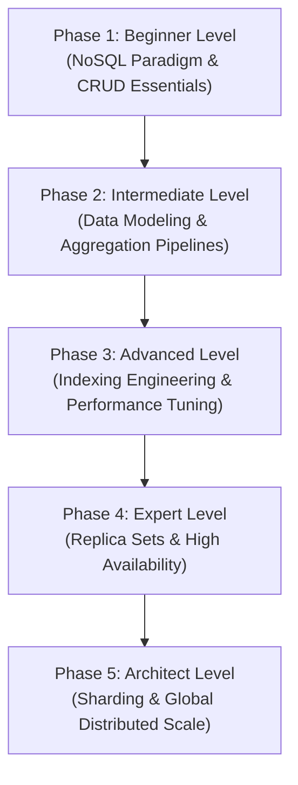

# MongoDB: The Complete Beginner-to-NoSQL Database Architect Masterclass

**MongoDB** is a document-oriented, open-source NoSQL database designed to handle massive volumes of data, horizontal scalability, and flexible data models. Instead of using tables and rows like traditional relational databases, MongoDB stores data in dynamic, self-describing documents called BSON (Binary JSON). 

This masterclass begins with the foundational NoSQL paradigms, guides you through sophisticated schema modeling patterns and the powerful aggregation framework, and ascends to advanced replica sets, indexing engineering, high-throughput sharding architectures, and enterprise database administration.

---

## 🗺️ The MongoDB Database Architect Roadmap



| Phase | Target Role | Key Focus Area | Capstone Project |
| :--- | :--- | :--- | :--- |
| **Phase 1: Beginner** | Junior Developer | BSON vs JSON, basic CRUD operations, query filters, update operators. | Normalized and embedded user profile document schema |
| **Phase 2: Intermediate** | Software Engineer | Embedding vs. Referencing, 1:N & N:M modeling, Aggregation pipelines. | E-commerce multi-stage analytics pipeline |
| **Phase 3: Advanced** | Performance Engineer | Compound indexes, Covered queries, Explain Plan profiling, Consistency levels. | Multi-index optimization suite for search operations |
| **Phase 4: Expert** | Devops/SRE Engineer | Replica Sets, election mechanics, oplog tuning, read preference routing. | High-availability multi-node local replica set |
| **Phase 5: Architect** | Database Architect | Sharding cluster topologies, Shard keys, config servers, mongos, RBAC & Backup. | Multi-shard horizontally scaled enterprise DB infrastructure |

---

## 🚀 Phase 1: Beginner Level (NoSQL Paradigm & CRUD Essentials)

### 1. What is MongoDB?

#### 💡 The File Folder Analogy:
Imagine an office **filing room**:
*   **The Database (Filing Room)**: The high-level physical room containing related filing cabinets.
*   **The Collection (Filing Cabinet)**: A cabinet representing a category (e.g., "Customers" or "Orders").
*   **The Document (File Folder)**: Inside the cabinet are individual paper folders.
*   **The Fields (Key-Value Forms)**: Inside each paper folder, instead of a rigid pre-printed sheet where empty cells are blocked, you can have custom forms. Alice's folder might contain a printed name, phone, and list of hobbies. Bob's folder might contain his name, email, and three addresses. The folders are stored in the same cabinet, but they do not have to conform to the exact same fields.

MongoDB is that digital folder collection. Relational databases force you to predefine tables (like rigid spreadsheets) and crash if you insert values into a column that doesn't exist. MongoDB gives you the power of **dynamic schemas**—ideal for rapidly changing data structures, content management, polymorphic structures, and agile microservices.

---

### 2. JSON vs BSON

While you write queries and view documents in **JSON** (JavaScript Object Notation), MongoDB stores them internally in **BSON** (Binary JSON).

```
JSON (Human-readable text)                  BSON (Optimized binary representation)
{                                           Length indicator (4 bytes)
  "name": "Alice",          =======>        Type identifier (e.g., 0x02 for String)
  "age": 28                                 Key ("name\0") + Value ("Alice\0")
}                                           Type identifier (e.g., 0x10 for 32-bit Int)
                                            Key ("age\0") + Value (0x0000001C)
                                            Document Terminator (0x00)
```

| Feature | JSON | BSON |
| :--- | :--- | :--- |
| **Readability** | Human-readable text format. | Binary encoded format (machine-optimized). |
| **Storage Speed** | Slower to parse and serialize. | High-speed traversal, skipping unneeded elements. |
| **Supported Types** | Basic: Strings, Numbers, Booleans, Null, Objects, Arrays. | Rich: `Date`, `ObjectId` (12-byte), `Decimal128`, `BinData`, `Int32`, `Int64`. |
| **Space Efficiency** | Standard text size overhead. | Slightly larger space overhead due to length headers, but fast for search. |

---

### 3. Core CRUD Operations

Here are the fundamental commands for creating, reading, updating, and deleting documents in the MongoDB Shell (`mongosh`):

```javascript
// 1. CREATE: Insert a single document into the "users" collection
db.users.insertOne({
  name: "Alice Smith",
  email: "alice@example.com",
  age: 28,
  skills: ["JavaScript", "Node.js"],
  status: "active",
  created_at: new Date()
});

// 2. READ: Query users older than 25 who have "JavaScript" skill
db.users.find({
  age: { $gt: 25 },
  skills: "JavaScript"
}, { name: 1, email: 1, _id: 0 }); // Projection: Return name & email, exclude _id

// 3. UPDATE: Add a new skill and update status
db.users.updateOne(
  { email: "alice@example.com" },
  { 
    $set: { status: "verified" },
    $push: { skills: "MongoDB" }
  }
);

// 4. DELETE: Remove suspended users
db.users.deleteMany({ status: "suspended" });
```

---

## 🛠️ Phase 2: Intermediate Level (Data Modeling & Aggregation Pipelines)

### 1. Data Modeling: Embedded vs References

In relational databases, you always normalize tables and join them. In MongoDB, you design schemas based on how your application reads and writes data. You have two options: **Embedded Documents (Denormalization)** and **References (Normalization)**.

#### a) Embedding (Denormalization)
*Rule: Nest related data directly inside the parent document. Best for 1:1 or bounded 1:N relationships where child data is always read together with parent.*

```json
{
  "_id": ObjectId("60d5ec40f8"),
  "title": "Clean Code Book",
  "author": "Robert C. Martin",
  "publisher": {
    "name": "Prentice Hall",
    "location": "New Jersey"
  }
}
```
*   **Pros**: Ultra-fast reads (single-query lookup, no joins), atomic updates on the whole document.
*   **Cons**: Document size limit is **16MB**. Unbounded arrays (e.g. infinite comments on a blog post) will bloat and corrupt the document memory structure.

#### b) Referencing (Normalization)
*Rule: Keep documents separate and reference them using an `_id` link. Best for unbound 1:N relationships or N:M relationships.*

```json
// Table: authors
{ "_id": ObjectId("507f1f77b1"), "name": "Robert C. Martin" }

// Table: books (references authors)
{
  "_id": ObjectId("60d5ec40f8"),
  "title": "Clean Code Book",
  "author_id": ObjectId("507f1f77b1")
}
```
*   **Pros**: Solves document bloat (avoids 16MB limit), reduces data duplication, keeps separate entities isolated.
*   **Cons**: Requires application-level joins or server-side `$lookup` aggregations, which incur memory and CPU performance costs.

---

### 2. The Aggregation Framework

The **Aggregation Framework** is MongoDB’s query processing powerhouse, allowing you to build multi-stage transformation pipelines to analyze data on the fly.

#### 💡 The Conveyor Belt Analogy:
Imagine an **assembly line conveyor belt**:
1.  **Raw Materials (`$match`)**: You filter out defective items, keeping only specific ones.
2.  **Repackaging (`$project`)**: You rename labels, remove useless components, or add a calculated sticker.
3.  **Unbundling (`$unwind`)**: You open a boxed array set of three components and spread them onto the belt as three individual items.
4.  **Grouping (`$group`)**: You count and bundle all identical items by color, calculating average weights.
5.  **Sorting & Shipping (`$sort` / `$out`)**: You sort them by size and pack them into a new crate on disk.

```
Raw Docs ────────▶ [ $match ] ──(Filtered)──▶ [ $unwind ] ──(Flattened Arrays)──▶ [ $group ] ──(Aggregated)──▶ Results
```

#### Real-World Example:
Calculate total sales revenue and average items sold per category from active orders:

```javascript
db.orders.aggregate([
  // Stage 1: Match active orders only
  { $match: { status: "completed" } },
  
  // Stage 2: Unwind the items array so we can process each item separately
  { $unwind: "$items" },
  
  // Stage 3: Group by item category and compute metrics
  { 
    $group: {
      _id: "$items.category",
      totalRevenue: { $sum: { $multiply: ["$items.price", "$items.quantity"] } },
      avgQuantity: { $avg: "$items.quantity" },
      itemCount: { $sum: 1 }
    }
  },
  
  // Stage 4: Sort by total revenue descending
  { $sort: { totalRevenue: -1 } }
]);
```

---

### 3. Transactions & ACID Compliance

Since version 4.0, MongoDB supports multi-document ACID transactions across replica sets (and sharded clusters in 4.2+). Transactions are wrapped in a session:

```javascript
const session = db.getMongo().startSession();
session.startTransaction();

try {
  // Step 1: Deduct balance from User A
  db.accounts.updateOne(
    { name: "User A", balance: { $gte: 100 } },
    { $inc: { balance: -100 } },
    { session }
  );

  // Step 2: Add balance to User B
  db.accounts.updateOne(
    { name: "User B" },
    { $inc: { balance: 100 } },
    { session }
  );

  session.commitTransaction();
  console.log("Transaction committed successfully!");
} catch (error) {
  session.abortTransaction();
  console.error("Transaction aborted due to error:", error);
} finally {
  session.endSession();
}
```

---

## ⚡ Phase 3: Advanced Level (Indexing Engineering & Performance Tuning)

### 1. B-Tree Indexes Internals

MongoDB utilizes **WiredTiger** storage engine, which maps indexes using standard B-Trees to keep query retrieval paths short.

#### Compound Indexes and the ESR (Equality, Sort, Range) Rule
A compound index is an index on multiple fields (e.g. `db.users.createIndex({ status: 1, age: 1 })`).
When creating compound indexes, always order fields using the **ESR rule**:
1.  **E**quality fields first: Fields being filtered with exact matches (e.g. `status: "active"`).
2.  **S**ort fields second: Fields used in the `.sort()` specification (e.g. `created_at: -1`).
3.  **R**ange fields last: Fields filtered with comparison operators (e.g. `age: { $gt: 25 }`).

```javascript
// Index Design corresponding to ESR rule:
db.orders.createIndex({ customer_id: 1, order_date: 1, total: 1 });
// Match Query:
db.orders.find({ customer_id: "C123", total: { $gt: 50 } }).sort({ order_date: -1 });
```

---

### 2. Query Profiling (`explain("executionStats")`)

Before optimizing queries, inspect their footprint via `.explain()`:

```javascript
db.orders.find({ status: "pending", total: { $gt: 200 } }).explain("executionStats");
```

#### Key Output Parameters to Monitor:
*   **stage**: Look for `IXSCAN` (Index Scan). If it says `COLLSCAN`, a full collection scan occurred, reading every single document from disk. This is highly unoptimized!
*   **nReturned**: The number of documents that matched the query and were returned to the user.
*   **totalKeysExamined**: The number of index entries scanned. In an optimized system, `totalKeysExamined` should match or be close to `nReturned`.
*   **totalDocsExamined**: The number of actual documents read from disk. If this is high and `nReturned` is low, your query is scanning too many physical pages.

---

### 3. Write Concerns and Read Concerns

To tune data consistency and system performance, MongoDB offers fine-grained configurations.

#### Write Concerns:
Controls the level of write verification before returning a success code.
*   `w: 1`: Returns success as soon as the **Primary node** writes data to memory/disk. High-performance, but data can be lost if Primary crashes before syncing to secondary nodes.
*   `w: "majority"`: Returns success only after a majority of replica set nodes have confirmed the write. Eliminates data loss risks.
*   `j: true`: Enforces writing changes to the journal file on disk before returning success, ensuring crash safety.

#### Read Concerns:
Controls the consistency and isolation of read data.
*   `local` / `available`: Returns data immediately from the node queried. High risk of dirty reads (reading data that gets rolled back later).
*   `majority`: Returns data verified by a majority of nodes. Prevents dirty reads.
*   `linearizable`: Reads wait for all nodes to agree, guaranteeing you will never read stale data, but with a high performance latency.

---

## 🧬 Phase 4: Expert Level (Replica Sets & High Availability)

### 1. Replica Set Architecture

To prevent a single point of failure, production databases use a **Replica Set**—a cluster of mongod instances maintaining the same dataset.

```
                       ┌─────────────────────────┐
                       │      PRIMARY NODE       │ (Receives all writes)
                       │       (R/W Port)        │
                       └─────────┬───────────────┘
                                 │
                 Heartbeats      │   Replication Logs (oplog)
               (Consensus Ping)  │
                                 ▼
         ┌───────────────────────┴───────────────────────┐
         ▼                                               ▼
┌──────────────────┐                            ┌──────────────────┐
│ SECONDARY NODE A │                            │ SECONDARY NODE B │
│  (Read-Only Sync)│                            │  (Read-Only Sync)│
└──────────────────┘                            └──────────────────┘
```

#### Key Components:
1.  **Primary**: The single leader node that accepts all write operations. Writes are logged to the primary's **oplog (operation log)**.
2.  **Secondaries**: Follower nodes that continually pull and replay the primary's `oplog` to remain synchronized. Secondaries can serve read requests.
3.  **Arbiter**: A node that does not store data. Its sole purpose is to act as a tie-breaker vote during elections to select a new primary if the current primary crashes.

#### Elections & Failover:
Nodes communicate via heartbeat pings every **2 seconds**. If the Primary fails to respond within **10 seconds**, the secondaries trigger an election using a Raft-based consensus protocol. The secondary with the most up-to-date oplog is promoted to be the new Primary automatically.

---

### 2. Read Preferences

By default, drivers route all read requests to the Primary node. You can change this behavior via **Read Preferences**:

*   `primary`: (Default) All reads go to the Primary. Throws error if Primary is down.
*   `primaryPreferred`: Reads go to Primary, but fall back to Secondaries if Primary is down.
*   `secondary`: All reads go to Secondaries (used to scale read operations).
*   `secondaryPreferred`: Reads go to Secondaries, but fall back to Primary if none are available.
*   `nearest`: Reads go to the node with the lowest network latency, regardless of its primary/secondary role.

---

## 🏛️ Phase 5: Database Architect Level (Sharding & Global Distributed Scale)

### 1. Horizontal Scaling via Sharding

When data grows beyond a single server's disk space, RAM, or CPU limit, you must scale horizontally using **Sharding** (partitioning data across multiple independent database servers).

```
                            ┌────────────────────────┐
                            │    CLIENT APPLICATION  │
                            └───────────┬────────────┘
                                        │
                                        ▼
                            ┌────────────────────────┐
                            │     mongos ROUTER      │ (Stateless Query Router)
                            └─────┬────────────┬─────┘
                                  │            │
            ┌─────────────────────┘            └─────────────────────┐
            ▼                                                        ▼
┌──────────────────────┐                                 ┌──────────────────────┐
│     SHARD A SET      │                                 │     SHARD B SET      │
│  (Holds range A-M)   │                                 │  (Holds range N-Z)   │
└──────────────────────┘                                 └──────────────────────┘
            ▲                                                        ▲
            └─────────────────── Config Servers ─────────────────────┘
                                (Metadata map)
```

#### Sharding Components:
1.  **Shards**: Replica sets containing a subset of the total dataset (e.g. Shard A holds user IDs A-M, Shard B holds N-Z).
2.  **Config Servers**: A dedicated replica set that stores the metadata and routing maps for the entire cluster (defines which shard holds which range of data).
3.  **Query Router (`mongos`)**: A stateless proxy instance that interfaces with client applications. When a client executes a query, `mongos` looks up the route map on the Config Servers and routes the query directly to the correct shard.

---

### 2. Choosing a Shard Key

The **Shard Key** is the field(s) that determines how documents are distributed across shards. Choosing the wrong shard key can ruin database performance and is extremely difficult to change.

#### a) Ranged Sharding
*Uses a continuous field (e.g., date, ID).*
*   **Pros**: Highly efficient for ranged queries (e.g., fetching logs from May).
*   **Cons**: Creates write bottlenecks. If your key is an auto-incrementing ID or timestamp, every *new* write goes to the exact same "highest value" shard, overloading a single machine.

#### b) Hashed Sharding
*Computes an MD5 hash of the shard key field to distribute writes randomly.*
*   **Pros**: Guarantees perfectly uniform write distribution.
*   **Cons**: Terrible for ranged queries. Finding users with IDs between 100 and 200 will force `mongos` to broadcast the query to every single shard in the cluster.

---

### 3. Enterprise Database Administration & Recovery

#### Disaster Recovery (`mongodump` & `mongorestore`)
Use these utility tools to take raw binary backups of database collections:

```bash
# 1. Back up database "e_commerce" to a compressed directory
mongodump --host="mongodb.example.com" --port=27017 --db=e_commerce --gzip --out=/backups/nightly/

# 2. Restore database backup
mongorestore --host="mongodb.example.com" --port=27017 --db=e_commerce --gzip /backups/nightly/e_commerce/
```

#### Security Best Practices:
*   **Disable Bind IP**: Ensure `bindIp` is locked to local addresses (`127.0.0.1` or internal VPC networks) inside `/etc/mongod.conf` rather than `0.0.0.0` (publicly open).
*   **Enforce Authentication**: Enable security authorization in `mongod.conf`:
    ```yaml
    security:
      authorization: "enabled"
    ```
*   **Enable TLS/SSL**: Force all client connections and internal replica communications to be encrypted using TLS/SSL certs.
