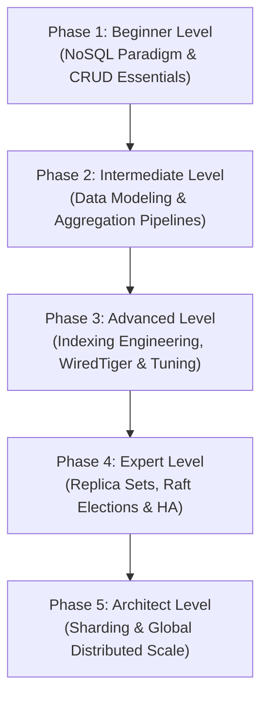

# MongoDB: The Complete Beginner-to-NoSQL Database Architect Masterclass

**MongoDB** is a document-oriented, open-source NoSQL database designed to handle massive volumes of data, horizontal scalability, and flexible data models. Instead of using tables and rows like traditional relational databases, MongoDB stores data in dynamic, self-describing documents called BSON (Binary JSON). 

This masterclass begins with NoSQL paradigms, guides you through sophisticated schema modeling patterns and the powerful aggregation framework, and ascends to advanced replica sets, indexing engineering, WiredTiger storage internals, high-throughput sharding architectures, and enterprise database administration.

---

## 🗺️ The MongoDB Database Architect Roadmap



| Phase | Target Role | Key Focus Area | Capstone Project |
| :--- | :--- | :--- | :--- |
| **Phase 1: Beginner** | Junior Developer | BSON vs JSON, basic CRUD operations, query filters, update operators. | Normalized and embedded user profile document schema |
| **Phase 2: Intermediate** | Software Engineer | Embedding vs. Referencing, Attribute/Extended Reference/Subset/Outlier Patterns, Aggregations. | E-commerce multi-stage analytics pipeline with memory tuning |
| **Phase 3: Advanced** | Performance Engineer | B-Tree index maths, compound ESR rules, WiredTiger engine, cache calculations, Explain Plan profiling. | Multi-index optimization suite and storage cache profiling |
| **Phase 4: Expert** | DevOps/SRE Engineer | Replica Sets, election consensus mechanics, split-brain mitigation, oplog tuning, read preference. | High-availability multi-node local replica set |
| **Phase 5: Architect** | Database Architect | Sharding cluster topologies, Shard keys, config servers, mongos, jumbo chunks, RBAC & Backup. | Multi-shard horizontally scaled enterprise DB infrastructure |

---

## 🚀 Phase 1: Beginner Level (NoSQL Paradigm & CRUD Essentials)

### 1. What is MongoDB?

#### 💡 The File Folder Analogy:
Imagine an office **filing room**:
*   **The Database (Filing Room)**: The high-level physical room containing related filing cabinets.
*   **The Collection (Filing Cabinet)**: A cabinet representing a category (e.g., "Customers" or "Orders").
*   **The Document (File Folder)**: Inside the cabinet are individual paper folders.
*   **The Fields (Key-Value Forms)**: Inside each paper folder, instead of a rigid pre-printed sheet where empty cells are blocked, you can have custom forms. Alice's folder might contain a printed name, phone, and list of hobbies. Bob's folder might contain his name, email, and three addresses. The folders are stored in the same cabinet, but they do not have to conform to the exact same fields.

MongoDB is that digital folder collection. Relational databases force you to predefine tables (like rigid spreadsheets) and crash if you insert values into a column that doesn't exist. MongoDB gives you the power of **dynamic schemas**—ideal for rapidly changing data structures, content management, polymorphic structures, and agile microservices.

---

### 2. JSON vs BSON

While you write queries and view documents in human-readable **JSON** (JavaScript Object Notation), MongoDB stores them internally in **BSON** (Binary JSON).

```
JSON (Human-readable text)                  BSON (Optimized binary representation)
{                                           Length indicator (4 bytes)
  "name": "Alice",          =======>        Type identifier (e.g., 0x02 for String)
  "age": 28                                 Key ("name\0") + Value ("Alice\0")
}                                           Type identifier (e.g., 0x10 for 32-bit Int)
                                            Key ("age\0") + Value (0x0000001C)
                                            Document Terminator (0x00)
```

| Feature | JSON | BSON |
| :--- | :--- | :--- |
| **Readability** | Human-readable text format. | Binary encoded format (machine-optimized). |
| **Storage Speed** | Slower to parse and serialize. | High-speed traversal, skipping unneeded elements. |
| **Supported Types** | Basic: Strings, Numbers, Booleans, Null, Objects, Arrays. | Rich: `Date`, `ObjectId` (12-byte), `Decimal128`, `BinData`, `Int32`, `Int64`. |
| **Space Efficiency** | Standard text size overhead. | Slightly larger space overhead due to length headers, but fast for search. |

---

### 3. Core CRUD Operations

Here are the fundamental commands for creating, reading, updating, and deleting documents in the MongoDB Shell (`mongosh`):

```javascript
// 1. CREATE: Insert a single document into the "users" collection
db.users.insertOne({
  name: "Alice Smith",
  email: "alice@example.com",
  age: 28,
  skills: ["JavaScript", "Node.js"],
  status: "active",
  created_at: new Date()
});

// 2. READ: Query users older than 25 who have "JavaScript" skill
db.users.find({
  age: { $gt: 25 },
  skills: "JavaScript"
}, { name: 1, email: 1, _id: 0 }); // Projection: Return name & email, exclude _id

// 3. UPDATE: Add a new skill and update status
db.users.updateOne(
  { email: "alice@example.com" },
  { 
    $set: { status: "verified" },
    $push: { skills: "MongoDB" }
  }
);

// 4. DELETE: Remove suspended users
db.users.deleteMany({ status: "suspended" });
```

---

## 🛠️ Phase 2: Intermediate Level (Data Modeling & Aggregation Pipelines)

### 1. Data Modeling: Embedded vs References

In relational databases, you always normalize tables and join them. In MongoDB, you design schemas based on how your application reads and writes data. You have two options: **Embedded Documents (Denormalization)** and **References (Normalization)**.

#### a) Embedding (Denormalization)
*Rule: Nest related data directly inside the parent document. Best for 1:1 or bounded 1:N relationships where child data is always read together with parent.*

```json
{
  "_id": ObjectId("60d5ec40f8"),
  "title": "Clean Code Book",
  "author": "Robert C. Martin",
  "publisher": {
    "name": "Prentice Hall",
    "location": "New Jersey"
  }
}
```
*   **Pros**: Ultra-fast reads (single-query lookup, no joins), atomic updates on the whole document.
*   **Cons**: Document size limit is **16MB**. Unbounded arrays (e.g., infinite comments on a blog post) will bloat and corrupt the document memory structure.

#### b) Referencing (Normalization)
*Rule: Keep documents separate and reference them using an `_id` link. Best for unbound 1:N relationships or N:M relationships.*

```json
// Table: authors
{ "_id": ObjectId("507f1f77b1"), "name": "Robert C. Martin" }

// Table: books (references authors)
{
  "_id": ObjectId("60d5ec40f8"),
  "title": "Clean Code Book",
  "author_id": ObjectId("507f1f77b1")
}
```
*   **Pros**: Solves document bloat (avoids 16MB limit), reduces data duplication, keeps separate entities isolated.
*   **Cons**: Requires application-level joins or server-side `$lookup` aggregations, which incur memory and CPU performance costs.

---

### 2. Four Advanced NoSQL Schema Design Patterns

To build resilient, highly scalable enterprise applications, architects must apply specialized schema design patterns to solve common scaling problems:

#### Pattern A: The Attribute Pattern
**The Problem**: A product catalog where products have hundreds of different specifications (e.g., power output, screen size, thread count, height, color). Creating indexes for every possible property creates massive index bloating and degrades write performance.

**The Solution**: Group polymorphic fields into an array of key-value documents. This allows you to index a single array path and perform fast searches across all attributes using one compound index.

```json
// BEFORE: Hard to index hundreds of potential properties
{
  "title": "Industrial Blender",
  "color": "Silver",
  "max_power": "1500W",
  "speed_settings": 10
}

// AFTER (Attribute Pattern): Indexed with db.products.createIndex({ "specs.k": 1, "specs.v": 1 })
{
  "title": "Industrial Blender",
  "specs": [
    { "k": "color", "v": "Silver" },
    { "k": "max_power", "v": "1500W" },
    { "k": "speed_settings", "v": 10 }
  ]
}
```

#### Pattern B: The Extended Reference Pattern
**The Problem**: A microservices system where the Order service needs to show the customer's name on an invoice. If we keep the Order normalized, we must run a `$lookup` join to the Customer collection for every order read. If our orders grow to millions, this join halts performance.

**The Solution**: Instead of fully normalizing or fully embedding, copy a small, stable subset of the customer data (e.g., `_id` and `name`) directly inside the Order document. If the customer changes their name, sync it asynchronously.

```json
// E-Commerce Order Document containing Extended Reference
{
  "_id": ObjectId("60f81d11f7"),
  "order_date": "2026-05-28T14:00:00Z",
  "total_amount": 299.99,
  "customer": {
    "_id": ObjectId("507f1f77b1"),
    "name": "Jane Doe" 
  }
}
```

#### Pattern C: The Subset Pattern
**The Problem**: An e-commerce system where products have millions of reviews. Embedding all reviews in the product document exceeds the 16MB BSON document limit. However, referencing reviews in a separate collection forces an expensive read join for the product detail page, which only displays the 10 most recent reviews.

**The Solution**: Split the relationship. Embed the 10 most recent reviews (the active subset) inside the main Product document. Store the historical reviews in a separate `reviews` collection.

```
+---------------------------------------+
|          PRODUCT DOCUMENT             |
|  _id: 123, name: "Sleek Headphones"   |
|  [Embed: 10 Recent Reviews]           |
+---------------------------------------+
                   |
     Split / Overflow Archiving
                   |
                   ▼
+---------------------------------------+
|          REVIEWS COLLECTION           |
|  _id: 999, product_id: 123            |
|  [Archive: Millions of Past Reviews]  |
+---------------------------------------+
```

```json
// Product Document storing only the recent subset
{
  "_id": ObjectId("60f81d5501"),
  "name": "Sleek Headphones",
  "price": 199.99,
  "recent_reviews": [
    { "author": "Alice", "rating": 5, "body": "Incredible!", "date": "2026-05-28" },
    { "author": "Bob", "rating": 4, "body": "Excellent", "date": "2026-05-27" }
  ]
}
```

#### Pattern D: The Outlier Pattern
**The Problem**: A social media platform where 99.9% of books, movies, or influencers have a standard number of followers or reviews (e.g., 50 to 500), which can easily be embedded. However, a few outliers (e.g., a viral book like "Harry Potter" or a celebrity profile) have millions of linked items. Designing the database for the 0.1% outlier causes massive performance loss for the standard 99.9% pages.

**The Solution**: Embed the linked data as normal, but add an `has_outliers` flag. If the array hits a threshold (e.g., 1000 items), write new items to an overflow collection linked via `_id` references.

```json
// The Outlier Parent Document (Harry Potter)
{
  "_id": ObjectId("60f81d9990"),
  "title": "Harry Potter and the Sorcerer's Stone",
  "author": "J.K. Rowling",
  "has_outliers": true,
  "embedded_reviews": [
    { "author": "Reviewer 1", "comment": "Great book!" }
  ]
}

// Outlier Overflow Document
{
  "_id": ObjectId("60f81d9991"),
  "parent_id": ObjectId("60f81d9990"),
  "extra_reviews": [
    { "author": "Reviewer 99999", "comment": "Life changing!" }
  ]
}
```

---

### 3. The Aggregation Framework

The **Aggregation Framework** is MongoDB’s query processing engine, allowing you to build multi-stage pipeline transformations to analyze data on the fly.

```
Raw Docs ────────▶ [ $match ] ──(Filtered)──▶ [ $unwind ] ──(Flattened Arrays)──▶ [ $group ] ──(Aggregated)──▶ Results
```

#### Real-World Example:
Calculate total sales revenue and average items sold per category from active orders:

```javascript
db.orders.aggregate([
  // Stage 1: Match active orders only (Utilizes indexes if placed first)
  { $match: { status: "completed" } },
  
  // Stage 2: Unwind the items array to process each item as an individual document
  { $unwind: "$items" },
  
  // Stage 3: Group by item category and compute metrics
  { 
    $group: {
      _id: "$items.category",
      totalRevenue: { $sum: { $multiply: ["$items.price", "$items.quantity"] } },
      avgQuantity: { $avg: "$items.quantity" },
      itemCount: { $sum: 1 }
    }
  },
  
  // Stage 4: Sort by total revenue descending
  { $sort: { totalRevenue: -1 } }
]);
```

#### Aggregation Pipeline Optimizations & Index Usage
1.  **Index Prefixes**: Indexes can only be utilized by the aggregation engine if the initial stages are `$match` and `$sort`. If you put `$unwind`, `$project`, or `$group` before `$match`, MongoDB must scan all collections into RAM, bypassing indexes.
2.  **Projection Pruning**: MongoDB internally analyzes your aggregation pipeline to fetch only the fields required for downstream stages, reducing system network and CPU constraints.

#### The 100MB In-Memory Sort Limit and `$allowDiskUse`
By default, aggregation pipeline stages that require sorting (`$sort`) or grouping (`$group`) will fail and halt execution if they consume more than **100MB of RAM**.

*   **The Cause**: MongoDB attempts to execute all transformations in memory to maintain maximum speed. However, sorting massive datasets requires creating temporary buffer pages.
*   **The Remedy**: Enable `$allowDiskUse` by setting the configuration parameter to `true`. This tells the engine to write temporary block files to the `_tmp` directory on the server disk if the 100MB threshold is breached.
*   **The Cost**: Writing to disk incurs physical SSD/HDD I/O latency, which can degrade performance by a factor of 10x or 100x. Ensure proper compound indexes are placed upstream to pre-sort data before it enters the aggregation pipeline.

```javascript
// Running a heavy aggregation with Disk Overflow enabled
db.orders.aggregate([
  { $match: { order_date: { $gte: ISODate("2020-01-01T00:00:00Z") } } },
  { $group: { _id: "$customer_id", total_spent: { $sum: "$total_amount" } } },
  { $sort: { total_spent: -1 } }
], { allowDiskUse: true }); // Bypasses the 100MB block limit
```

---

### 4. Transactions & ACID Compliance

Since version 4.0, MongoDB supports multi-document ACID transactions across replica sets (and sharded clusters in 4.2+). Transactions are wrapped in a session:

```javascript
const session = db.getMongo().startSession();
session.startTransaction();

try {
  // Step 1: Deduct balance from User A
  db.accounts.updateOne(
    { name: "User A", balance: { $gte: 100 } },
    { $inc: { balance: -100 } },
    { session }
  );

  // Step 2: Add balance to User B
  db.accounts.updateOne(
    { name: "User B" },
    { $inc: { balance: 100 } },
    { session }
  );

  session.commitTransaction();
  console.log("Transaction committed successfully!");
} catch (error) {
  session.abortTransaction();
  console.error("Transaction aborted due to error:", error);
} finally {
  session.endSession();
}
```

---

## ⚡ Phase 3: Advanced Level (Indexing Engineering, WiredTiger & Tuning)

### 1. B-Tree Indexes Internals

MongoDB utilizes **WiredTiger** storage engine, which maps indexes using standard B-Trees to keep query retrieval paths short.

```
                    [ Root Node ]
                   /             \
             [ Internal ]       [ Internal ]
            /            \     /            \
          [Leaf]        [Leaf] [Leaf]      [Leaf]  <-- Contain BSON keys + disk byte-offset pointers
```

#### Traversal Mathematics
A B-Tree index has a branching factor (order) $B$. For $N$ documents, the depth of the index is bounded by $O(\log_B N)$. Under average configurations, finding any individual document out of 100 million records requires traversing only 3 to 4 node levels in memory before resolving the physical storage location on disk, bypassing the slow $O(N)$ linear table scans.

#### Compound Indexes and the ESR (Equality, Sort, Range) Rule
A compound index is an index on multiple fields (e.g., `db.users.createIndex({ status: 1, age: 1 })`).
When creating compound indexes, always order fields using the **ESR rule**:
1.  **E**quality fields first: Fields being filtered with exact matches (e.g., `status: "active"`).
2.  **S**ort fields second: Fields used in the `.sort()` specification (e.g., `created_at: -1`).
3.  **R**ange fields last: Fields filtered with comparison operators (e.g., `age: { $gt: 25 }`).

```javascript
// Index Design corresponding to ESR rule:
db.orders.createIndex({ customer_id: 1, order_date: 1, total: 1 });

// Match Query:
db.orders.find({ customer_id: "C123", total: { $gt: 50 } }).sort({ order_date: -1 });
```

#### Why standardizing on ESR works:
If you put the Range field before the Sort field, the index scan must read all range elements across different nodes, preventing the index from returning the documents in pre-sorted order. The database is then forced to perform an expensive **In-Memory Sort (In-Memory Sort Stage)**.

---

### 2. Query Profiling (`explain("executionStats")`)

Before optimizing queries, inspect their footprint via `.explain()`:

```javascript
db.orders.find({ status: "pending", total: { $gt: 200 } }).explain("executionStats");
```

#### Key Output Parameters to Monitor:
*   **stage**: Look for `IXSCAN` (Index Scan). If it says `COLLSCAN`, a full collection scan occurred, reading every single document from disk. This is highly unoptimized.
*   **nReturned**: The number of documents that matched the query and were returned to the user.
*   **totalKeysExamined**: The number of index entries scanned. In an optimized system, `totalKeysExamined` should match or be close to `nReturned`.
*   **totalDocsExamined**: The number of actual documents read from disk. If this is high and `nReturned` is low, your query is scanning too many physical pages.

```json
// Example Optimized Explain Plan output snippet
{
  "queryPlanner": {
    "winningPlan": {
      "stage": "FETCH",
      "inputStage": {
        "stage": "IXSCAN",
        "keyPattern": { "status": 1, "total": 1 }
      }
    }
  },
  "executionStats": {
    "nReturned": 50,
    "totalKeysExamined": 50,
    "totalDocsExamined": 50
  }
}
```

---

### 3. WiredTiger Storage Engine Architecture

The **WiredTiger** storage engine handles all disk I/O, compression, caching, and serialization inside modern MongoDB deployments.

#### a) Document-Level Locking (Concurrency Control)
*   **The Mechanism**: WiredTiger uses **Optimistic Concurrency Control (OCC)**. Instead of locking an entire database or collection during writes (which causes query queuing), WiredTiger writes directly at the document level.
*   **Conflict Resolution**: When two concurrent write operations attempt to mutate the exact same document, WiredTiger detects the conflict, transparently rolls back one of the operations, and retries it. This architecture provides high-throughput parallel write execution.

#### b) Journaling (Durability write-ahead logging)
*   **The Process**: MongoDB writes all mutations to the WiredTiger **Memory Cache** first. To prevent data loss in the event of sudden power failure, WiredTiger maintains a **Journal**—a write-ahead log stored on disk.
*   **Commit Interval**: Every 100ms (or immediately on configuring write concern `{ j: true }`), WiredTiger flushes memory mutations to the physical Journal. In the event of a crash, the database recovers by parsing the Journal and replaying changes to reconstruct the clean state.

```
Mutation ──▶ [ WiredTiger Memory Cache ] ──(Every 60s Checkpoint)──▶ [ Data Files (Disk) ]
                   │
         (Every 100ms or on j:true)
                   │
                   ▼
         [ Journal Log (Disk) ]
```

#### c) Storage Memory Cache Configurations
WiredTiger maintains its own dedicated memory cache separate from standard OS buffers.
*   **The Formula**: By default, WiredTiger reserves the larger of:
    $$\text{Cache Size} = 50\% \times (\text{RAM} - 1\text{GB})$$
    or $256\text{MB}$.
*   **Production Sizing Warning**: Sizing this cache incorrectly (e.g., letting other applications like Node.js run on the same virtual machine without limiting their memory footings) will cause the OS memory pages to overflow. This leads to heavy VM swapping or invokes the **OOM (Out Of Memory) Killer** daemon which abruptly terminates the database server.
*   **Configuration (`mongod.conf`)**:
    ```yaml
    storage:
      wiredTiger:
        engineConfig:
          cacheSizeGB: 8  # Dedicated allocation for a 17GB RAM database server
    ```

---

### 4. Write Concerns and Read Concerns

To tune data consistency and system performance, MongoDB offers fine-grained configurations.

#### Write Concerns:
Controls the level of write verification before returning a success code.
*   `w: 1`: Returns success as soon as the **Primary node** writes data to memory/disk. High-performance, but data can be lost if Primary crashes before syncing to secondary nodes.
*   `w: "majority"`: Returns success only after a majority of replica set nodes have confirmed the write. Eliminates data loss risks.
*   `j: true`: Enforces writing changes to the journal file on disk before returning success, ensuring crash safety.

#### Read Concerns:
Controls the consistency and isolation of read data.
*   `local` / `available`: Returns data immediately from the node queried. High risk of dirty reads (reading data that gets rolled back later).
*   `majority`: Returns data verified by a majority of nodes. Prevents dirty reads.
*   `linearizable`: Reads wait for all nodes to agree, guaranteeing you will never read stale data, but with a high performance latency.

---

## 🧬 Phase 4: Expert Level (Replica Sets & High Availability)

### 1. Replica Set Architecture

To prevent a single point of failure, production databases use a **Replica Set**—a cluster of mongod instances maintaining the same dataset.

```
                       ┌─────────────────────────┐
                       │      PRIMARY NODE       │ (Receives all writes)
                       │       (R/W Port)        │
                       └─────────┬───────────────┘
                                 │
                 Heartbeats      │   Replication Logs (oplog)
               (Consensus Ping)  │
                                 ▼
         ┌───────────────────────┴───────────────────────┐
         ▼                                               ▼
 ┌──────────────────┐                            ┌──────────────────┐
 │ SECONDARY NODE A │                            │ SECONDARY NODE B │
 │  (Read-Only Sync)│                            │  (Read-Only Sync)│
 └──────────────────┘                            └──────────────────┘
```

#### Key Components:
1.  **Primary**: The single leader node that accepts all write operations. Writes are logged to the primary's **oplog (operation log)**.
2.  **Secondaries**: Follower nodes that continually pull and replay the primary's `oplog` to remain synchronized. Secondaries can serve read requests.
3.  **Arbiter**: A node that does not store data. Its sole purpose is to act as a tie-breaker vote during elections to select a new primary if the current primary crashes.

---

### 2. High-Availability: Raft consensus elections & Heartbeats

#### Heartbeat Intervals
Replica set members send ping heartbeats to one another every **2 seconds**. If a secondary node does not receive a heartbeat response from the primary within **10 seconds** (`electionTimeoutMillis`), it marks the primary as offline and triggers an election.

#### Raft Consensus & Majority Voting Math
MongoDB replica sets use a consensus mechanism derived from the Raft protocol. To elect or maintain a Primary, a candidate node must obtain votes from a strict **majority** of the active replica set voting members:

$$\text{Majority Requirement} = \left\lfloor \frac{N}{2} \right\rfloor + 1$$

Where $N$ is the total number of voting members in the replica set configuration.

| Total Voting Members ($N$) | Votes Needed for Majority |
| :--- | :--- |
| **3** | 2 |
| **5** | 3 |
| **7** | 4 |

#### Split-Brain Prevention Scenarios
**Split-Brain** occurs when a network partition cuts a cluster in half, and both sides elect their own primary, leading to silent data corruption when the network reunites. MongoDB prevents split-brain by enforcing the majority voting requirement:

```
               [ Network Partition Boundary ]
   PARTITION A (2 Nodes)           PARTITION B (3 Nodes)
   Nodes: [Secondary A, B]         Nodes: [Primary, Secondary C, D]
   Active Voting: 2/5 (40%)        Active Voting: 3/5 (60%)
   
   Result:                         Result:
   Cannot reach majority (3 votes). Maintains strict majority.
   Demotes itself to Secondary!    Maintains or Elects Primary safely.
```

1.  If the network partitions, Partition A (with only 2 nodes) cannot reach the majority requirement of 3 votes. It is barred from electing a Primary. If a primary was in this partition, it immediately demotes itself to a Secondary.
2.  Partition B (with 3 nodes) maintains a strict majority (60% of the original cluster). It safely keeps or elects its Primary.
3.  When the network partition heals, the nodes in Partition A pull the updated oplog from Partition B's Primary and sync their datasets, maintaining absolute consistency with zero write divergence.

---

### 3. Read Preferences

By default, drivers route all read requests to the Primary node. You can change this behavior via **Read Preferences**:

*   `primary`: (Default) All reads go to the Primary. Throws error if Primary is down.
*   `primaryPreferred`: Reads go to Primary, but fall back to Secondaries if Primary is down.
*   `secondary`: All reads go to Secondaries (used to scale read operations).
*   `secondaryPreferred`: Reads go to Secondaries, but fall back to Primary if none are available.
*   `nearest`: Reads go to the node with the lowest network latency, regardless of its primary/secondary role.

---

## 🏛️ Phase 5: Database Architect Level (Sharding & Global Distributed Scale)

### 1. Horizontal Scaling via Sharding

When data grows beyond a single server's disk space, RAM, or CPU limit, you must scale horizontally using **Sharding** (partitioning data across multiple independent database servers).

```
                            ┌────────────────────────┐
                            │    CLIENT APPLICATION  │
                            └───────────┬────────────┘
                                        │
                                        ▼
                            ┌────────────────────────┐
                            │     mongos ROUTER      │ (Stateless Query Router)
                            └─────┬────────────┬─────┘
                                  │            │
            ┌─────────────────────┘            └─────────────────────┐
            ▼                                                        ▼
┌──────────────────────┐                                 ┌──────────────────────┐
│     SHARD A SET      │                                 │     SHARD B SET      │
│  (Holds range A-M)   │                                 │  (Holds range N-Z)   │
└──────────────────────┘                                 └──────────────────────┘
            ▲                                                        ▲
            └─────────────────── Config Servers ─────────────────────┘
                                (Metadata map)
```

#### Sharding Components:
1.  **Shards**: Replica sets containing a subset of the total dataset (e.g., Shard A holds user IDs A-M, Shard B holds N-Z).
2.  **Config Servers**: A dedicated replica set that stores the metadata and routing maps for the entire cluster (defines which shard holds which range of data).
3.  **Query Router (`mongos`)**: A stateless proxy instance that interfaces with client applications. When a client executes a query, `mongos` looks up the route map on the Config Servers and routes the query directly to the correct shard.

---

### 2. Choosing a Shard Key: Metrics & Optimization

The **Shard Key** determines how the query router distributes documents across the cluster shards. Selecting an incorrect shard key can lead to performance degradation and is highly complex to alter in production.

#### Three Core Shard Key Metrics
1.  **Cardinality**: The total number of unique values the shard key field can produce.
    *   *Low Cardinality* (e.g., `status: ["active", "inactive"]`): Bad choice. MongoDB can only split data into two chunks. Adding 10 shards will not distribute the load, leaving 8 shards idle.
    *   *High Cardinality* (e.g., `user_id` or `uuid`): Good choice. Provides infinite chunk partition targets.
2.  **Write Distribution (Frequency of Key Values)**:
    *   *Monotonically Increasing Keys* (e.g., auto-incrementing integers, ObjectIds, timestamps): Bad choice. Every new write contains a value higher than the previous, routing all new insertions to a single shard (the "hot shard"). This leaves other shards unused for writes.
    *   *Uniform/Hashed Keys*: Good choice. Distributes writes evenly across all shards.
3.  **Query Isolation (Scatter-Gather Mitigation)**:
    *   If your queries frequently filter by `organization_id`, including `organization_id` in the shard key allows `mongos` to isolate and target a single shard (Isolated Query).
    *   If your shard key is `uuid` and you query by `organization_id`, `mongos` does not know which shard holds the data. It must broadcast the query to every shard in the cluster (Scatter-Gather Query), consuming massive system resources.

#### Shard Key Strategies Compared:
| Strategy | Cardinality | Write Distribution | Query Isolation |
| :--- | :--- | :--- | :--- |
| **Ranged Sharding** (e.g., `created_at`) | High | Poor (Creates hot shard) | High (For range queries) |
| **Hashed Sharding** (e.g., `hashed user_id`) | High | Excellent (Uniform spread) | Poor (Forces scatter-gather) |
| **Compound Sharding** (e.g., `{ org_id: 1, user_id: 1 }`) | High | Good (Dynamic routing) | High (For targeted queries) |

#### Chunk Balancers, Splits, and The Jumbo Chunk Problem
*   **Chunk Splits**: MongoDB partitions sharded data into **Chunks** (default size is 64MB). When a chunk exceeds this limit, the config server automatically splits it into two smaller chunks.
*   **The Balancer**: A background process that monitors chunk counts across shards. If one shard holds significantly more chunks than another, the balancer migrates chunks between shards in the background.
*   **The Jumbo Chunk Problem**: A critical performance issue.
    *   *The Cause*: If a chunk exceeds 64MB, but all documents inside that chunk share the **exact same shard key value**, MongoDB cannot find a split point. The chunk is marked as **Jumbo**.
    *   *The Consequence*: The balancer is unable to migrate Jumbo chunks to other shards because they cannot be split. This results in permanent write bottlenecks and uneven disk utilization on the hosting shard.
    *   *The Fix*: You must select a shard key with higher cardinality, or create a compound shard key that adds a unique secondary suffix (e.g., `{ tenant_id: 1, _id: 1 }`).

---

### 3. Enterprise Database Administration & Recovery

#### Disaster Recovery (`mongodump` & `mongorestore`)
Use these utility tools to take raw binary backups of database collections:

```bash
# 1. Back up database "e_commerce" to a compressed directory
mongodump --host="mongodb.example.com" --port=27017 --db=e_commerce --gzip --out=/backups/nightly/

# 2. Restore database backup
mongorestore --host="mongodb.example.com" --port=27017 --db=e_commerce --gzip /backups/nightly/e_commerce/
```

#### Security Best Practices:
*   **Disable Bind IP**: Ensure `bindIp` is locked to local addresses (`127.0.0.1` or internal VPC networks) inside `/etc/mongod.conf` rather than `0.0.0.0` (publicly open).
*   **Enforce Authentication**: Enable security authorization in `mongod.conf`:
    ```yaml
    security:
      authorization: "enabled"
    ```
*   **Enable TLS/SSL**: Force all client connections and internal replica communications to be encrypted using TLS/SSL certs.
