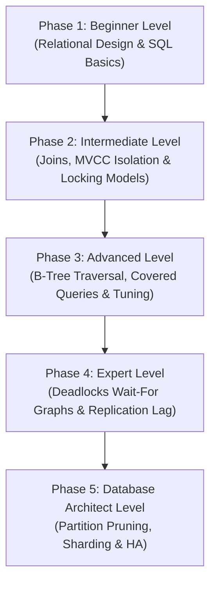

# MySQL: The Complete Beginner-to-Database Architect Masterclass

**MySQL** is an open-source relational database management system (RDBMS) that stores data in structured tables using rows and columns, managed via Structured Query Language (SQL). It is the backbone of major enterprise tech stacks, running transactional databases for companies like Meta, Netflix, and Uber.

This guide starts from relational database design and normalization, then progressively builds through query optimization, indexing internals, transaction concurrency levels, storage engines, replication topologies, and high-availability enterprise database clustering.

---

## 🗺️ The Database Architect Roadmap



| Phase | Target Role | Key Focus Area | Capstone Project |
| :--- | :--- | :--- | :--- |
| **Phase 1: Beginner** | Software Developer | Table normalization (1NF-3NF), keys, standard DML & DDL operations. | Normalized school enrollment schema design |
| **Phase 2: Intermediate** | Backend Developer | Joins, group aggregation, ACID, 4 Isolation Levels under the hood, InnoDB MVCC & Locks. | E-commerce checkout transactional query suite |
| **Phase 3: Advanced** | Performance Engineer | B-Tree traversal mechanics, covered queries, composite index skip-scans, EXPLAIN profiling. | Optimize slow reporting queries with covered indexing |
| **Phase 4: Expert** | Database Engineer | Deadlock wait-for graphs, transactional retry suites, replication lag, multi-threaded slave workers. | Row-level auditing system via Triggers + replication optimizer |
| **Phase 5: Architect** | Database Architect | Table partitioning pruning, multi-master cluster topologies, ProxySQL routing, backups. | Multi-region, high-availability SaaS database gateway |

---

## 🚀 Phase 1: Beginner Level (Relational Design & SQL Fundamentals)

### 1. What is MySQL?

#### 💡 The Digital Filing Cabinet Analogy:
Imagine an office **filing cabinet**:
- **The Cabinet (The Database)**: The high-level container holding everything.
- **The Drawers (Tables)**: Divided sections holding specific categories of records (e.g., one drawer for "Customers", one for "Orders", one for "Products").
- **The Paper Folders (Rows/Records)**: Inside each drawer are individual folders containing information about a single entity (e.g., Customer #1234).
- **The Sheet Template (Schema)**: Every paper folder has a pre-printed form with empty fields. You have strict rules: the "Age" box must contain a number, the "Email" box must have an `@` symbol, and the "Name" cannot be left blank.

**MySQL** is that digital filing cabinet. Unlike flat text files or spreadsheets where anyone can write anything, MySQL enforces **structural contracts** (types, keys, constraints) across tables to ensure data remains perfectly organized, structured, and consistent.

---

### 2. Normalization: 1NF, 2NF, 3NF

Normalization is the process of structuring relational tables to reduce data redundancy and eliminate anomalies (update, insert, delete problems).

```
UNNORMALIZED:
┌─────────┬──────────────┬──────────────────┬──────────────┬─────────────┐
│ Student │   Classes    │   Instructor     │ InstructorRm │ Instructor  │
├─────────┼──────────────┼──────────────────┼──────────────┼─────────────┤
│  Alice  │ CS101, CS202 │ Dr. Bob, Dr. Bob │  301, 301    │ bob@uni.edu │
└─────────┴──────────────┴──────────────────┴──────────────┴─────────────┘
```

#### a) First Normal Form (1NF): Atomic Values
*Rule: Every column must contain atomic (single, indivisible) values. No multi-value lists.*

```
1NF Table (Atomic rows):
┌─────────┬─────────┬─────────────┬──────────────┬─────────────┐
│ Student │  Class  │ Instructor  │ InstructorRm │ Instructor  │
├─────────┼─────────┼─────────────┼──────────────┼─────────────┤
│  Alice  │  CS101  │   Dr. Bob   │     301      │ bob@uni.edu │
│  Alice  │  CS202  │   Dr. Bob   │     301      │ bob@uni.edu │
└─────────┴─────────┴─────────────┴──────────────┴─────────────┘
```

#### b) Second Normal Form (2NF): Full Functional Dependency
*Rule: Must be in 1NF, and all non-key columns must fully depend on the entire Primary Key (no partial dependencies on a composite key).*

In our composite key `(Student, Class)` above: `InstructorRm` and `Instructor` only depend on `Class`, not `Student`. We must split them.

```
Table: enrollments (Composite key: student_id, class_id)
┌────────────┬──────────┐
│ student_id │ class_id │
├────────────┼──────────┤
│   Alice    │  CS101   │
│   Alice    │  CS202   │
└────────────┴──────────┘

Table: classes (Primary key: class_id)
┌──────────┬─────────────┬──────────────┬─────────────┐
│ class_id │ instructor  │ instructor_rm│  inst_email │
├──────────┼─────────────┼──────────────┼─────────────┤
│  CS101   │   Dr. Bob   │     301      │ bob@uni.edu │
│  CS202   │   Dr. Bob   │     301      │ bob@uni.edu │
└──────────┴─────────────┴──────────────┴─────────────┘
```

#### c) Third Normal Form (3NF): No Transitive Dependency
*Rule: Must be in 2NF, and no non-key column can depend transitively on another non-key column (no X → Y → Z dependencies).*

In our `classes` table: `instructor_rm` and `inst_email` depend on `instructor` (non-key), which depends on `class_id` (Primary Key). We must split instructors into their own table.

```
Table: classes (Primary key: class_id)
┌──────────┬───────────────┐
│ class_id │ instructor_id │
├──────────┼───────────────┤
│  CS101   │      10       │
│  CS202   │      10       │
└──────────┴───────────────┘

Table: instructors (Primary key: instructor_id)
┌───────────────┬───────────┬──────────────┬─────────────┐
│ instructor_id │   name    │    office    │    email    │
├───────────────┼───────────┼──────────────┼─────────────┤
│      10       │  Dr. Bob  │     301      │ bob@uni.edu │
└───────────────┴───────────┴──────────────┴─────────────┘
```

---

### 3. Core SQL Commands (DDL & DML)

- **DDL (Data Definition Language)**: Defines database structures (`CREATE`, `ALTER`, `DROP`).
- **DML (Data Manipulation Language)**: Modifies database content (`SELECT`, `INSERT`, `UPDATE`, `DELETE`).

```sql
-- DDL: Create a normalized users table
CREATE TABLE users (
  id INT AUTO_INCREMENT PRIMARY KEY,
  username VARCHAR(50) NOT NULL UNIQUE,
  email VARCHAR(100) NOT NULL UNIQUE,
  status ENUM('active', 'suspended', 'pending') DEFAULT 'pending',
  created_at TIMESTAMP DEFAULT CURRENT_TIMESTAMP
);

-- DML: Insert a record
INSERT INTO users (username, email, status) 
VALUES ('alice', 'alice@example.com', 'active');

-- DML: Read a record with filters
SELECT id, username, status 
FROM users 
WHERE status = 'active' 
ORDER BY username ASC 
LIMIT 10;

-- DML: Update a record
UPDATE users 
SET status = 'suspended' 
WHERE id = 1;

-- DML: Delete a record
DELETE FROM users 
WHERE status = 'pending';
```

---

## 🛠️ Phase 2: Intermediate Level (Joins, MVCC Isolation & Locking Models)

### 1. Joins Explained

Joins combine rows from two or more tables based on a related column between them.

```
Table: users (L)                 Table: orders (R)
┌────┬──────────┐                ┌────┬─────────┬──────────┐
│ id │ name     │                │ id │ total   │ user_id  │
├────┼──────────┤                ├────┼─────────┼──────────┤
│ 1  │ Alice    │                │ 99 │ 50.00   │ 1        │
│ 2  │ Bob      │                │ 98 │ 25.00   │ 3        │
└────┴──────────┘                └────┴─────────┴──────────┘
```

```sql
-- 1. INNER JOIN (Renders matching rows from BOTH tables)
SELECT u.name, o.total 
FROM users u 
INNER JOIN orders o ON u.id = o.user_id;
-- Result: Alice | 50.00 (Only matching IDs exist)

-- 2. LEFT JOIN (Renders ALL rows from Left, plus matching Right)
SELECT u.name, o.total 
FROM users u 
LEFT JOIN orders o ON u.id = o.user_id;
-- Result: 
-- Alice | 50.00
-- Bob   | NULL (Bob has no orders, but is kept)

-- 3. RIGHT JOIN (Renders ALL rows from Right, plus matching Left)
SELECT u.name, o.total 
FROM users u 
RIGHT JOIN orders o ON u.id = o.user_id;
-- Result:
-- Alice | 50.00
-- NULL  | 25.00 (Order #98 belongs to user #3, which doesn't exist in left)
```

---

### 2. Aggregations & Grouping

Aggregations calculate aggregate statistics over groups of rows.

```sql
-- Find total sales and order count per user
SELECT 
  user_id,
  COUNT(id) AS total_orders,
  SUM(total) AS lifetime_value,
  AVG(total) AS average_order_value
FROM orders
GROUP BY user_id
HAVING lifetime_value > 100.00  -- Filters groups (WHERE filters raw rows)
ORDER BY lifetime_value DESC;
```

---

### 3. Transactions & ACID Compliance

#### 💡 The Bank Transfer Analogy:
Imagine you want to transfer $100 from your **Checking Account (A)** to your **Savings Account (B)**. The database needs to perform two updates:
1. Deduct $100 from Account A.
2. Add $100 to Account B.

If the database server crashes exactly *after* Step 1 but *before* Step 2, the $100 vanishes. Your money is gone, and the bank database is inconsistent.

To prevent this, relational databases use **Transactions**. A transaction wraps both steps in an **all-or-nothing box**. If both succeed, the change is committed. If any step fails, the entire transaction is rolled back (undone) as if it never started.

#### The ACID Guarantees:
| Property | Meaning | How MySQL Enforces It |
| :--- | :--- | :--- |
| **Atomicity** | All operations in a transaction succeed or all fail. | Undo log / Rollbacks |
| **Consistency** | Data must transition from one valid state to another, obeying all constraints. | Foreign keys, unique constraints, schema validation |
| **Isolation** | Concurrent transactions do not interfere with each other. | Locks & Multiversion Concurrency Control (MVCC) |
| **Durability** | Committed transactions persist permanently, even if the system crashes. | Redo log (WAL - Write-Ahead Logging) |

---

### 4. MVCC and the 4 Isolation Levels under the Hood

InnoDB achieves high performance and transaction isolation using **Multi-Version Concurrency Control (MVCC)**. Instead of locking every read row (which locks out writers), InnoDB maintains multiple versions of a modified row simultaneously.

#### InnoDB Row Metadata Hidden Columns
For every row stored in an InnoDB table, the system automatically appends two hidden metadata columns:
1.  `DB_TRX_ID` (6 bytes): The transaction ID of the transaction that last inserted or mutated the row.
2.  `DB_ROLL_PTR` (7 bytes): The "Rollback Pointer." Points directly to the **Undo Log** segment containing the original state of the row before this mutation.

```
+---------------+-----------+-------------+-------------+
| User records  | ...       | DB_TRX_ID   | DB_ROLL_PTR |
+---------------+-----------+-------------+-------------+
| "Alice"       | Active    | Tx #105     | OxFF001A24  |--+
+---------------+-----------+-------------+-------------+  | (Points to Undo Log)
                                                             ▼
                                                    +-----------------------+
                                                    | UNDO LOG SEGMENT      |
                                                    | Old record: "Alice"   |
                                                    | Status: "Pending"     |
                                                    +-----------------------+
```

When a transaction performs a read, InnoDB constructs a **Read View** (a snapshot of active transactions at that moment) to filter which `DB_TRX_ID` values are visible. If a row version is modified by an uncommitted transaction, the query router traverses the `DB_ROLL_PTR` link into the Undo Log to find the last committed version.

#### The 4 Transaction Isolation Levels
MVCC behaves differently across the four standard ANSI SQL isolation levels:

```
              [ Transaction isolation levels and Anomaly Matrix ]
  READ UNCOMMITTED ----(Dirty Reads)----> READ COMMITTED ----(Non-Repeatable Reads)
         |                                       |
         | (Gap Locking Disabled)                | (Gap Locking Disabled)
         ▼                                       ▼
  REPEATABLE READ -----(Phantom Reads)----> SERIALIZABLE
   (MySQL Default)                          (Strict Implicit Shared Locks)
```

1.  **Read Uncommitted**
    *   *Under the hood*: Reads rows directly, ignoring both locks and MVCC `DB_TRX_ID` checks.
    *   *Anomaly*: **Dirty Reads**. You can read modified data from another transaction before it commits. If that transaction rolls back, your read was fake.
2.  **Read Committed**
    *   *Under the hood*: Every individual `SELECT` statement in a transaction generates a **new** MVCC Read View.
    *   *Anomaly*: **Non-Repeatable Reads**. If you query a row at 12:00 PM and query it again at 12:01 PM, another transaction could commit a change in between. Your two identical queries return different data.
3.  **Repeatable Read** (MySQL Default)
    *   *Under the hood*: A **single** MVCC Read View is created when the first `SELECT` statement in the transaction runs. This identical Read View is reused for every subsequent query in that transaction.
    *   *How it prevents Phantom Reads*: InnoDB uses **Gap Locks** and **Next-Key Locks** to lock not just rows, but the empty indexing gaps between rows, blocking concurrent transactions from inserting new records (phantoms) into your queried ranges.
4.  **Serializable**
    *   *Under the hood*: MVCC is bypassed for reads. Every plain `SELECT` is implicitly converted to `SELECT ... FOR SHARE`. This forces every read query to acquire a Shared lock (S), completely blocking concurrent writers and creating serial execution queues.

---

### 5. InnoDB Locking Taxonomy

To manage concurrency safely, InnoDB deploys a rich taxonomy of lock types:

#### a) Shared (S) and Exclusive (X) Locks
*   **Shared Lock (S)**: Acquired during read transactions (e.g., `FOR SHARE`). Allows concurrent S-locks on the same resource, but blocks Exclusive locks (X).
*   **Exclusive Lock (X)**: Acquired during mutations (`UPDATE`, `DELETE`, `FOR UPDATE`). Blocks all other S and X locks.

#### b) Intent Locks: IS and IX
*   **Intent Shared (IS)** and **Intent Exclusive (IX)** are **Table-Level Locks**.
*   *The Purpose*: They indicate that a transaction plans to acquire a row-level lock (S or X) on a row within that table.
*   *Why they are needed*: Before a transaction can acquire a table lock (e.g., `LOCK TABLES users WRITE`), it must verify no other transaction holds a row-level lock. Instead of scanning millions of rows to check, it inspects the table's IX or IS locks instantly.

#### c) Record, Gap, and Next-Key Locks
*   **Record Lock**: Locks the exact index record.
*   **Gap Lock**: Locks the empty space *between* index records, or the space before/after the first/last index keys.
*   **Next-Key Lock**: A combination of a Record Lock and a Gap Lock on the gap preceding the index record.

```
       Index Keys:       [ 10 ]               [ 20 ]               [ 30 ]
                         /    \               /    \               /    \
     Gap Lock targets:  (  Gap  )            (  Gap  )            (  Gap  )
                       Locks empty space to prevent new inserts in these ranges.
```

If you execute `SELECT * FROM users WHERE age BETWEEN 10 AND 20 FOR UPDATE`, InnoDB places a Gap Lock on the space between 10 and 20. If another transaction tries to execute `INSERT INTO users (age) VALUES (15)`, the write is blocked, preventing phantom rows from appearing.

---

## ⚡ Phase 3: Advanced Level (Indexing & Performance Tuning)

### 1. B-Tree Indexes Internals: Mathematics and Leaf Layouts

Relational indexing requires storing records in physical storage pages (typically 16KB blocks in InnoDB) that are indexed using B-Trees.

```
                         [ 16KB Index Page ]
             +-----------------------------------------+
             | Page Header                             |
             +-----------------------------------------+
             | Slot Directory (For Binary Search)     |
             +-----------------------------------------+
             | User Records (Sorted List)              |
             |  [Key: 10] -> [Key: 20] -> [Key: 30]   |
             +-----------------------------------------+
```

#### Traversal Path Step-by-Step
When you execute `WHERE id = 25`:
1.  MySQL loads the index **Root Page** into memory.
2.  It reads the **Slot Directory** and performs a fast **Binary Search** inside the page's sorted keys to find the child pointer matching the target value.
3.  It follows the pointer to load the intermediate internal node page, repeating the binary search.
4.  It traverses to the **Leaf Page** containing key `25`.
5.  *Resolution*: If searching a **Clustered Index**, the leaf node contains the key and the actual data row. If searching a **Secondary Index**, the leaf contains the key and a pointer to the Primary Key value, requiring a second traversal down the Clustered Index tree (a double lookup).

---

### 2. Composite Indexes, Skip-Scans, and Covered Queries

#### Composite Index Skip-Scans
As discussed in the Left-Prefix rule, a composite index on `(last_name, first_name)` is structured around `last_name` as the leading column. 

*   *Standard Behavior*: If you query `WHERE first_name = 'John'`, MySQL must bypass the index and scan the whole table.
*   *Index Skip-Scan*: If the leading column (`last_name`) has very low cardinality (e.g., only 3 unique values like 'Smith', 'Jones', 'Doe'), the MySQL optimizer can perform an **Index Skip-Scan**. It splits the query into three sub-scans:
    1. Scan `WHERE last_name = 'Smith' AND first_name = 'John'`
    2. Scan `WHERE last_name = 'Jones' AND first_name = 'John'`
    3. Scan `WHERE last_name = 'Doe' AND first_name = 'John'`
    
    This technique allows MySQL to use the index even when the leading column is missing, though it incurs a performance overhead compared to a matching query.

#### Covered Queries (Index-Only Scan)
A **Covered Query** occurs when all columns requested in the `SELECT` and `WHERE` clauses are contained entirely within the index itself.

```sql
-- Creating the index
CREATE INDEX idx_user_status ON users (username, status);

-- Running the covered query
SELECT username, status FROM users WHERE username = 'alice';
```

*   **Under the hood**: When executing this query, MySQL reads the index tree nodes. Because the index blocks contain the values for both `username` and `status`, MySQL resolves the query directly from memory.
*   **The Benefit**: It bypasses the clustered index leaf pointer lookup entirely. It does not touch the physical table data files on disk, saving extensive disk I/O operations.
*   **EXPLAIN Profiling**: The `Extra` column will display `Using index`.

---

### 3. Query Profiling (EXPLAIN ANALYZE)

Before optimizing a slow query, run the `EXPLAIN` command to see how MySQL executes it.

#### Let's profile an unoptimized query:
```sql
EXPLAIN SELECT id, total FROM orders WHERE customer_id = 42 AND status = 'shipped';
```

#### Raw Output Analysis:
| id | select_type | table | type | possible_keys | key | key_len | ref | rows | Extra |
| :--- | :--- | :--- | :--- | :--- | :--- | :--- | :--- | :--- | :--- |
| 1 | SIMPLE | orders | **ALL** | NULL | **NULL** | NULL | NULL | **850230** | Using where |

- **type = ALL**: Means a **full table scan**. MySQL inspected all 850,230 rows.
- **key = NULL**: No index was used.

#### Optimizing with a Composite Index:
```sql
CREATE INDEX idx_cust_status ON orders (customer_id, status);
```

#### Let's run EXPLAIN again:
```sql
EXPLAIN SELECT id, total FROM orders WHERE customer_id = 42 AND status = 'shipped';
```

Output:
| id | select_type | table | type | possible_keys | key | key_len | ref | rows | Extra |
| :--- | :--- | :--- | :--- | :--- | :--- | :--- | :--- | :--- | :--- |
| 1 | SIMPLE | orders | **ref** | idx_cust_status | **idx_cust_status** | 105 | const,const | **12** | NULL |

- **type = ref**: Accessing rows directly via index equality lookup.
- **key = idx_cust_status**: The new composite index is actively used.
- **rows = 12**: MySQL only read 12 rows to return the result, bypassing 850,000+ rows.

---

### 4. Storage Engines: InnoDB vs MyISAM

MySQL supports multiple storage engines, configurable per table. InnoDB is the modern default.

| Feature | InnoDB | MyISAM |
| :--- | :--- | :--- |
| **Transactions** | ✅ Yes (ACID compliant) | ❌ No |
| **Locking Level** | **Row-level locking** (high concurrency) | **Table-level locking** (blocks other writes) |
| **Foreign Keys** | ✅ Yes (enforced referential integrity) | ❌ No |
| **Crash Recovery** | ✅ Yes (crash-safe via logs) | ❌ No (requires manual repair) |
| **Best For** | Standard applications, transactional databases | High-read static reporting, historical logs |

---

## 🧬 Phase 4: Expert Level (Locks, Deadlocks & Replication)

### 1. Deadlock wait-for graphs and Cycle Detection

InnoDB maintains an internal **Wait-For Graph** to detect deadlock dependencies dynamically.

```
       +-------------------+               +-------------------+
       |   Transaction A   |-------------->|   Transaction B   | (Tx A waits for Row 2
       |  Holds Lock: Row 1|               |  Holds Lock: Row 2|  which is locked by Tx B)
       +-------------------+               +-------------------+
                 ▲                                   |
                 |                                   | (Tx B requests Row 1
                 +-----------------------------------+  which is locked by Tx A)
                            [ CYCLE DETECTED ]
```

*   **Wait-For Graph**: A directed graph where nodes represent active transactions, and directed edges represent lock dependencies (e.g., $Tx_A \to Tx_B$ indicates Transaction A is waiting for a lock held by Transaction B).
*   **The Detector Thread**: InnoDB runs an internal background thread that continually traverses this graph. If it finds a closed loop (a cycle), it declares a deadlock.
*   **The Resolution Heuristic**: To resolve the deadlock, InnoDB evaluates the active transactions in the cycle and selects the transaction that has generated the **fewest Undo Log records** (the one that made the fewest modifications). It terminates and rolls back this "cheapest" transaction, releasing its locks and allowing the other transaction to complete.

#### Production TypeScript/Node Transaction Retry Wrapper
Applications running on transactional databases must handle deadlocks gracefully by implementing a retry mechanism.

```typescript
import mysql from 'mysql2/promise';

const dbPool = mysql.createPool({
  host: 'db-primary.example.com',
  user: 'admin',
  database: 'payments'
});

/**
 * Runs a database transaction, automatically retrying if a deadlock is encountered.
 */
export async function runTransactionWithRetry<T>(
  action: (connection: mysql.PoolConnection) => Promise<T>,
  maxRetries = 5,
  delayMs = 100
): Promise<T> {
  let attempt = 0;

  while (true) {
    const connection = await dbPool.getConnection();
    try {
      await connection.beginTransaction();
      
      // Execute the database mutations
      const result = await action(connection);
      
      await connection.commit();
      return result;
    } catch (error: any) {
      await connection.rollback();
      
      const isDeadlock = error.errno === 1213 || error.sqlState === '40001';
      attempt++;

      if (isDeadlock && attempt < maxRetries) {
        // Deadlock detected: backoff exponentially and retry
        const backoff = delayMs * Math.pow(2, attempt);
        console.warn(`Deadlock detected (attempt ${attempt}/${maxRetries}). Retrying in ${backoff}ms...`);
        await new Promise((resolve) => setTimeout(resolve, backoff));
        continue;
      }

      // Throw error if max retries exceeded or not a deadlock error
      throw error;
    } finally {
      connection.release();
    }
  }
}
```

---

### 2. Replication Topology & Mitigation of Replication Lag

MySQL Replication distributes database loads by copying data from one primary database server to one or more replicas.

```
                     ┌──────────────────┐
                     │   PRIMARY (R/W)  │
                     │  (Writes to BIN) │
                     └────────┬─────────┘
                               │
               ┌───────────────┴───────────────┐
               ▼                               ▼
      ┌─────────────────┐             ┌─────────────────┐
      │  REPLICA (Read) │             │  REPLICA (Read) │
      │  (Reads Relay)  │             │  (Reads Relay)  │
      └─────────────────┘             └─────────────────┘
```

#### What Causes Replication Lag?
Replication lag is the delay between a write operation committing on the Primary and that write executing on the Replica.
1.  **Single-Thread Replay Bottleneck**: By default, the Primary executes transactions in parallel using multiple CPU threads. However, older or poorly configured replica nodes process the incoming Binary Log using a single thread (`SQL Thread`), creating a write bottleneck.
2.  **Write Amplification and Lock Contention**: Running heavy analytical queries or reports on the Replica creates read-locks that block the incoming SQL replication replay thread.

#### Monitoring Replication Lag
Connect to the Replica instance and execute:
```sql
SHOW REPLICA STATUS;
```
Look for the metric **`Seconds_Behind_Master`**. A non-zero value represents the duration (in seconds) the replica's state lags behind the primary node.

#### Lag Mitigation Strategies
*   **Enable Multi-Threaded Replay**: Configure the replica to replay transactions in parallel using worker threads:
    ```sql
    -- MySQL Configuration (my.cnf)
    replica_parallel_workers = 8
    replica_parallel_type = 'LOGICAL_CLOCK'
    ```
*   **Semi-Synchronous Replication**: Instead of asynchronous replication (where the Primary commits without waiting), enable semi-synchronous replication. This forces the Primary to wait until at least one Replica has received and written the transaction logs to its relay log before returning success to the client.
*   **Write-to-Read Routing Paths**: Ensure your application routing layer sends fresh reads (such as a profile change a user just saved) directly to the Primary, while routing non-urgent reads to the Replicas.

---

### 3. Triggers & Auditing

Triggers automatically execute operations in response to INSERT, UPDATE, or DELETE events.

```sql
-- Create an audit table
CREATE TABLE user_audits (
  id INT AUTO_INCREMENT PRIMARY KEY,
  user_id INT,
  action VARCHAR(50),
  old_email VARCHAR(100),
  new_email VARCHAR(100),
  changed_at TIMESTAMP DEFAULT CURRENT_TIMESTAMP
);

-- Define trigger for tracking email changes
DELIMITER //
CREATE TRIGGER after_user_email_update
AFTER UPDATE ON users
FOR EACH ROW
BEGIN
  -- Trigger condition
  IF OLD.email <> NEW.email THEN
    INSERT INTO user_audits (user_id, action, old_email, new_email)
    VALUES (OLD.id, 'EMAIL_CHANGE', OLD.email, NEW.email);
  END IF;
End //
DELIMITER ;
```

---

## 🏛️ Phase 5: Database Architect Level (Partitioning, Sharding & HA)

### 1. Table Partitioning: Range, List, and Hash

Partitioning splits a massive table into smaller, physically separate files on disk, while presenting a single table interface to the application.

#### a) Range Partitioning
Splits rows based on value ranges within a specified column (e.g., dividing transactions by calendar year).

```sql
CREATE TABLE historical_orders (
  order_id INT NOT NULL,
  amount DECIMAL(10, 2) NOT NULL,
  order_date DATE NOT NULL,
  PRIMARY KEY (order_id, order_date)
)
PARTITION BY RANGE (YEAR(order_date)) (
  PARTITION p2024 VALUES LESS THAN (2025),
  PARTITION p2025 VALUES LESS THAN (2026),
  PARTITION p_future VALUES LESS THAN MAXVALUE
);
```

#### b) List Partitioning
Partitions rows based on a predefined set of literal value lists (e.g., grouping customers by geographic region).

```sql
CREATE TABLE customers (
  id INT NOT NULL,
  name VARCHAR(50),
  region_id INT NOT NULL,
  PRIMARY KEY (id, region_id)
)
PARTITION BY LIST (region_id) (
  PARTITION p_americas VALUES IN (1, 2, 3),
  PARTITION p_europe VALUES IN (4, 5, 6),
  PARTITION p_asia VALUES IN (7, 8, 9)
);
```

#### c) Hash Partitioning
Distributes rows evenly across a fixed number of partitions using a hashing function.

```sql
CREATE TABLE user_sessions (
  session_id INT NOT NULL,
  token VARCHAR(100),
  user_id INT NOT NULL,
  PRIMARY KEY (session_id)
)
PARTITION BY HASH (session_id)
PARTITIONS 8; -- Distributes keys uniformly modulo 8
```

#### How Partition Pruning Works Mathematically
When you run the query `SELECT * FROM historical_orders WHERE order_date = '2025-06-15'`, the MySQL query optimizer evaluates the partition range definitions. 
It calculates:

$$\text{Target Year} = 2025 \implies 2025 < 2026 \implies \text{Partition: } p2025$$

MySQL prunes all other partitions (`p2024`, `p_future`) and reads *only* the physical storage file corresponding to `p2025`. This minimizes disk scans and improves search performance.

---

### 2. High Availability (MySQL Group Replication)

For mission-critical applications, Primary-Replica replication lacks automatic failover. Architects use **Group Replication** inside **MySQL InnoDB Clusters**.

```
                    ┌───────────────────────────────────┐
                    │        ProxySQL ROUTER            │
                    │  (Auto-routes & detects healthy)  │
                    └─────────────────┬─────────────────┘
                                      │
          ┌───────────────────────────┼───────────────────────────┐
          ▼                           ▼                           ▼
 ┌──────────────────┐        ┌──────────────────┐        ┌──────────────────┐
 │   Node A (Primary)│◀──────▶│  Node B (Replica)│◀──────▶│  Node C (Replica)│
 │   Reads & Writes │        │  Read-Only Sync  │        │  Read-Only Sync  │
 └──────────────────┘        └──────────────────┘        └──────────────────┘
          ▲                           ▲                           ▲
          └────────────────── Paxos Consensus Group ──────────────┘
```

#### Key Architecture Concepts:
- **Paxos Consensus**: Nodes continually communicate via consensus protocols. If Node A (Primary) crashes, Node B and C elect a new primary node automatically.
- **ProxySQL**: An active SQL proxy gateway sitting in front of the database cluster. It intercepts application connections, routes queries, pools connections, and handles database failovers transparently.

---

### 3. Enterprise Disaster Recovery & PITR

A robust architect design requires regular backups and Point-in-Time Recovery.

#### a) Backup Options:
- **Logical Backup (`mysqldump`)**: Exporter generates SQL insert commands. Very slow, reads tables, but highly portable.
- **Physical Backup (`xtrabackup`)**: Copies raw database data files directly on disk while running. Extremely fast, zero read/write locks, suitable for large enterprise databases.

#### b) Point-in-Time Recovery (PITR):
To restore a database to a precise millisecond (e.g., exactly 1 second before a rogue script ran `DROP DATABASE` at 11:34 AM):
1. Restore the last nightly full physical backup (taken at 2:00 AM).
2. Replay all binary logs (`binlog`) created between 2:00 AM and 11:33 AM:
   ```bash
   mysqlbinlog --start-datetime="2026-05-26 02:00:00" \
               --stop-datetime="2026-05-26 11:33:59" \
               /var/log/mysql/mysql-bin.000012 | mysql -u root -p
   ```
