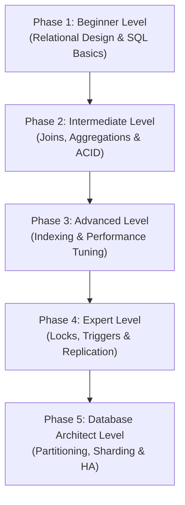

# MySQL: The Complete Beginner-to-Database Architect Masterclass

**MySQL** is an open-source relational database management system (RDBMS) that stores data in structured tables using rows and columns, managed via Structured Query Language (SQL). It is the backbone of major enterprise tech stacks, running transactional databases for companies like Meta, Netflix, and Uber.

This guide starts from relational database design and normalization, then progressively builds through query optimization, indexing internals, transaction concurrency levels, storage engines, replication topologies, and high-availability enterprise database clustering.

---

## 🗺️ The Database Architect Roadmap



| Phase | Target Role | Key Focus Area | Capstone Project |
| :--- | :--- | :--- | :--- |
| **Phase 1: Beginner** | Software Developer | Table normalization (1NF-3NF), keys, standard DML & DDL operations. | Normalized school enrollment schema design |
| **Phase 2: Intermediate** | Backend Developer | Complex Joins, grouping/aggregation, subqueries, CTEs, ACID compliance. | E-commerce checkout transactional query suite |
| **Phase 3: Advanced** | Performance Engineer | B-Tree index structures, composite indexes, query optimization, EXPLAIN profiling. | Optimize slow reporting queries with composite indexes |
| **Phase 4: Expert** | Database Engineer | Locking levels, deadlock mitigation, stored procedures, triggers, Primary-Replica. | Row-level auditing system via Triggers + read replica |
| **Phase 5: Architect** | Database Architect | Table partitioning, multi-master cluster topologies, ProxySQL routing, backups. | Multi-region, high-availability SaaS database gateway |

---

## 🚀 Phase 1: Beginner Level (Relational Design & SQL Fundamentals)

### 1. What is MySQL?

#### 💡 The Digital Filing Cabinet Analogy:
Imagine an office **filing cabinet**:
- **The Cabinet (The Database)**: The high-level container holding everything.
- **The Drawers (Tables)**: Divided sections holding specific categories of records (e.g. one drawer for "Customers", one for "Orders", one for "Products").
- **The Paper Folders (Rows/Records)**: Inside each drawer are individual folders containing information about a single entity (e.g., Customer #1234).
- **The Sheet Template (Schema)**: Every paper folder has a pre-printed form with empty fields. You have strict rules: the "Age" box must contain a number, the "Email" box must have an `@` symbol, and the "Name" cannot be left blank.

**MySQL** is that digital filing cabinet. Unlike flat text files or spreadsheets where anyone can write anything, MySQL enforces **structural contracts** (types, keys, constraints) across tables to ensure data remains perfectly organized, structured, and consistent.

---

### 2. Normalization: 1NF, 2NF, 3NF

Normalization is the process of structuring relational tables to reduce data redundancy and eliminate anomalies (update, insert, delete problems).

```
UNNORMALIZED:
┌─────────┬──────────────┬──────────────────┬──────────────┬─────────────┐
│ Student │   Classes    │   Instructor     │ InstructorRm │ Instructor  │
├─────────┼──────────────┼──────────────────┼──────────────┼─────────────┤
│  Alice  │ CS101, CS202 │ Dr. Bob, Dr. Bob │  301, 301    │ bob@uni.edu │
└─────────┴──────────────┴──────────────────┴──────────────┴─────────────┘
```

#### a) First Normal Form (1NF): Atomic Values
*Rule: Every column must contain atomic (single, indivisible) values. No multi-value lists.*

```
1NF Table (Atomic rows):
┌─────────┬─────────┬─────────────┬──────────────┬─────────────┐
│ Student │  Class  │ Instructor  │ InstructorRm │ Instructor  │
├─────────┼─────────┼─────────────┼──────────────┼─────────────┤
│  Alice  │  CS101  │   Dr. Bob   │     301      │ bob@uni.edu │
│  Alice  │  CS202  │   Dr. Bob   │     301      │ bob@uni.edu │
└─────────┴─────────┴─────────────┴──────────────┴─────────────┘
```

#### b) Second Normal Form (2NF): Full Functional Dependency
*Rule: Must be in 1NF, and all non-key columns must fully depend on the entire Primary Key (no partial dependencies on a composite key).*

In our composite key `(Student, Class)` above: `InstructorRm` and `Instructor` only depend on `Class`, not `Student`. We must split them.

```
Table: enrollments (Composite key: student_id, class_id)
┌────────────┬──────────┐
│ student_id │ class_id │
├────────────┼──────────┤
│   Alice    │  CS101   │
│   Alice    │  CS202   │
└────────────┴──────────┘

Table: classes (Primary key: class_id)
┌──────────┬─────────────┬──────────────┬─────────────┐
│ class_id │ instructor  │ instructor_rm│  inst_email │
├──────────┼─────────────┼──────────────┼─────────────┤
│  CS101   │   Dr. Bob   │     301      │ bob@uni.edu │
│  CS202   │   Dr. Bob   │     301      │ bob@uni.edu │
└──────────┴─────────────┴──────────────┴─────────────┘
```

#### c) Third Normal Form (3NF): No Transitive Dependency
*Rule: Must be in 2NF, and no non-key column can depend transitively on another non-key column (no X → Y → Z dependencies).*

In our `classes` table: `instructor_rm` and `inst_email` depend on `instructor` (non-key), which depends on `class_id` (Primary Key). We must split instructors into their own table.

```
Table: classes (Primary key: class_id)
┌──────────┬───────────────┐
│ class_id │ instructor_id │
├──────────┼───────────────┤
│  CS101   │      10       │
│  CS202   │      10       │
└──────────┴───────────────┘

Table: instructors (Primary key: instructor_id)
┌───────────────┬───────────┬──────────────┬─────────────┐
│ instructor_id │   name    │    office    │    email    │
├───────────────┼───────────┼──────────────┼─────────────┤
│      10       │  Dr. Bob  │     301      │ bob@uni.edu │
└───────────────┴───────────┴──────────────┴─────────────┘
```

---

### 3. Core SQL Commands (DDL & DML)

- **DDL (Data Definition Language)**: Defines database structures (`CREATE`, `ALTER`, `DROP`).
- **DML (Data Manipulation Language)**: Modifies database content (`SELECT`, `INSERT`, `UPDATE`, `DELETE`).

```sql
-- DDL: Create a normalized users table
CREATE TABLE users (
  id INT AUTO_INCREMENT PRIMARY KEY,
  username VARCHAR(50) NOT NULL UNIQUE,
  email VARCHAR(100) NOT NULL UNIQUE,
  status ENUM('active', 'suspended', 'pending') DEFAULT 'pending',
  created_at TIMESTAMP DEFAULT CURRENT_TIMESTAMP
);

-- DML: Insert a record
INSERT INTO users (username, email, status) 
VALUES ('alice', 'alice@example.com', 'active');

-- DML: Read a record with filters
SELECT id, username, status 
FROM users 
WHERE status = 'active' 
ORDER BY username ASC 
LIMIT 10;

-- DML: Update a record
UPDATE users 
SET status = 'suspended' 
WHERE id = 1;

-- DML: Delete a record
DELETE FROM users 
WHERE status = 'pending';
```

---

## 🛠️ Phase 2: Intermediate Level (Joins, Aggregations & ACID)

### 1. Joins Explained

Joins combine rows from two or more tables based on a related column between them.

```
Table: users (L)                 Table: orders (R)
┌────┬──────────┐                ┌────┬─────────┬──────────┐
│ id │ name     │                │ id │ total   │ user_id  │
├────┼──────────┤                ├────┼─────────┼──────────┤
│ 1  │ Alice    │                │ 99 │ 50.00   │ 1        │
│ 2  │ Bob      │                │ 98 │ 25.00   │ 3        │
└────┴──────────┘                └────┴─────────┴──────────┘
```

```sql
-- 1. INNER JOIN (Renders matching rows from BOTH tables)
SELECT u.name, o.total 
FROM users u 
INNER JOIN orders o ON u.id = o.user_id;
-- Result: Alice | 50.00 (Only matching IDs exist)

-- 2. LEFT JOIN (Renders ALL rows from Left, plus matching Right)
SELECT u.name, o.total 
FROM users u 
LEFT JOIN orders o ON u.id = o.user_id;
-- Result: 
-- Alice | 50.00
-- Bob   | NULL (Bob has no orders, but is kept)

-- 3. RIGHT JOIN (Renders ALL rows from Right, plus matching Left)
SELECT u.name, o.total 
FROM users u 
RIGHT JOIN orders o ON u.id = o.user_id;
-- Result:
-- Alice | 50.00
-- NULL  | 25.00 (Order #98 belongs to user #3, which doesn't exist in left)
```

---

### 2. Aggregations & Grouping

Aggregations calculate aggregate statistics over groups of rows.

```sql
-- Find total sales and order count per user
SELECT 
  user_id,
  COUNT(id) AS total_orders,
  SUM(total) AS lifetime_value,
  AVG(total) AS average_order_value
FROM orders
GROUP BY user_id
HAVING lifetime_value > 100.00  -- Filters groups (WHERE filters raw rows)
ORDER BY lifetime_value DESC;
```

---

### 3. Transactions & ACID Compliance

#### 💡 The Bank Transfer Analogy:
Imagine you want to transfer $100 from your **Checking Account (A)** to your **Savings Account (B)**. The database needs to perform two updates:
1. Deduct $100 from Account A.
2. Add $100 to Account B.

If the database server crashes exactly *after* Step 1 but *before* Step 2, the $100 vanishes into thin air. Your money is gone, and the bank database is inconsistent.

To prevent this, relational databases use **Transactions**. A transaction wraps both steps in an **all-or-nothing box**. If both succeed, the change is committed. If any step fails, the entire transaction is rolled back (undone) as if it never started.

#### The ACID Guarantees:
| Property | Meaning | How MySQL Enforces It |
| :--- | :--- | :--- |
| **Atomicity** | All operations in a transaction succeed or all fail. | Undo log / Rollbacks |
| **Consistency** | Data must transition from one valid state to another, obeying all constraints. | Foreign keys, unique constraints, schema validation |
| **Isolation** | Concurrent transactions do not interfere with each other. | Locks & Multiversion Concurrency Control (MVCC) |
| **Durability** | Committed transactions persist permanently, even if the system crashes. | Redo log (WAL - Write-Ahead Logging) |

#### Transaction Syntax in MySQL:
```sql
START TRANSACTION;

-- Step 1: Deduct from Account A
UPDATE accounts 
SET balance = balance - 100.00 
WHERE id = 1 AND balance >= 100.00;

-- Step 2: Add to Account B (Only if Step 1 succeeded)
UPDATE accounts 
SET balance = balance + 100.00 
WHERE id = 2;

-- Confirm transaction (make permanent)
COMMIT;

-- Or if an error occurs, undo everything:
-- ROLLBACK;
```

---

## ⚡ Phase 3: Advanced Level (Indexing & Performance Tuning)

### 1. B-Tree Indexes Internals

#### 💡 The Textbook Index Analogy:
Imagine you are reading a 1,000-page textbook on databases. You want to look up the term **"deadlocks."**
- **Without an Index (Table Scan)**: You start on page 1, scan every word, then turn to page 2, scanning all the way to page 1,000. This is O(N) complexity and incredibly slow.
- **With an Index (B-Tree)**: You flip to the back of the book, where all terms are alphabetized. You look under "D", locate "deadlocks", find "Page 412", and immediately flip directly to page 412. This is O(log N) complexity.

#### How MySQL Indexes Work (InnoDB B-Trees):
InnoDB organizes data using a **balanced tree (B-Tree)** structure. The tree consists of:
- **Root Node**: The top entry point of the search tree.
- **Internal Nodes**: Guide pointers directing the query down the tree.
- **Leaf Nodes**: The bottom layer containing the actual indexed keys and pointers to the raw rows.

```
                       [ 50 ]                   <-- Root Node
                      /      \
               [ 25 ]          [ 75 ]           <-- Internal Nodes
              /      \        /      \
            [10]    [30]    [60]    [90]        <-- Leaf Nodes (Contain Row Pointers)
```

For a table with 1,000,000 rows, searching without an index requires **1,000,000 reads**. With a B-Tree index, it takes only **3 or 4 page reads** to locate the exact row.

---

### 2. Composite Indexes & Left-Prefix Rule

A **composite index** is an index built on multiple columns (e.g., `INDEX (last_name, first_name)`).

```sql
CREATE INDEX idx_name ON employees (last_name, first_name);
```

#### The Left-Prefix Rule:
A composite index can only be used if the columns in your query's `WHERE` clause match the index columns from left to right:

*   `WHERE last_name = 'Smith'` — **Yes** (uses index)
*   `WHERE last_name = 'Smith' AND first_name = 'John'` — **Yes** (uses index fully)
*   `WHERE first_name = 'John'` — **No** (index is ignored, performs full table scan)

---

### 3. Query Profiling (EXPLAIN ANALYZE)

Before optimizing a slow query, run the `EXPLAIN` command to see how MySQL executes it.

#### Let's profile an unoptimized query:
```sql
EXPLAIN SELECT id, total FROM orders WHERE customer_id = 42 AND status = 'shipped';
```

#### Raw Output Analysis:
| id | select_type | table | type | possible_keys | key | key_len | ref | rows | Extra |
| :--- | :--- | :--- | :--- | :--- | :--- | :--- | :--- | :--- | :--- |
| 1 | SIMPLE | orders | **ALL** | NULL | **NULL** | NULL | NULL | **850230** | Using where |

- **type = ALL**: Means a **full table scan**. MySQL inspected all 850,230 rows.
- **key = NULL**: No index was used.

#### Optimizing with a Composite Index:
```sql
CREATE INDEX idx_cust_status ON orders (customer_id, status);
```

#### Let's run EXPLAIN again:
```sql
EXPLAIN SELECT id, total FROM orders WHERE customer_id = 42 AND status = 'shipped';
```

Output:
| id | select_type | table | type | possible_keys | key | key_len | ref | rows | Extra |
| :--- | :--- | :--- | :--- | :--- | :--- | :--- | :--- | :--- | :--- |
| 1 | SIMPLE | orders | **ref** | idx_cust_status | **idx_cust_status** | 105 | const,const | **12** | NULL |

- **type = ref**: Accessing rows directly via index equality lookup.
- **key = idx_cust_status**: The new composite index is actively used.
- **rows = 12**: MySQL only read 12 rows to return the result, bypassing 850,000+ rows!

---

### 4. Storage Engines: InnoDB vs MyISAM

MySQL supports multiple storage engines, configurable per table. InnoDB is the modern default.

| Feature | InnoDB | MyISAM |
| :--- | :--- | :--- |
| **Transactions** | ✅ Yes (ACID compliant) | ❌ No |
| **Locking Level** | **Row-level locking** (high concurrency) | **Table-level locking** (blocks other writes) |
| **Foreign Keys** | ✅ Yes (enforced referential integrity) | ❌ No |
| **Crash Recovery** | ✅ Yes (crash-safe via logs) | ❌ No (requires manual repair) |
| **Best For** | Standard applications, transactional databases | High-read static reporting, historical logs |

---

## 🧬 Phase 4: Expert Level (Locks, Triggers & Replication)

### 1. Database Locking Mechanisms

To maintain isolation, InnoDB uses lock types depending on the transaction level:

- **Shared Locks (S)**: Read locks. Multiple transactions can hold S-locks on the same row simultaneously to read data.
- **Exclusive Locks (X)**: Write locks. Only one transaction can hold an X-lock, blocking all other reads and writes.

#### Lock Granularity:
- **Table Locks**: Locks the entire table. High write latency, low memory footprint.
- **Row Locks**: Locks specific rows. Low latency, allows concurrent writes to other rows, but high memory overhead.

#### Explicit Locking Syntax:
```sql
-- Get an Exclusive (Write) lock on a row (blocks others until commit/rollback)
SELECT * FROM users WHERE id = 1 FOR UPDATE;

-- Get a Shared (Read) lock on a row
SELECT * FROM users WHERE id = 1 FOR SHARE;
```

---

### 2. Deadlocks: Causes & Mitigation

A **deadlock** occurs when two transactions hold locks that the other needs, creating an infinite block.

```
Transaction A                       Transaction B
1. Lock Row 1 (Success)             1. Lock Row 2 (Success)
2. Request Row 2 (Waiting...)       2. Request Row 1 (Waiting...)
      │                                   │
      └──────────────── Deadlock ─────────┘
```

#### Real-World Example:
```sql
-- Transaction A
UPDATE accounts SET balance = balance - 10.00 WHERE id = 1; -- Holds lock on Row 1
-- Transaction B
UPDATE accounts SET balance = balance + 10.00 WHERE id = 2; -- Holds lock on Row 2

-- Transaction A requests Row 2
UPDATE accounts SET balance = balance + 10.00 WHERE id = 2; -- Blocked, waits for B

-- Transaction B requests Row 1
UPDATE accounts SET balance = balance - 10.00 WHERE id = 1; -- DEADLOCK!
```

#### Deadlock Mitigations:
1.  **Uniform Order**: Always update tables and rows in the exact same logical order (e.g. order by primary key ID ascending).
2.  **Keep Transactions Short**: Commit transactions quickly to release locks immediately.
3.  **App Retry Logic**: Application code must catch Deadlock errors (Error code `1213`) and transparently retry the transaction.

---

### 3. Triggers & Auditing

Triggers automatically execute operations in response to INSERT, UPDATE, or DELETE events.

```sql
-- Create an audit table
CREATE TABLE user_audits (
  id INT AUTO_INCREMENT PRIMARY KEY,
  user_id INT,
  action VARCHAR(50),
  old_email VARCHAR(100),
  new_email VARCHAR(100),
  changed_at TIMESTAMP DEFAULT CURRENT_TIMESTAMP
);

-- Define trigger for tracking email changes
DELIMITER //
CREATE TRIGGER after_user_email_update
AFTER UPDATE ON users
FOR EACH ROW
BEGIN
  -- Trigger condition
  IF OLD.email <> NEW.email THEN
    INSERT INTO user_audits (user_id, action, old_email, new_email)
    VALUES (OLD.id, 'EMAIL_CHANGE', OLD.email, NEW.email);
  END IF;
END //
DELIMITER ;
```

---

### 4. MySQL Replication Topology

MySQL Replication distributes database loads by copying data from one primary database server to one or more replicas.

```
                     ┌──────────────────┐
                     │   PRIMARY (R/W)  │
                     │  (Writes to BIN) │
                     └────────┬─────────┘
                              │
              ┌───────────────┴───────────────┐
              ▼                               ▼
     ┌─────────────────┐             ┌─────────────────┐
     │  REPLICA (Read) │             │  REPLICA (Read) │
     │  (Reads Relay)  │             │  (Reads Relay)  │
     └─────────────────┘             └─────────────────┘
```

| Server Role | Operations Allowed | Internal Mechanism |
| :--- | :--- | :--- |
| **Primary (Master)** | Read & Write (mutations) | Writes changes to its **Binary Log (`binlog`)**. |
| **Replica (Slave)** | Read-Only | Copies the binlog into its **Relay Log**, then replays queries sequentially to sync data. |

#### Read-Write Splitting (Application Pattern):
```typescript
import mysql from 'mysql2/promise';

// Define two pools
const writePool = mysql.createPool({ host: 'primary.database.internal' });
const readPool = mysql.createPool({ host: 'replica.database.internal' });

async function executeQuery(sql: string, params: any[], isMutation = false) {
  // Routes writes to primary, reads to replica
  const pool = isMutation ? writePool : readPool;
  const [rows] = await pool.execute(sql, params);
  return rows;
}
```

---

## 🏛️ Phase 5: Database Architect Level (Partitioning, Sharding & HA)

### 1. Table Partitioning

Partitioning splits a massive table into smaller, physically separate files on disk, while presenting a single table interface to the application.

```sql
-- Partition a logs table by Year
CREATE TABLE system_logs (
  id INT NOT NULL,
  log_text TEXT,
  created_at DATE NOT NULL,
  PRIMARY KEY (id, created_at)
)
PARTITION BY RANGE (YEAR(created_at)) (
  PARTITION p2024 VALUES LESS THAN (2025),
  PARTITION p2025 VALUES LESS THAN (2026),
  PARTITION p_future VALUES LESS THAN MAXVALUE
);
```

#### Why partition?
*   **Partition Pruning**: If your query filters `WHERE created_at >= '2025-01-01'`, MySQL completely ignores the `p2024` file on disk, scanning only the `p2025` partition file.
*   **Fast Archiving**: Instead of running a slow `DELETE` query to purge old logs, you can drop a partition instantly: `ALTER TABLE system_logs DROP PARTITION p2024;`.

---

### 2. High Availability (MySQL Group Replication)

For mission-critical applications, Primary-Replica replication lacks automatic failover. Architects use **Group Replication** inside **MySQL InnoDB Clusters**.

```
                   ┌───────────────────────────────────┐
                   │        ProxySQL ROUTER            │
                   │  (Auto-routes & detects healthy)  │
                   └─────────────────┬─────────────────┘
                                     │
         ┌───────────────────────────┼───────────────────────────┐
         ▼                           ▼                           ▼
┌──────────────────┐        ┌──────────────────┐        ┌──────────────────┐
│   Node A (Primary)│◀──────▶│  Node B (Replica)│◀──────▶│  Node C (Replica)│
│   Reads & Writes │        │  Read-Only Sync  │        │  Read-Only Sync  │
└──────────────────┘        └──────────────────┘        └──────────────────┘
         ▲                           ▲                           ▲
         └────────────────── Paxos Consensus Group ──────────────┘
```

#### Key Architecture Concepts:
- **Paxos Consensus**: Nodes continually communicate via consensus protocols. If Node A (Primary) crashes, Node B and C elect a new primary node automatically.
- **ProxySQL**: An active SQL proxy gateway sitting in front of the database cluster. It intercepts application connections, routes queries, pools connections, and handles database failovers transparently.

---

### 3. Enterprise Disaster Recovery & PITR

A robust architect design requires regular backups and Point-in-Time Recovery.

#### a) Backup Options:
- **Logical Backup (`mysqldump`)**: Exporter generates SQL insert commands. Very slow, reads tables, but highly portable.
- **Physical Backup (`xtrabackup`)**: Copies raw database data files directly on disk while running. Extremely fast, zero read/write locks, suitable for large enterprise databases.

#### b) Point-in-Time Recovery (PITR):
To restore a database to a precise millisecond (e.g., exactly 1 second before a rogue script ran `DROP DATABASE` at 11:34 AM):
1. Restore the last nightly full physical backup (taken at 2:00 AM).
2. Replay all binary logs (`binlog`) created between 2:00 AM and 11:33 AM:
   ```bash
   mysqlbinlog --start-datetime="2026-05-26 02:00:00" \
               --stop-datetime="2026-05-26 11:33:59" \
               /var/log/mysql/mysql-bin.000012 | mysql -u root -p
   ```
