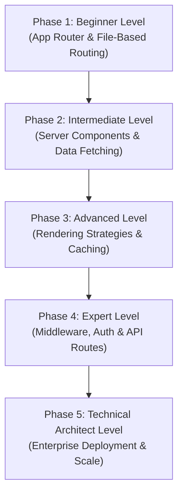

# Next.js: The Complete Beginner-to-Architect Masterclass

**Next.js** is a full-stack React framework built by Vercel that provides everything you need to build production-grade web applications. While React itself is a UI library for rendering components, Next.js wraps React with enterprise infrastructure: file-based routing, server-side rendering, API endpoints, caching layers, image optimization, and deployment pipelines.

This guide is written in clear, simple language with rich real-world analogies, step-by-step rendering strategy comparisons, complete Server Action implementations, and enterprise deployment architectures to take you from a React developer to a high-level Fullstack Architect.

---

## 🗺️ The Fullstack Architect Roadmap



| Phase | Target Role | Key Focus Area | Capstone Project |
| :--- | :--- | :--- | :--- |
| **Phase 1: Beginner** | React Developer | App Router conventions, layouts, dynamic routes, navigation. | Multi-page Marketing Site with nested layouts |
| **Phase 2: Intermediate** | Fullstack Engineer | React Server Components, `'use client'` boundaries, Server Actions. | Blog CMS with server-fetched posts & Server Action comments |
| **Phase 3: Advanced** | Performance Engineer | SSG, SSR, ISR, Streaming, and the 4 Next.js caching layers. | E-commerce catalog with ISR + streaming checkout |
| **Phase 4: Expert** | Platform Engineer | Middleware interception, Route Handlers, JWT auth, image optimization. | Protected admin dashboard with auth guards |
| **Phase 5: Architect** | Enterprise Architect | Vercel/Docker/Node deployments, Edge Runtime, Turborepo monorepos. | Multi-tenant SaaS deployment blueprint |

---

## 🚀 Phase 1: Beginner Level (App Router & File-Based Routing)

### 1. What is Next.js?

#### 💡 The Restaurant Kitchen Analogy:
Think of **React** as a brilliant **Chef**. The chef can cook any dish perfectly, but the chef alone is not a restaurant. You still need a dining room, a menu system, a waiter to take orders, a pass to serve finished dishes, a delivery driver for takeout, and a reservation management system.

**Next.js** is the entire **Restaurant**. It wraps the chef (React) with all the infrastructure needed to run a real business:
- **File-Based Routing** = The printed menu with organized categories.
- **Server-Side Rendering** = The kitchen pass where dishes are plated before reaching the customer.
- **API Routes** = The back-office phone line for suppliers and delivery platforms.
- **Middleware** = The bouncer at the front door checking reservations.
- **Caching** = The pre-made dishes sitting under heat lamps, ready to serve instantly without cooking from scratch.

---

### 2. App Router Directory Conventions
In Next.js 13+ (App Router), your file system structure **is** your route structure. Every folder inside `app/` becomes a URL segment. Special file names trigger specific rendering behaviors:

```
app/
├── layout.tsx          # Root Layout (wraps every page, persistent across navigations)
├── page.tsx            # Home page → renders at "/"
├── loading.tsx         # Loading skeleton (auto-wrapped inside <Suspense>)
├── error.tsx           # Error boundary (catches render failures)
├── not-found.tsx       # Custom 404 page
├── about/
│   └── page.tsx        # About page → renders at "/about"
├── blog/
│   ├── page.tsx        # Blog index → renders at "/blog"
│   └── [slug]/
│       └── page.tsx    # Dynamic route → renders at "/blog/my-first-post"
└── (marketing)/
    ├── pricing/
    │   └── page.tsx    # Route Group → renders at "/pricing" (no /marketing/ in URL)
    └── contact/
        └── page.tsx    # Route Group → renders at "/contact"
```

#### Special File Naming Rules:
| File Name | Purpose |
| :--- | :--- |
| `page.tsx` | The visual component rendered at this route. **Required** to make a folder publicly accessible. |
| `layout.tsx` | Persistent wrapper component. Preserved across navigations (e.g. sidebar stays mounted). |
| `loading.tsx` | Automatic loading skeleton. Next.js wraps it in `<Suspense>` for you. |
| `error.tsx` | Error boundary that catches runtime errors in this route segment. Must be a Client Component (`'use client'`). |
| `not-found.tsx` | Custom 404 UI when `notFound()` is called or the route doesn't match. |

---

### 3. Dynamic Routes & Route Groups
- **Dynamic Routes (`[slug]`)**: Create pages for dynamic content (blog posts, user profiles).
  ```typescript
  // app/blog/[slug]/page.tsx
  export default async function BlogPost({ params }: { params: Promise<{ slug: string }> }) {
    const { slug } = await params;
    return <h1>Reading post: {slug}</h1>;
  }
  ```
- **Route Groups (`(folderName)`)**: Organize files into logical groups without affecting the URL path. Wrap `(marketing)` around pricing/contact pages to share a layout without adding `/marketing/` to the URL.

---

### 4. Navigation
Next.js provides client-side navigation that pre-fetches linked routes in the background.

```tsx
import Link from 'next/link';
import { useRouter, usePathname } from 'next/navigation';

export function NavBar() {
  const router = useRouter();
  const pathname = usePathname();

  return (
    <nav>
      {/* 1. Declarative Link (pre-fetches on viewport entry) */}
      <Link href="/about" className={pathname === '/about' ? 'active' : ''}>
        About
      </Link>

      {/* 2. Programmatic Navigation */}
      <button onClick={() => router.push('/dashboard')}>
        Go to Dashboard
      </button>
    </nav>
  );
}
```

---

## 🛠️ Phase 2: Intermediate Level (Server Components & Data Fetching)

### 1. React Server Components (RSC)

#### 💡 The Assembly Line Analogy:
Imagine a car factory. There are two sections of the assembly line:
- **The Heavy Factory Floor (Server)**: Massive robotic arms weld steel frames, install engines, wire electrical systems, and paint the chassis. These robots are too heavy and expensive to ship to the customer's garage.
- **The Customer's Garage (Browser)**: The customer receives a fully assembled, painted car. They only need to install lightweight personal accessories: a phone mount, seat covers, and air fresheners (interactive JavaScript).

**React Server Components** work the same way. The server does all the heavy data fetching, database querying, and HTML assembly. It ships **only the finished HTML** to the browser. The browser receives a lightweight page and only hydrates the small interactive pieces (buttons, forms, dropdowns) that need JavaScript.

---

### 2. Server vs. Client Components

```
+---------------------------------------------------------------+
|          SERVER COMPONENTS (Default in App Router)             |
|  - Run ONLY on the server. Zero JavaScript shipped to browser.|
|  - CAN: Access databases, read files, use API keys directly.  |
|  - CANNOT: Use useState, useEffect, onClick, or browser APIs. |
+---------------------------------------------------------------+
|          CLIENT COMPONENTS ('use client' directive)            |
|  - Run on the browser (hydrated with JavaScript).             |
|  - CAN: Use hooks, event handlers, browser APIs (localStorage)|
|  - CANNOT: Directly access databases or server-only secrets.  |
+---------------------------------------------------------------+
```

#### The Boundary Rule:
Add `'use client'` at the very top of a file to mark it as a Client Component. Everything imported by that file also becomes client-side. Push the `'use client'` boundary as **deep** as possible (wrap only the interactive leaf components, not the entire page).

```tsx
// ✅ GOOD: Only the interactive counter is a Client Component
// app/dashboard/page.tsx (Server Component - default)
import { Counter } from './Counter';

export default async function DashboardPage() {
  const stats = await fetch('https://api.example.com/stats').then(r => r.json());
  
  return (
    <div>
      <h1>Dashboard</h1>
      <p>Total Users: {stats.totalUsers}</p>  {/* Server-rendered, zero JS */}
      <Counter />                              {/* Client island, interactive */}
    </div>
  );
}
```

```tsx
// app/dashboard/Counter.tsx
'use client'; // This file ships JavaScript to the browser

import { useState } from 'react';

export function Counter() {
  const [count, setCount] = useState(0);
  return <button onClick={() => setCount(c => c + 1)}>Clicks: {count}</button>;
}
```

---

### 3. Data Fetching (Async Server Components)
In the App Router, Server Components can be `async` functions. You can `await` data directly inside the component body — no `useEffect`, no loading state boilerplate.

```tsx
// app/blog/page.tsx — Server Component (default)
interface Post {
  id: number;
  title: string;
}

export default async function BlogIndex() {
  // Fetch runs on the server. API keys stay private. Zero client-side JS.
  const posts: Post[] = await fetch('https://jsonplaceholder.typicode.com/posts?_limit=5', {
    next: { revalidate: 3600 } // ISR: Revalidate cache every hour
  }).then(res => res.json());

  return (
    <ul>
      {posts.map(post => (
        <li key={post.id}>{post.title}</li>
      ))}
    </ul>
  );
}
```

---

### 4. Server Actions
**Server Actions** let you write server-side mutation functions directly inside your components. No separate API routes needed. They execute on the server and can interact with databases, send emails, or write files.

```tsx
// app/comments/page.tsx — Server Component
import { revalidatePath } from 'next/cache';

// 1. Define Server Action (runs ONLY on the server)
async function addComment(formData: FormData) {
  'use server';

  const comment = formData.get('comment') as string;

  // 2. Write to database (server-only operation)
  await fetch('https://api.example.com/comments', {
    method: 'POST',
    headers: { 'Content-Type': 'application/json' },
    body: JSON.stringify({ text: comment })
  });

  // 3. Purge the cached page so fresh data appears
  revalidatePath('/comments');
}

export default function CommentsPage() {
  return (
    <form action={addComment}>
      <textarea name="comment" placeholder="Write a comment..." required />
      <button type="submit">Post Comment</button>
    </form>
  );
}
```

---

## ⚡ Phase 3: Advanced Level (Rendering Strategies & Caching)

### 1. The Four Rendering Modes
Next.js supports four rendering strategies. Choosing the right one for each page is a critical architectural decision:

| Mode | When HTML is Generated | Best For | How to Enable |
| :--- | :--- | :--- | :--- |
| **Static (SSG)** | At **build time** once. | Marketing pages, docs, blog posts. | Default for pages with no dynamic data. |
| **Dynamic (SSR)** | On **every request**. | User dashboards, search results. | Use `cookies()`, `headers()`, or `{ cache: 'no-store' }`. |
| **ISR** | At build time, then **revalidates** periodically. | Product catalogs, news feeds. | `fetch(url, { next: { revalidate: 60 } })` |
| **Streaming** | Progressively sent in **chunks**. | Pages with slow data sources. | Wrap slow sections in `<Suspense>`. |

---

### 2. The Four Next.js Caching Layers
Next.js implements an aggressive, multi-layered caching system. Understanding each layer is essential to avoid serving stale data.

```
Request Lifecycle:

[Browser] ──> [Router Cache] ──> [Full Route Cache] ──> [Data Cache] ──> [Request Memoization] ──> [Origin Server]
```

| Layer | Location | What it Caches | Duration | How to Opt Out |
| :--- | :--- | :--- | :--- | :--- |
| **Request Memoization** | Server (per-request) | Duplicate `fetch()` calls in the same render tree. | Single request lifecycle. | Automatic, no opt-out needed. |
| **Data Cache** | Server (persistent) | Individual `fetch()` response payloads. | Permanent until revalidated. | `{ cache: 'no-store' }` or `revalidateTag()`. |
| **Full Route Cache** | Server (persistent) | Entire rendered HTML + RSC payload for static routes. | Permanent until redeployed or revalidated. | Make route dynamic or call `revalidatePath()`. |
| **Router Cache** | Client (browser memory) | Previously visited route RSC payloads. | Session-based (30s dynamic, 5min static). | `router.refresh()` or `revalidatePath()`. |

---

### 3. Streaming with `<Suspense>`
Streaming delivers the page shell instantly and fills in slow data sections as they resolve, preventing the entire page from being blocked by one slow API call.

```tsx
import { Suspense } from 'react';

// Fast shell component (renders instantly)
function PageShell() {
  return <h1>Product Catalog</h1>;
}

// Slow data component (takes 3 seconds to fetch)
async function ProductReviews() {
  const reviews = await fetch('https://api.example.com/reviews', {
    cache: 'no-store'
  }).then(r => r.json());
  
  return (
    <ul>
      {reviews.map((r: any) => <li key={r.id}>{r.text}</li>)}
    </ul>
  );
}

// Page assembles both with Suspense boundary
export default function ProductPage() {
  return (
    <div>
      <PageShell />
      <Suspense fallback={<p>Loading reviews...</p>}>
        <ProductReviews />
      </Suspense>
    </div>
  );
}
```

---

## 🧬 Phase 4: Expert Level (Middleware, Auth & API Routes)

### 1. Middleware

#### 💡 The Bouncer Analogy:
Imagine a premium nightclub. Before any guest can enter the venue (reach a page), they must pass the **Bouncer** at the front door. The Bouncer checks your ID, verifies your name against the VIP guest list, and either waves you through or sends you to the public bar instead. The Bouncer doesn't serve drinks or play music — they only control access.

Next.js **Middleware** runs at the edge *before* any page or API route renders. It intercepts every incoming request and can redirect, rewrite, set headers, or block access entirely.

```typescript
// middleware.ts (Root of project — runs on EVERY request)
import { NextRequest, NextResponse } from 'next/server';

export function middleware(request: NextRequest) {
  const token = request.cookies.get('session-token')?.value;
  const isProtectedRoute = request.nextUrl.pathname.startsWith('/dashboard');

  // 1. Redirect unauthenticated users away from protected routes
  if (isProtectedRoute && !token) {
    return NextResponse.redirect(new URL('/login', request.url));
  }

  // 2. Add custom security headers to every response
  const response = NextResponse.next();
  response.headers.set('X-Frame-Options', 'DENY');
  response.headers.set('X-Content-Type-Options', 'nosniff');
  
  return response;
}

// 3. Define which routes this middleware applies to
export const config = {
  matcher: ['/dashboard/:path*', '/admin/:path*', '/api/:path*']
};
```

---

### 2. Route Handlers (API Routes)
Route Handlers let you build REST API endpoints inside the App Router using standard Web Request/Response APIs.

```typescript
// app/api/users/route.ts
import { NextRequest, NextResponse } from 'next/server';

// GET /api/users
export async function GET() {
  const users = await fetch('https://jsonplaceholder.typicode.com/users').then(r => r.json());

  return NextResponse.json(users, { status: 200 });
}

// POST /api/users
export async function POST(request: NextRequest) {
  const body = await request.json();

  if (!body.name || !body.email) {
    return NextResponse.json(
      { error: 'Name and email are required fields.' },
      { status: 400 }
    );
  }

  // Simulate database insertion
  const newUser = { id: Date.now(), ...body };

  return NextResponse.json(newUser, { status: 201 });
}
```

---

### 3. Image Optimization (`next/image`)
The `next/image` component automatically optimizes images: resizing, converting to modern formats (WebP/AVIF), lazy loading, and preventing layout shift.

```tsx
import Image from 'next/image';

export function HeroSection() {
  return (
    <Image
      src="/hero-banner.jpg"
      alt="Enterprise landing hero banner"
      width={1200}
      height={600}
      priority              // Loads immediately (above-the-fold image)
      placeholder="blur"    // Shows blurred placeholder during load
      blurDataURL="data:image/jpeg;base64,..."
    />
  );
}
```

---

## 🏛️ Phase 5: Technical Architect Level (Enterprise Deployment & Scale)

### 1. Deployment Targets

| Target | Best For | Trade-Offs |
| :--- | :--- | :--- |
| **Vercel** (Serverless) | Fastest deployment, zero config, automatic edge functions. | Vendor lock-in, usage-based pricing at scale. |
| **Docker Container** | Full control, runs anywhere (AWS ECS, GCP Cloud Run, on-prem). | Requires Dockerfile maintenance, no automatic edge. |
| **Self-Hosted Node.js** | Maximum control, custom caching layers. | Manual scaling, infrastructure ops overhead. |

#### Production Dockerfile:
```dockerfile
FROM node:20-alpine AS builder
WORKDIR /app
COPY package*.json ./
RUN npm ci
COPY . .
RUN npm run build

FROM node:20-alpine AS runner
WORKDIR /app
ENV NODE_ENV=production
COPY --from=builder /app/.next/standalone ./
COPY --from=builder /app/.next/static ./.next/static
COPY --from=builder /app/public ./public

EXPOSE 3000
CMD ["node", "server.js"]
```

> [!IMPORTANT]
> Enable `output: 'standalone'` in `next.config.js` to generate a minimal self-contained server folder suitable for Docker containers.

---

### 2. Edge Runtime vs. Node.js Runtime
Next.js allows individual routes or middleware to run on either runtime:

| Feature | Node.js Runtime | Edge Runtime |
| :--- | :--- | :--- |
| **Cold start** | ~250ms | ~1ms |
| **API access** | Full Node.js APIs (fs, crypto, streams) | Limited Web APIs only |
| **Location** | Single region | Globally distributed CDN edge |
| **Best for** | Database queries, heavy computation | Auth checks, redirects, A/B testing |

```typescript
// Force a specific route to run on the Edge
export const runtime = 'edge';

export async function GET() {
  return new Response('Hello from the edge!', { status: 200 });
}
```

---

### 3. Parallel & Intercepting Routes
For complex enterprise UIs (e.g. opening a photo modal that also has its own shareable URL), Next.js supports:

- **Parallel Routes (`@slot`)**: Render multiple page components simultaneously in the same layout.
- **Intercepting Routes (`(.)`, `(..)`)**: Intercept a navigation to render a modal overlay while preserving the background page, then show the full page on hard refresh.

```
app/
├── layout.tsx               # Renders both @feed and @modal in parallel
├── @feed/
│   └── page.tsx             # Main photo feed
├── @modal/
│   └── (.)photo/[id]/
│       └── page.tsx         # Intercepted modal view (soft navigation)
└── photo/[id]/
    └── page.tsx             # Full page view (hard refresh / direct URL)
```

```tsx
// app/layout.tsx — Parallel slot rendering
export default function Layout({
  children,
  feed,
  modal
}: {
  children: React.ReactNode;
  feed: React.ReactNode;
  modal: React.ReactNode;
}) {
  return (
    <html lang="en">
      <body>
        {children}
        {feed}
        {modal}
      </body>
    </html>
  );
}
```

---

### 4. Monorepo Integration with Turborepo
Enterprise teams split shared UI components, configs, and utilities into separate packages within a monorepo. **Turborepo** orchestrates builds, caching task outputs across packages.

```
my-enterprise/
├── apps/
│   ├── web/              # Next.js main application
│   └── admin/            # Next.js admin dashboard
├── packages/
│   ├── ui/               # Shared component library
│   ├── config/           # Shared ESLint, TSConfig
│   └── database/         # Shared Prisma schema
├── turbo.json
└── package.json
```

```json
// turbo.json
{
  "tasks": {
    "build": {
      "dependsOn": ["^build"],
      "outputs": [".next/**", "dist/**"]
    },
    "dev": {
      "cache": false,
      "persistent": true
    },
    "lint": {
      "dependsOn": ["^lint"]
    }
  }
}
```
