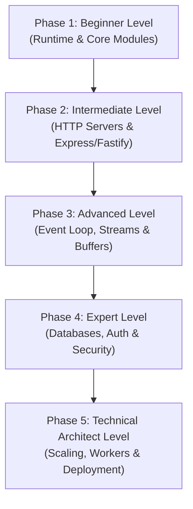

# Node.js: The Complete Beginner-to-Infrastructure Architect Masterclass

**Node.js** is a JavaScript runtime built on Chrome's V8 engine that lets you run JavaScript outside the browser — on servers, in CLIs, inside IoT devices, and across distributed cloud infrastructure. It uses an **event-driven, non-blocking I/O model** that makes it exceptionally efficient for building high-throughput network applications.

This guide is written in clear, simple language with real-world analogies, deep runtime internals, production-ready code patterns, and enterprise deployment architectures to take you from a frontend developer to a high-level Node.js Infrastructure Architect.

---

## 🗺️ The Infrastructure Architect Roadmap



| Phase | Target Role | Key Focus Area | Capstone Project |
| :--- | :--- | :--- | :--- |
| **Phase 1: Beginner** | Frontend Developer | V8 + libuv runtime, core modules, CommonJS vs ESM, npm. | CLI tool that reads/writes files and makes HTTP requests |
| **Phase 2: Intermediate** | Backend Developer | Raw HTTP server, Express middleware, Fastify plugins, request lifecycle. | REST API with Express (CRUD + validation + error handling) |
| **Phase 3: Advanced** | Performance Engineer | Event Loop 6 phases, `nextTick` vs `setImmediate`, Streams, backpressure. | File processing pipeline using Transform streams |
| **Phase 4: Expert** | Platform Engineer | Prisma/Drizzle ORM, JWT auth, bcrypt, Helmet, rate limiting, Zod config. | Secure authenticated API with database and security hardening |
| **Phase 5: Architect** | Infrastructure Architect | `cluster`, `worker_threads`, PM2, Docker, graceful shutdown, OpenTelemetry. | Production containerized service with clustering & observability |

---

## 🚀 Phase 1: Beginner Level (Runtime & Core Modules)

### 1. What is Node.js?

#### 💡 The Power Plant Analogy:
You already know JavaScript works inside a **browser** — think of the browser as a **household electrical outlet**. It powers small appliances: a toaster (DOM manipulation), a lamp (CSS animations), a radio (fetch requests). It works perfectly for household tasks, but you can't power a steel factory from a wall outlet.

**Node.js** is the **power plant** itself. It generates the same electricity (JavaScript), but at industrial scale. Now that same energy can power:
- **Factories** (web servers handling 10,000 concurrent connections)
- **Railways** (CLI tools, build systems, task runners)
- **Entire cities** (microservice architectures, real-time chat platforms, IoT networks)

The key insight: Node.js didn't invent a new language. It took JavaScript's engine (V8) out of the browser and wired it to the operating system — giving JavaScript direct access to the file system, network sockets, child processes, and hardware.

---

### 2. Architecture: V8 + libuv

```
┌─────────────────────────────────────────────────────────────────┐
│                        NODE.JS RUNTIME                          │
│                                                                 │
│  ┌──────────────────┐         ┌──────────────────────────────┐  │
│  │    V8 ENGINE      │         │          libuv                │  │
│  │  (Google Chrome)  │         │  (Cross-platform async I/O)  │  │
│  │                  │         │                              │  │
│  │  • Parses JS     │         │  • Event Loop                │  │
│  │  • Compiles to   │◀───────▶│  • Thread Pool (4 threads)   │  │
│  │    machine code  │         │  • File system operations    │  │
│  │  • Executes code │         │  • DNS lookups               │  │
│  │  • Garbage       │         │  • Network sockets           │  │
│  │    collection    │         │  • Child processes           │  │
│  └──────────────────┘         └──────────────────────────────┘  │
│                                                                 │
│  ┌──────────────────────────────────────────────────────────┐   │
│  │                   Node.js Bindings (C++)                  │   │
│  │   fs | http | crypto | zlib | os | path | net | dns      │   │
│  └──────────────────────────────────────────────────────────┘   │
└─────────────────────────────────────────────────────────────────┘
```

| Component | Role |
| :--- | :--- |
| **V8** | Compiles JavaScript to optimized machine code. Handles memory allocation and garbage collection. |
| **libuv** | Provides the event loop and an OS-abstraction layer for asynchronous I/O (files, network, DNS). Uses a thread pool for operations that can't be async at the OS level. |
| **Node.js Bindings** | C++ bridges that expose OS-level capabilities (file system, crypto, networking) to JavaScript as core modules. |

---

### 3. Core Modules

Node.js ships with built-in modules — no `npm install` required.

#### `fs` (File System):
```javascript
import { readFile, writeFile, readdir } from 'node:fs/promises';

// Read a file
const content = await readFile('./config.json', 'utf-8');
const config = JSON.parse(content);

// Write a file
await writeFile('./output.txt', 'Hello from Node.js!', 'utf-8');

// List directory contents
const files = await readdir('./src');
console.log(files); // ['index.js', 'utils.js', 'routes/']
```

#### `path` (Cross-Platform Path Handling):
```javascript
import path from 'node:path';

path.join('/users', 'alice', 'docs', 'file.txt');
// → '/users/alice/docs/file.txt' (Unix)
// → '\\users\\alice\\docs\\file.txt' (Windows)

path.resolve('./src', 'utils.js');
// → '/absolute/path/to/project/src/utils.js'

path.extname('report.pdf');  // → '.pdf'
path.basename('/a/b/c.txt'); // → 'c.txt'
path.dirname('/a/b/c.txt');  // → '/a/b'
```

#### `events` (EventEmitter):
```javascript
import { EventEmitter } from 'node:events';

const emitter = new EventEmitter();

// Register a listener
emitter.on('order:placed', (order) => {
  console.log(`Processing order #${order.id} for $${order.total}`);
});

// Emit an event
emitter.emit('order:placed', { id: 42, total: 99.99 });
// → "Processing order #42 for $99.99"
```

#### `http` (Raw HTTP Server):
```javascript
import http from 'node:http';

const server = http.createServer((req, res) => {
  res.writeHead(200, { 'Content-Type': 'application/json' });
  res.end(JSON.stringify({ message: 'Hello from raw Node.js!' }));
});

server.listen(3000, () => {
  console.log('Server running at http://localhost:3000');
});
```

---

### 4. The Module System: CommonJS vs ES Modules

| Feature | CommonJS (CJS) | ES Modules (ESM) |
| :--- | :--- | :--- |
| **Syntax** | `const x = require('./x')` | `import x from './x'` |
| **Export** | `module.exports = { ... }` | `export default / export { ... }` |
| **Loading** | Synchronous (blocks execution) | Asynchronous (non-blocking) |
| **Top-level `await`** | ❌ Not supported | ✅ Supported |
| **File extension** | `.js` (default) or `.cjs` | `.mjs` or `.js` with `"type": "module"` |
| **`this` at top level** | `module.exports` object | `undefined` |
| **Recommended** | Legacy codebases | ✅ All new projects |

#### Enabling ESM in Your Project:
```json
// package.json
{
  "type": "module"
}
```

Now all `.js` files in the project use `import`/`export` syntax by default.

---

### 5. npm & `package.json` Deep Dive

#### Semantic Versioning (SemVer):
```
  MAJOR . MINOR . PATCH
    2   .   4   .   1

  ^2.4.1  → accepts 2.x.x  (minor + patch updates)    ← default
  ~2.4.1  → accepts 2.4.x  (patch updates only)
   2.4.1  → exact version, no updates
```

#### Key `package.json` Fields:
```json
{
  "name": "my-api",
  "version": "1.0.0",
  "type": "module",
  "engines": { "node": ">=20.0.0" },
  "scripts": {
    "dev": "node --watch src/index.js",
    "start": "node src/index.js",
    "test": "node --test src/**/*.test.js",
    "lint": "eslint src/"
  },
  "dependencies": {
    "express": "^4.21.0"
  },
  "devDependencies": {
    "eslint": "^9.0.0"
  }
}
```

> [!TIP]
> Node.js 18+ has a built-in `--watch` flag (replaces `nodemon`): `node --watch src/index.js` restarts automatically on file changes.

---

## 🛠️ Phase 2: Intermediate Level (HTTP Servers & Express/Fastify)

### 1. Express.js Fundamentals

Express is the most widely-used Node.js web framework. It provides a minimal layer over raw `http` with routing, middleware, and error handling.

#### The Middleware Pipeline:
```
Request ──▶ [Logger] ──▶ [Auth] ──▶ [Validator] ──▶ [Route Handler] ──▶ Response
               │            │            │                │
               ▼            ▼            ▼                ▼
          Logs request  Checks JWT  Validates body   Sends JSON
          to console    or rejects  or rejects 400   response 200
```

Every middleware function receives `(req, res, next)`. Call `next()` to pass control to the next middleware. If you don't call `next()`, the request hangs.

```typescript
import express from 'express';

const app = express();

// 1. Built-in middleware: parse JSON bodies
app.use(express.json());

// 2. Custom middleware: request logger
app.use((req, res, next) => {
  console.log(`${new Date().toISOString()} ${req.method} ${req.url}`);
  next(); // Pass to the next middleware
});

// 3. Route handler
app.get('/api/users', (req, res) => {
  res.json([
    { id: 1, name: 'Alice' },
    { id: 2, name: 'Bob' }
  ]);
});

// 4. Parameterized route
app.get('/api/users/:id', (req, res) => {
  const userId = parseInt(req.params.id);
  res.json({ id: userId, name: 'Alice' });
});

// 5. POST with body parsing
app.post('/api/users', (req, res) => {
  const { name, email } = req.body;

  if (!name || !email) {
    return res.status(400).json({ error: 'Name and email are required.' });
  }

  const newUser = { id: Date.now(), name, email };
  res.status(201).json(newUser);
});

// 6. Error-handling middleware (MUST have 4 parameters)
app.use((err, req, res, next) => {
  console.error(err.stack);
  res.status(500).json({ error: 'Internal Server Error' });
});

app.listen(3000, () => console.log('Express running on :3000'));
```

---

### 2. Express Router (Modular Routes)

Split routes into separate files for maintainability:

```typescript
// src/routes/users.js
import { Router } from 'express';

const router = Router();

router.get('/', (req, res) => {
  res.json([{ id: 1, name: 'Alice' }]);
});

router.get('/:id', (req, res) => {
  res.json({ id: req.params.id, name: 'Alice' });
});

router.post('/', (req, res) => {
  res.status(201).json({ id: Date.now(), ...req.body });
});

export default router;
```

```typescript
// src/index.js
import express from 'express';
import usersRouter from './routes/users.js';

const app = express();
app.use(express.json());
app.use('/api/users', usersRouter);  // Mount at prefix

app.listen(3000);
```

---

### 3. Fastify (Performance-First Alternative)

**Fastify** is designed for speed — up to 2–3x faster than Express in benchmarks. It uses JSON Schema for request/response validation and a plugin-based architecture.

```typescript
import Fastify from 'fastify';

const app = Fastify({ logger: true });

// Schema-based validation (automatic 400 on invalid input)
const createUserSchema = {
  body: {
    type: 'object',
    required: ['name', 'email'],
    properties: {
      name: { type: 'string', minLength: 1 },
      email: { type: 'string', format: 'email' }
    }
  },
  response: {
    201: {
      type: 'object',
      properties: {
        id: { type: 'number' },
        name: { type: 'string' },
        email: { type: 'string' }
      }
    }
  }
};

app.post('/api/users', { schema: createUserSchema }, async (request, reply) => {
  const { name, email } = request.body;
  const newUser = { id: Date.now(), name, email };
  reply.code(201).send(newUser);
});

app.listen({ port: 3000 });
```

#### Express vs. Fastify:
| Feature | Express | Fastify |
| :--- | :--- | :--- |
| **Performance** | ~15,000 req/s | ~45,000 req/s |
| **Validation** | Manual (middleware) | Built-in JSON Schema |
| **Plugin system** | Middleware-based | Encapsulated plugin tree |
| **TypeScript** | Community types | First-class TS support |
| **Ecosystem** | Massive (most popular) | Growing rapidly |
| **Learning curve** | Lower | Slightly higher |

---

### 4. Request Lifecycle Architecture

```
┌─────────────────────────────────────────────────────────────────┐
│                    REQUEST LIFECYCLE                             │
│                                                                 │
│  Client Request                                                 │
│       │                                                         │
│       ▼                                                         │
│  ┌─────────┐   ┌─────────┐   ┌───────────┐   ┌─────────────┐  │
│  │  Parse   │──▶│Validate │──▶│Authenticate│──▶│  Authorize  │  │
│  │  Body    │   │  Input  │   │   (JWT)    │   │  (Roles)    │  │
│  └─────────┘   └─────────┘   └───────────┘   └─────────────┘  │
│       │             │              │                │           │
│       ▼             ▼              ▼                ▼           │
│  400 if bad    400 if invalid  401 if no token  403 if denied  │
│                                                                 │
│                                    │                            │
│                                    ▼                            │
│                          ┌─────────────────┐                    │
│                          │  Route Handler   │                   │
│                          │  (Business Logic)│                   │
│                          └────────┬────────┘                    │
│                                   │                             │
│                                   ▼                             │
│                          ┌─────────────────┐                    │
│                          │  Send Response   │                   │
│                          │  (200/201/204)   │                   │
│                          └─────────────────┘                    │
└─────────────────────────────────────────────────────────────────┘
```

---

## ⚡ Phase 3: Advanced Level (Event Loop, Streams & Buffers)

### 1. The Node.js Event Loop

#### 💡 The Airport Control Tower Analogy:
Imagine a busy international airport with a single **air traffic controller** sitting in the control tower. This controller doesn't fly any of the planes — but they orchestrate **hundreds of flights** simultaneously: telling Flight A to take off on Runway 1, Flight B to hold at the taxiway, Flight C to begin its descent, and Flight D to proceed to the gate.

The controller works through a **strict rotation of tasks** in a repeating cycle:
1. **Departures desk** (Timers) — "Any flights scheduled to depart now?"
2. **Maintenance bay** (Pending Callbacks) — "Any repairs completed from last cycle?"
3. **Crew briefing room** (Idle/Prepare) — Internal prep (you never interact with this).
4. **Arrivals radar** (Poll) — "Any incoming flights landing now? Wait here if nothing else is queued."
5. **Ground crew dispatch** (Check / `setImmediate`) — "Any ground tasks to run after arrivals?"
6. **Gate closures** (Close Callbacks) — "Any flights finished and closing doors?"

The controller repeats this cycle continuously. They never fly a plane, but no plane moves without their coordination. **Node.js's event loop is that controller** — a single thread orchestrating thousands of asynchronous I/O operations.

---

### 2. The 6 Event Loop Phases

```
   ┌───────────────────────────┐
┌─▶│        1. Timers          │  setTimeout(), setInterval() callbacks
│  │   (departure desk)        │
│  └────────────┬──────────────┘
│               │
│  ┌────────────▼──────────────┐
│  │   2. Pending Callbacks    │  I/O callbacks deferred from previous cycle
│  │   (maintenance bay)       │  (e.g., TCP errors, some OS callbacks)
│  └────────────┬──────────────┘
│               │
│  ┌────────────▼──────────────┐
│  │   3. Idle / Prepare       │  Internal housekeeping (not user-facing)
│  │   (crew briefing room)    │
│  └────────────┬──────────────┘
│               │
│  ┌────────────▼──────────────┐
│  │      4. Poll              │  Retrieve new I/O events (file reads,
│  │   (arrivals radar)        │  network data). Blocks here if idle.
│  └────────────┬──────────────┘
│               │
│  ┌────────────▼──────────────┐
│  │      5. Check             │  setImmediate() callbacks execute here
│  │   (ground crew dispatch)  │
│  └────────────┬──────────────┘
│               │
│  ┌────────────▼──────────────┐
│  │   6. Close Callbacks      │  socket.on('close'), server.on('close')
│  │   (gate closures)         │
│  └────────────┬──────────────┘
│               │
└───────────────┘  (cycle repeats)
```

---

### 3. Microtask Queues: `process.nextTick()` vs `queueMicrotask()` vs `setImmediate()`

Between **every phase** of the event loop, Node.js drains two special microtask queues:

```
  Phase N completes
       │
       ▼
  ┌────────────────────────┐
  │  process.nextTick()    │  ◀── Runs FIRST (highest priority)
  │  queue (drained fully) │
  └────────┬───────────────┘
           │
  ┌────────▼───────────────┐
  │  Promise microtasks    │  ◀── .then(), await, queueMicrotask()
  │  queue (drained fully) │
  └────────┬───────────────┘
           │
           ▼
     Phase N+1 begins
```

| Function | When it Runs | Use Case |
| :--- | :--- | :--- |
| `process.nextTick(cb)` | Before **any** I/O, before Promises. Drained between every phase. | Ensure callback runs before anything else. Emit events after constructor returns. |
| `queueMicrotask(cb)` | After `nextTick`, before next phase. Same queue as Promise `.then()`. | Spec-compliant microtask scheduling. |
| `setImmediate(cb)` | In the **Check** phase (phase 5) of the current or next loop iteration. | Run after I/O events are processed. |
| `setTimeout(cb, 0)` | In the **Timers** phase (phase 1) of the next loop iteration. | Delay execution to next loop cycle. |

#### Execution Order Proof:
```javascript
console.log('1 - synchronous');

setTimeout(() => console.log('2 - setTimeout'), 0);
setImmediate(() => console.log('3 - setImmediate'));

process.nextTick(() => console.log('4 - nextTick'));
queueMicrotask(() => console.log('5 - queueMicrotask'));

Promise.resolve().then(() => console.log('6 - Promise.then'));

console.log('7 - synchronous');

// Output:
// 1 - synchronous
// 7 - synchronous
// 4 - nextTick           (nextTick queue drained first)
// 5 - queueMicrotask     (microtask queue drained second)
// 6 - Promise.then       (same microtask queue)
// 2 - setTimeout          (Timers phase)
// 3 - setImmediate        (Check phase)
```

> [!WARNING]
> **`process.nextTick()` starvation**: If you recursively call `nextTick` inside a `nextTick` callback, the I/O will never be processed because the nextTick queue is drained completely before moving to the next phase. Prefer `setImmediate()` for recursive patterns.

---

### 4. Streams

Streams process data **piece by piece** instead of loading everything into memory. This is critical for large files, network data, and real-time processing.

#### 💡 The Water Pipeline Analogy:
Imagine pumping water from a lake to a treatment plant to homes. You don't drain the entire lake into a bucket, carry it to the plant, treat it all at once, then carry it to every house. Instead, water flows through **pipes** continuously — the pump pushes water (Readable), the treatment plant cleans it as it flows through (Transform), and the faucet receives clean water (Writable). If the faucet is turned off, **backpressure** builds up and the pump slows down.

#### The 4 Stream Types:
| Stream Type | Description | Example |
| :--- | :--- | :--- |
| **Readable** | Source of data (produces chunks) | `fs.createReadStream()`, `http.IncomingMessage` |
| **Writable** | Destination for data (consumes chunks) | `fs.createWriteStream()`, `http.ServerResponse` |
| **Transform** | Modifies data as it passes through | `zlib.createGzip()`, custom CSV parser |
| **Duplex** | Both Readable and Writable (independent) | `net.Socket`, WebSocket connections |

#### Reading a Large File with Streams:
```javascript
import { createReadStream } from 'node:fs';

const stream = createReadStream('./large-file.csv', {
  encoding: 'utf-8',
  highWaterMark: 64 * 1024   // 64KB chunks
});

let lineCount = 0;

stream.on('data', (chunk) => {
  lineCount += chunk.split('\n').length - 1;
});

stream.on('end', () => {
  console.log(`Total lines: ${lineCount}`);
});

stream.on('error', (err) => {
  console.error('Stream error:', err.message);
});
```

#### Transform Stream (process data flowing through):
```javascript
import { Transform } from 'node:stream';
import { createReadStream, createWriteStream } from 'node:fs';
import { pipeline } from 'node:stream/promises';

// Custom Transform: convert each line to uppercase
const toUpperCase = new Transform({
  transform(chunk, encoding, callback) {
    const upper = chunk.toString().toUpperCase();
    callback(null, upper);   // Push transformed data downstream
  }
});

// Pipeline: Read → Transform → Write (handles backpressure automatically)
await pipeline(
  createReadStream('./input.txt'),
  toUpperCase,
  createWriteStream('./output.txt')
);

console.log('Pipeline complete!');
```

> [!IMPORTANT]
> Always use `pipeline()` instead of `.pipe()`. `pipeline` properly handles errors, cleans up streams on failure, and resolves backpressure. `.pipe()` does not handle errors — a failed stream can cause memory leaks.

---

### 5. Buffers (Binary Data)

Buffers represent raw binary data in memory. They're essential when working with file I/O, network protocols, and cryptography.

```javascript
// Create a Buffer from a string
const buf = Buffer.from('Hello Node.js', 'utf-8');
console.log(buf);            // <Buffer 48 65 6c 6c 6f 20 4e 6f 64 65 2e 6a 73>
console.log(buf.length);     // 13 (bytes, not characters)
console.log(buf.toString()); // 'Hello Node.js'

// Allocate a fixed-size buffer (zeroed out)
const empty = Buffer.alloc(1024);       // 1KB, filled with 0x00
const unsafe = Buffer.allocUnsafe(1024); // 1KB, may contain old memory (faster)

// Concatenate buffers
const combined = Buffer.concat([buf, Buffer.from(' — Runtime')]);
console.log(combined.toString()); // 'Hello Node.js — Runtime'
```

---

## 🧬 Phase 4: Expert Level (Databases, Auth & Security)

### 1. Database Integration Patterns

#### Connection Pooling (Why It Matters):
Without a pool, every database query opens a new TCP connection, performs a TLS handshake, authenticates, executes the query, and tears down the connection. For a server handling 1,000 requests/second, that's 1,000 connections being created and destroyed every second.

A **connection pool** pre-creates a set of persistent connections and reuses them across requests.

```
WITHOUT Pool:                    WITH Pool:
Request 1 → Open → Query → Close    Request 1 ──┐
Request 2 → Open → Query → Close    Request 2 ──┤──▶ Pool (10 connections) ──▶ Database
Request 3 → Open → Query → Close    Request 3 ──┤     (reused, persistent)
...1000 connections/sec              ...1000 ──┘      3ms per query
   ~50ms overhead per query
```

#### Prisma ORM (Type-Safe Database Client):
```typescript
// prisma/schema.prisma
generator client {
  provider = "prisma-client-js"
}

datasource db {
  provider = "postgresql"
  url      = env("DATABASE_URL")
}

model User {
  id        Int      @id @default(autoincrement())
  name      String
  email     String   @unique
  posts     Post[]
  createdAt DateTime @default(now())
}

model Post {
  id        Int      @id @default(autoincrement())
  title     String
  content   String?
  author    User     @relation(fields: [authorId], references: [id])
  authorId  Int
  createdAt DateTime @default(now())
}
```

```typescript
// src/db.ts
import { PrismaClient } from '@prisma/client';

// Singleton pattern — reuse across the application
const prisma = new PrismaClient();

// Create a user with related posts
const user = await prisma.user.create({
  data: {
    name: 'Alice',
    email: 'alice@example.com',
    posts: {
      create: [
        { title: 'First Post', content: 'Hello world!' },
        { title: 'Second Post', content: 'Node.js is awesome.' }
      ]
    }
  },
  include: { posts: true }  // Eager-load relationships
});

// Query with filtering, sorting, pagination
const recentPosts = await prisma.post.findMany({
  where: { author: { email: { endsWith: '@example.com' } } },
  orderBy: { createdAt: 'desc' },
  take: 10,
  skip: 0,
  include: { author: { select: { name: true } } }
});
```

---

### 2. Authentication (JWT + bcrypt)

```typescript
import jwt from 'jsonwebtoken';
import bcrypt from 'bcrypt';

const JWT_SECRET = process.env.JWT_SECRET!;
const SALT_ROUNDS = 12;

// --- Registration ---
async function register(name: string, email: string, password: string) {
  // Hash the password (never store plaintext)
  const hashedPassword = await bcrypt.hash(password, SALT_ROUNDS);

  const user = await prisma.user.create({
    data: { name, email, password: hashedPassword }
  });

  return user;
}

// --- Login ---
async function login(email: string, password: string) {
  const user = await prisma.user.findUnique({ where: { email } });
  if (!user) throw new Error('User not found');

  // Compare plaintext password with stored hash
  const isValid = await bcrypt.compare(password, user.password);
  if (!isValid) throw new Error('Invalid password');

  // Generate JWT token
  const token = jwt.sign(
    { userId: user.id, role: user.role },
    JWT_SECRET,
    { expiresIn: '24h' }
  );

  return { token, user: { id: user.id, name: user.name } };
}

// --- Auth Middleware ---
function authenticate(req, res, next) {
  const authHeader = req.headers.authorization;
  if (!authHeader?.startsWith('Bearer ')) {
    return res.status(401).json({ error: 'Missing token' });
  }

  try {
    const token = authHeader.split(' ')[1];
    const payload = jwt.verify(token, JWT_SECRET);
    req.user = payload;  // Attach decoded user to request
    next();
  } catch (err) {
    res.status(401).json({ error: 'Invalid or expired token' });
  }
}

// --- Protected Route ---
app.get('/api/profile', authenticate, (req, res) => {
  res.json({ userId: req.user.userId, role: req.user.role });
});
```

---

### 3. Security Hardening

```typescript
import helmet from 'helmet';
import rateLimit from 'express-rate-limit';
import cors from 'cors';

const app = express();

// 1. Helmet: Sets 15+ security HTTP headers
app.use(helmet());
// X-Content-Type-Options: nosniff
// X-Frame-Options: DENY
// Strict-Transport-Security: max-age=...
// Content-Security-Policy: ...

// 2. Rate Limiting: Prevent brute-force and DDoS
const limiter = rateLimit({
  windowMs: 15 * 60 * 1000,  // 15 minutes
  max: 100,                   // 100 requests per window per IP
  standardHeaders: true,
  legacyHeaders: false,
  message: { error: 'Too many requests. Try again later.' }
});
app.use('/api/', limiter);

// 3. CORS: Restrict cross-origin access
app.use(cors({
  origin: ['https://myapp.com', 'https://admin.myapp.com'],
  methods: ['GET', 'POST', 'PUT', 'DELETE'],
  credentials: true
}));

// 4. Input size limits (prevent payload bombs)
app.use(express.json({ limit: '1mb' }));
```

#### Security Checklist:
| Threat | Mitigation |
| :--- | :--- |
| **XSS** | Helmet CSP headers, sanitize user input, never `innerHTML` user data |
| **SQL Injection** | Always use parameterized queries or ORM (Prisma). Never concatenate user input into SQL. |
| **Brute Force** | Rate limiting on auth endpoints, account lockout after N failures. |
| **CSRF** | Use `SameSite=Strict` cookies, CSRF tokens for form submissions. |
| **Dependency Vulnerabilities** | Run `npm audit` regularly, use Snyk or Socket.dev for monitoring. |
| **Secrets Exposure** | Never commit `.env` files. Use vault services (AWS Secrets Manager, Doppler). |

---

### 4. Environment Management with Zod

```typescript
import { z } from 'zod';
import 'dotenv/config';

// Define the schema for your environment variables
const envSchema = z.object({
  NODE_ENV: z.enum(['development', 'production', 'test']).default('development'),
  PORT: z.coerce.number().default(3000),
  DATABASE_URL: z.string().url(),
  JWT_SECRET: z.string().min(32, 'JWT_SECRET must be at least 32 characters'),
  REDIS_URL: z.string().url().optional(),
});

// Validate at startup — crash immediately if config is invalid
const env = envSchema.parse(process.env);

export default env;

// Usage: import env from './env.js';
// env.PORT, env.DATABASE_URL — fully typed and validated
```

> [!IMPORTANT]
> Validate environment variables **at application startup**, not at first use. Failing fast with a clear error message is far better than a cryptic crash 6 hours into production when a missing variable is finally accessed.

---

## 🏛️ Phase 5: Technical Architect Level (Scaling, Workers & Deployment)

### 1. `cluster` Module (Multi-Process Scaling)

Node.js runs on a **single thread**. On a machine with 8 CPU cores, a single Node.js process uses only 1 core — leaving 7 idle. The `cluster` module forks multiple worker processes that share the same port.

```typescript
import cluster from 'node:cluster';
import { availableParallelism } from 'node:os';
import http from 'node:http';

const numCPUs = availableParallelism();

if (cluster.isPrimary) {
  console.log(`Primary ${process.pid} forking ${numCPUs} workers`);

  // Fork one worker per CPU core
  for (let i = 0; i < numCPUs; i++) {
    cluster.fork();
  }

  // Restart crashed workers
  cluster.on('exit', (worker, code) => {
    console.log(`Worker ${worker.process.pid} died (code ${code}). Restarting...`);
    cluster.fork();
  });
} else {
  // Each worker runs the full HTTP server
  http.createServer((req, res) => {
    res.writeHead(200);
    res.end(`Handled by worker ${process.pid}\n`);
  }).listen(3000);

  console.log(`Worker ${process.pid} started`);
}
```

---

### 2. `worker_threads` (True Multi-Threading)

Unlike `cluster` (which forks separate processes), `worker_threads` create threads **within the same process**, sharing memory. Ideal for CPU-intensive computation (image processing, encryption, data parsing) without blocking the event loop.

```typescript
// main.js
import { Worker } from 'node:worker_threads';

function runHeavyTask(data) {
  return new Promise((resolve, reject) => {
    const worker = new Worker('./heavy-task.js', {
      workerData: data
    });

    worker.on('message', resolve);
    worker.on('error', reject);
    worker.on('exit', (code) => {
      if (code !== 0) reject(new Error(`Worker exited with code ${code}`));
    });
  });
}

// Main thread stays responsive while worker crunches data
const result = await runHeavyTask({ numbers: Array.from({ length: 10_000_000 }, (_, i) => i) });
console.log('Sum:', result);
```

```typescript
// heavy-task.js
import { parentPort, workerData } from 'node:worker_threads';

// CPU-intensive work runs on a separate thread
const sum = workerData.numbers.reduce((acc, n) => acc + n, 0);

// Send result back to main thread
parentPort.postMessage(sum);
```

#### `cluster` vs `worker_threads`:
| Feature | `cluster` | `worker_threads` |
| :--- | :--- | :--- |
| **Model** | Multiple processes (forked) | Multiple threads (same process) |
| **Memory** | Separate memory per process | Shared memory via `SharedArrayBuffer` |
| **Use case** | Scale HTTP servers across cores | CPU-intensive computation |
| **Communication** | IPC (JSON serialized) | `postMessage` or `SharedArrayBuffer` |
| **Crash isolation** | ✅ One worker crash doesn't affect others | ❌ Thread crash can affect the process |

---

### 3. PM2 (Production Process Manager)

PM2 manages Node.js processes in production — cluster mode, log management, monitoring, and zero-downtime reloads.

```bash
# Start in cluster mode (one worker per CPU)
pm2 start src/index.js -i max --name my-api

# Zero-downtime reload (rolling restart)
pm2 reload my-api

# Monitor all processes
pm2 monit

# View logs
pm2 logs my-api --lines 100

# Ecosystem file (pm2.config.cjs)
```

```javascript
// pm2.config.cjs
module.exports = {
  apps: [{
    name: 'my-api',
    script: 'src/index.js',
    instances: 'max',           // One per CPU core
    exec_mode: 'cluster',
    max_memory_restart: '500M', // Auto-restart if memory exceeds 500MB
    env: {
      NODE_ENV: 'production',
      PORT: 3000
    },
    // Graceful shutdown
    kill_timeout: 5000,         // Wait 5s for connections to drain
    listen_timeout: 10000       // Wait 10s for app to signal 'ready'
  }]
};
```

---

### 4. Graceful Shutdown

When a container or PM2 sends `SIGTERM`, your server must:
1. Stop accepting new connections.
2. Wait for in-flight requests to complete.
3. Close database connections.
4. Exit cleanly.

```typescript
import express from 'express';
import { PrismaClient } from '@prisma/client';

const app = express();
const prisma = new PrismaClient();

const server = app.listen(3000, () => {
  console.log('Server ready on :3000');
});

// Graceful shutdown handler
async function shutdown(signal: string) {
  console.log(`\n${signal} received. Starting graceful shutdown...`);

  // 1. Stop accepting new connections
  server.close(() => {
    console.log('HTTP server closed (no new connections).');
  });

  // 2. Set a hard deadline (force-kill if still alive)
  const forceExit = setTimeout(() => {
    console.error('Forceful shutdown — deadline exceeded.');
    process.exit(1);
  }, 10_000); // 10 seconds

  try {
    // 3. Close database connections
    await prisma.$disconnect();
    console.log('Database connections closed.');

    clearTimeout(forceExit);
    process.exit(0);
  } catch (err) {
    console.error('Error during shutdown:', err);
    process.exit(1);
  }
}

process.on('SIGTERM', () => shutdown('SIGTERM'));
process.on('SIGINT', () => shutdown('SIGINT'));
```

---

### 5. Production Dockerfile (Multi-Stage)

```dockerfile
# Stage 1: Build
FROM node:20-alpine AS builder
WORKDIR /app
COPY package*.json ./
RUN npm ci --production=false     # Install all deps (including devDeps for build)
COPY . .
RUN npx prisma generate           # Generate Prisma client
RUN npm run build                 # If using TypeScript

# Stage 2: Production
FROM node:20-alpine AS runner
WORKDIR /app

# Create non-root user for security
RUN addgroup -S appgroup && adduser -S appuser -G appgroup

# Copy only production artifacts
COPY --from=builder /app/node_modules ./node_modules
COPY --from=builder /app/dist ./dist
COPY --from=builder /app/package.json ./
COPY --from=builder /app/prisma ./prisma

# Switch to non-root user
USER appuser

# Health check
HEALTHCHECK --interval=30s --timeout=5s --start-period=10s --retries=3 \
  CMD wget --no-verbose --tries=1 --spider http://localhost:3000/health || exit 1

EXPOSE 3000
ENV NODE_ENV=production

CMD ["node", "dist/index.js"]
```

---

### 6. Observability

#### Structured Logging with Pino:
```typescript
import pino from 'pino';

const logger = pino({
  level: process.env.LOG_LEVEL || 'info',
  transport: process.env.NODE_ENV === 'development'
    ? { target: 'pino-pretty' }  // Human-readable in dev
    : undefined                   // JSON in production (for log aggregators)
});

// Structured log (machine-parseable)
logger.info({ userId: 42, action: 'login', ip: '192.168.1.1' }, 'User logged in');

// Output in production (JSON):
// {"level":30,"time":1700000000000,"userId":42,"action":"login","ip":"192.168.1.1","msg":"User logged in"}

// Express middleware
app.use((req, res, next) => {
  req.log = logger.child({ requestId: crypto.randomUUID() });
  req.log.info({ method: req.method, url: req.url }, 'Request received');
  next();
});
```

#### Why Pino over Winston/Morgan?
| Feature | Pino | Winston |
| :--- | :--- | :--- |
| **Performance** | ~5x faster (low overhead) | Slower (flexible but heavy) |
| **Output format** | JSON by default (prod-optimized) | Configurable (often string-based) |
| **Child loggers** | ✅ Built-in (request-scoped context) | Manual setup |
| **Pretty printing** | Separate transport (`pino-pretty`) | Built-in formatters |
