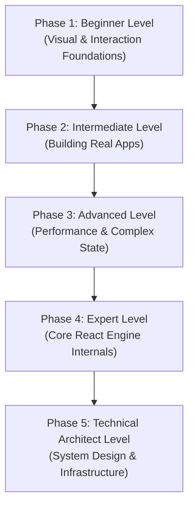
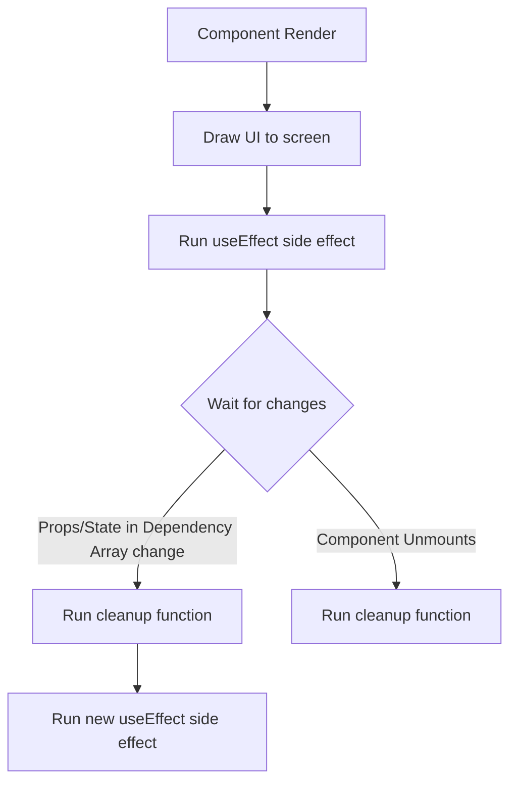
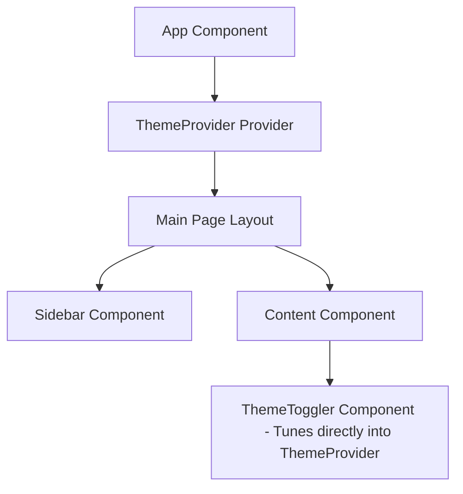

# ReactJS: The Complete Beginner-to-Architect Masterclass

Welcome to the ultimate ReactJS learning resource! This guide is written with a simple, conversational, and highly educational approach. Whether you are starting from zero or aiming to design enterprise-grade frontends as a Technical Architect, this document will explain every single concept using:
- **Simple Real-World Analogies** to make complex ideas intuitive.
- **Detailed Step-by-Step Explanations** of how things work behind the scenes.
- **Complete, Production-Ready Code Examples** with no placeholders or shortcuts.

---

## 🗺️ The Zero-to-Architect Roadmap

This diagram shows your learning path. Each level builds a foundation for the next.



---

## 🚀 Phase 1: Beginner Level (UI & Interaction Foundations)

### 1. Declarative vs. Imperative UI
To understand React, you must understand the shift from **Imperative** programming to **Declarative** programming.

#### 💡 The Restaurant Analogy:
- **Imperative (Vanilla Javascript)**: Imagine going to a restaurant kitchen and instructing the chef step-by-step: *"Pick up a frying pan. Pour 10ml of olive oil. Turn on the stove to medium heat. Crack two eggs. Wait 3 minutes..."* You are telling the system **how** to do it.
- **Declarative (React)**: You sit at the table and say: *"I would like two sunny-side-up eggs, please."* You describe **what** you want. The kitchen (React) takes care of all the complex steps to make it happen.

Let's look at this in code:

#### Imperative UI (Vanilla Javascript)
Every time the count changes, we have to manually grab the DOM element, modify its text, and append elements ourselves.
```javascript
// Step 1: Create HTML elements manually
const container = document.getElementById('app');
const countSpan = document.createElement('span');
countSpan.innerText = 'Count: 0'; // Initial state

const button = document.createElement('button');
button.innerText = 'Increment';

// Step 2: Track state in a separate variable
let count = 0;

// Step 3: Write manual instructions to update the DOM on user click
button.addEventListener('click', () => {
  count++;
  countSpan.innerText = `Count: ${count}`; // Manual sync: easy to forget in larger apps!
});

// Step 4: Assemble the page layout manually
container.appendChild(countSpan);
container.appendChild(button);
```

#### Declarative UI (React)
Instead of updating elements manually, you define a single state variable. You tell React: *"When state changes, draw the UI like this."* React automatically synchronizes the display.
```jsx
import React, { useState } from 'react';

function Counter() {
  // Define state. React tracks this variable.
  const [count, setCount] = useState(0);

  // We declare WHAT the HTML should look like for the current count.
  return (
    <div style={{ padding: '20px', fontFamily: 'Arial' }}>
      <span>Count: {count}</span>
      <button onClick={() => setCount(count + 1)}>
        Increment
      </button>
    </div>
  );
}
```

---

### 2. Setting Up a Modern Project with Vite
We no longer use outdated tools like `Create React App` (CRA) because they are slow and outdated. Instead, we use **Vite** (pronounced "Veet", French for "fast").

#### Why is Vite so fast?
In development, Vite does not bundle your code into one massive file. Instead, it serves files as **Native ES Modules** directly to your browser. The browser requests only the code it needs to display the current screen, resulting in near-instant project startups and hot updates.

#### Quick Setup:
```bash
# 1. Run the Vite builder and choose "React" and "TypeScript"
npm create vite@latest learn-react -- --template react-ts

# 2. Open the project folder
cd learn-react

# 3. Install all default libraries
npm install

# 4. Start the lightning-fast development server
npm run dev
```

---

### 3. JSX Syntax and Compilation
**JSX** (JavaScript XML) is a visual extension that allows you to write HTML-like structures directly inside your JavaScript code. 

Browsers do not natively understand JSX. When you run or build your app, a compiler (like SWC or Babel) compiles the visual code into normal JavaScript functions.

#### 📝 JSX Input Code:
```jsx
const element = <h1 className="main-title">Hello React!</h1>;
```

#### ⚙️ Compiled Output (Under the Hood):
```javascript
import { jsx as _jsx } from "react/jsx-runtime";

// The compiler turns JSX elements into normal function calls!
const element = _jsx("h1", {
  className: "main-title",
  children: "Hello React!"
});
```

---

### 4. Components, Props, and Immutability
- **Components** are the building blocks of a React application. Think of them as reusable UI stamps.
- **Props** (Properties) are parameters passed to a component, similar to inputs passed to a function.

#### 💡 The Sandwich Analogy:
Think of a sandwich-making component. **Props** are the ingredients you pass into the maker (e.g. `bread="wheat"`, `filling="turkey"`). The component uses these ingredients to build the sandwich. The sandwich maker must **never** swap out or mutate those ingredients internally; they are read-only!

#### Code Example:
```tsx
import React from 'react';

// Step 1: Define what props this component expects using TypeScript
interface ProductCardProps {
  title: string;
  price: number;
  isAvailable: boolean;
}

// Step 2: Write the component as a function
export function ProductCard({ title, price, isAvailable }: ProductCardProps) {
  // CRITICAL RULE: Props are immutable (read-only).
  // DO NOT write: price = 20; (React will throw errors!)

  return (
    <div style={{ border: '1px solid #ccc', padding: '16px', borderRadius: '8px' }}>
      <h2>{title}</h2>
      <p>Price: ${price.toFixed(2)}</p>
      
      {/* Conditional visual label */}
      <span style={{ color: isAvailable ? 'green' : 'red' }}>
        {isAvailable ? 'In Stock' : 'Out of Stock'}
      </span>
    </div>
  );
}
```

---

### 5. Local State (`useState`)
State represents variables that hold data unique to a component that can change over time based on user interactions.

#### 💡 The Light Switch Analogy:
A light switch has a state: it can be `ON` or `OFF`. When a user toggles the switch, the state changes, and the light bulb updates its behavior (shining or dark).

#### Step-by-Step Code Example:
```tsx
import React, { useState } from 'react';

export function StatefulSwitch() {
  // useState returns an array with exactly two elements:
  // 1. The current state value (isLightOn)
  // 2. A function to change that value (setIsLightOn)
  const [isLightOn, setIsLightOn] = useState<boolean>(false);

  // A handler to toggle the state safely
  const handleToggle = () => {
    // When the next state depends on the previous state,
    // pass a callback function to guarantee we have the latest value!
    setIsLightOn(previousState => !previousState);
  };

  return (
    <div style={{ 
      padding: '24px', 
      backgroundColor: isLightOn ? '#FFFDF0' : '#1E1E1E',
      color: isLightOn ? '#000' : '#FFF',
      textAlign: 'center' 
    }}>
      <h3>The Light is {isLightOn ? 'ON 💡' : 'OFF 🌙'}</h3>
      <button onClick={handleToggle} style={{ padding: '8px 16px', cursor: 'pointer' }}>
        Toggle Switch
      </button>
    </div>
  );
}
```

> [!WARNING]
> React state updates are batched and asynchronous. If you call `setIsLightOn(true)` and try to `console.log(isLightOn)` on the very next line, it will still output the *old* value. React schedules state updates to happen right before drawing the next frame.

---

### 6. Event Handling & Synthetic Events
React normalizes event structures using its **Synthetic Event System**.

#### What does that mean?
Different browsers (Chrome, Firefox, Safari) historically had varying names and behaviors for events. React wraps native browser events in a custom `SyntheticEvent` wrapper. This guarantees that your event handlers work exactly the same way on every browser.

```tsx
import React from 'react';

export function EventShowcase() {
  // We type the event parameter explicitly for safety
  const handleFormSubmit = (event: React.FormEvent<HTMLFormElement>) => {
    // 1. Prevent the browser from refreshing the page
    event.preventDefault();

    // 2. Read values from target safely
    console.log('Form was submitted safely without page reload.');
  };

  const handleInputChange = (event: React.ChangeEvent<HTMLInputElement>) => {
    console.log('User typed:', event.target.value);
  };

  return (
    <form onSubmit={handleFormSubmit} style={{ display: 'flex', flexDirection: 'column', gap: '10px' }}>
      <label>Type something:</label>
      <input type="text" onChange={handleInputChange} />
      <button type="submit">Submit Data</button>
    </form>
  );
}
```

---

### 7. Rendering Collections and the Critical Role of `key`
When you want to display an array of data, you use the JavaScript `.map()` method to convert your data array into JSX tags.

```tsx
interface Student {
  id: string; // Stable, unique identifier
  name: string;
}

export function StudentList({ students }: { students: Student[] }) {
  return (
    <div>
      <h3>Classroom Roster</h3>
      <ul>
        {students.map((student) => (
          // The 'key' prop is mandatory for list items
          <li key={student.id}>
            {student.name}
          </li>
        ))}
      </ul>
    </div>
  );
}
```

#### ❓ Why does React require a `key` prop?
Imagine a list of 1,000 items rendered on screen. If you insert a new item at the top of the list, how does React know if it should redraw all 1,000 items, or simply insert one new DOM element and shift the rest?
- Without a unique `key`, React is blind. It has to re-evaluate and often recreate the entire list.
- With a unique, stable `key` (like a database ID), React matches the keys before and after the update. It says: *"Aha! Keys 2 to 1,001 are identical. Key 1 is new. I will perform a single, efficient DOM insertion at the top."*

> [!CAUTION]
> Avoid using array indexes (`key={index}`) for dynamic lists that can be sorted, filtered, or rearranged. If you sort the list, the indexes stay `0, 1, 2`, causing React to bind input values and animation states to the wrong items.

---

## 🛠️ Phase 2: Intermediate Level (Building Real-World Apps)

### 1. Side Effects and the `useEffect` Hook
React components are pure rendering functions. They are only supposed to take state and props, and return HTML. 
Anything that happens *outside* this pure process is a **Side Effect** (e.g., calling an API, starting a timer, writing to LocalStorage, or opening a WebSocket).

We use the `useEffect` hook to run side effects safely at specific points in a component's lifecycle.



#### Complete Fetching Code Example with Cleanup:
```tsx
import React, { useState, useEffect } from 'react';

interface User {
  id: number;
  name: string;
  email: string;
}

export function UserLoader({ userId }: { userId: number }) {
  const [user, setUser] = useState<User | null>(null);
  const [error, setError] = useState<string | null>(null);
  const [isLoading, setIsLoading] = useState<boolean>(true);

  useEffect(() => {
    // 1. Reset state whenever the userId changes
    setIsLoading(true);
    setError(null);

    // 2. Setup a flag to prevent "race conditions"
    // If userId changes rapidly from 1 to 2, API call 1 might return *after* API call 2 finishes.
    // Without this flag, the screen would glitch and show old user data!
    let active = true;

    async function loadData() {
      try {
        const response = await fetch(`https://jsonplaceholder.typicode.com/users/${userId}`);
        if (!response.ok) {
          throw new Error('Failed to retrieve user data.');
        }
        const data = await response.json();

        // Only update state if this effect execution is still active
        if (active) {
          setUser(data);
          setIsLoading(false);
        }
      } catch (err: any) {
        if (active) {
          setError(err.message);
          setIsLoading(false);
        }
      }
    }

    loadData();

    // 3. CLEANUP FUNCTION: React calls this before running this effect again,
    // and also when the component is destroyed (unmounted) from the screen.
    return () => {
      active = false; // Cancel old state updates
    };
  }, [userId]); // Dependency Array: Only execute this effect when userId changes!

  if (isLoading) return <p>Loading user profile...</p>;
  if (error) return <p style={{ color: 'red' }}>Error: {error}</p>;
  if (!user) return null;

  return (
    <div style={{ border: '1px solid #ddd', padding: '16px', borderRadius: '4px' }}>
      <h4>{user.name}</h4>
      <p>Email: {user.email}</p>
    </div>
  );
}
```

---

### 2. Custom Hooks: Separating Logic from Presentation
A **Custom Hook** is simply a JavaScript function that uses other React hooks under the hood. It allows us to extract messy business logic out of UI rendering files, making code reusable and highly readable.

#### 💡 The Engine Analogy:
Think of a car. The UI is the steering wheel and dashboard (buttons and graphics). The custom hook is the engine block. The driver doesn't need to see the internal pistons firing; they just interact with clear dashboard readouts and controls.

#### The Custom Hook (`useFetch.ts`):
```ts
import { useState, useEffect } from 'react';

export function useFetch<T>(url: string) {
  const [data, setData] = useState<T | null>(null);
  const [loading, setLoading] = useState<boolean>(true);
  const [error, setError] = useState<string | null>(null);

  useEffect(() => {
    let active = true;
    setLoading(true);

    fetch(url)
      .then((res) => {
        if (!res.ok) throw new Error('Network error fetching resource');
        return res.json();
      })
      .then((fetchedData) => {
        if (active) {
          setData(fetchedData);
          setLoading(false);
        }
      })
      .catch((err) => {
        if (active) {
          setError(err.message);
          setLoading(false);
        }
      });

    return () => {
      active = false;
    };
  }, [url]);

  return { data, loading, error };
}
```

#### Using the Custom Hook inside a Component:
```tsx
import React from 'react';
import { useFetch } from './useFetch';

interface Todo {
  id: number;
  title: string;
  completed: boolean;
}

export function TodoDashboard() {
  // Look how clean the UI file becomes! We just read variables.
  const { data: todos, loading, error } = useFetch<Todo[]>('https://jsonplaceholder.typicode.com/todos?_limit=5');

  if (loading) return <div>Loading dashboard...</div>;
  if (error) return <div>Failed to load: {error}</div>;

  return (
    <ul>
      {todos?.map(todo => (
        <li key={todo.id} style={{ textDecoration: todo.completed ? 'line-through' : 'none' }}>
          {todo.title}
        </li>
      ))}
    </ul>
  );
}
```

---

### 3. Sharing Global State with the Context API
By default, data in React moves in a single direction: from top to bottom (Parent to Child) via props. If you need to share data between two far-apart components in the tree, passing props down 10 levels is called **Prop Drilling** and is highly annoying.

The **Context API** solves this by creating a global "broadcast station." Any component inside the coverage area can tune in and read the broadcast data directly.



#### Step-by-Step Code Example:
```tsx
import React, { createContext, useContext, useState } from 'react';

// Step 1: Define what values our Context will broadcast
interface ThemeContextType {
  theme: 'light' | 'dark';
  toggleTheme: () => void;
}

// Step 2: Create the Context container
const ThemeContext = createContext<ThemeContextType | undefined>(undefined);

// Step 3: Create a wrapper Provider component
export function ThemeProvider({ children }: { children: React.ReactNode }) {
  const [theme, setTheme] = useState<'light' | 'dark'>('light');

  const toggleTheme = () => {
    setTheme((prevTheme) => (prevTheme === 'light' ? 'dark' : 'light'));
  };

  return (
    <ThemeContext.Provider value={{ theme, toggleTheme }}>
      {children}
    </ThemeContext.Provider>
  );
}

// Step 4: Create a clean custom hook to consume the Context
export function useAppTheme() {
  const context = useContext(ThemeContext);
  // Defend against developers trying to use this hook outside the Provider
  if (!context) {
    throw new Error('useAppTheme must be used within a ThemeProvider');
  }
  return context;
}

// Step 5: Implement consumer components
export function ThemeStatusDisplay() {
  const { theme, toggleTheme } = useAppTheme();

  return (
    <div style={{
      padding: '20px',
      backgroundColor: theme === 'light' ? '#fff' : '#333',
      color: theme === 'light' ? '#000' : '#fff',
      borderRadius: '8px',
      marginTop: '10px'
    }}>
      <p>The active global theme is <strong>{theme}</strong></p>
      <button onClick={toggleTheme}>Toggle Theme</button>
    </div>
  );
}
```

---

## ⚡ Phase 3: Advanced Level (Performance & Enterprise State)

### 1. Rendering Optimization: Caching Techniques
To build super fast applications, you must master React's three major rendering optimization tools: `React.memo`, `useMemo`, and `useCallback`.

#### Why do we need them?
Whenever state changes inside a component, React re-renders that component **and recursively re-renders all of its children by default**, even if their props did not change! For large components, this causes significant performance lag.

#### 💡 The Math Exam Analogy:
- **`React.memo`**: A smart student who says: *"I already solved these exact homework problems. Since my inputs didn't change, I will just hand in my cached answers without recalculating."*
- **`useMemo`**: Caches the result of a massive math formula ($100,000 \times 400$). The student stores the answer `40,000,000` on a scratchpad and only recalculates if the numbers in the formula change.
- **`useCallback`**: Saves a custom drawing technique. It ensures the drawing function instance stays identical in memory so it doesn't trigger new canvas recalculations.

#### Implementation Example:
```tsx
import React, { useState, useMemo, useCallback } from 'react';

interface Task {
  id: number;
  label: string;
  points: number;
}

// 1. React.memo: This component ONLY re-renders if its item or onClick changes.
const TaskRow = React.memo(({ task, onClick }: { task: Task; onClick: (id: number) => void }) => {
  console.log(`Rendering Row: ${task.label}`);
  return (
    <div style={{ padding: '8px 0', borderBottom: '1px dashed #eee' }}>
      <span>{task.label} ({task.points} pts)</span>
      <button onClick={() => onClick(task.id)} style={{ marginLeft: '12px' }}>
        Complete
      </button>
    </div>
  );
});

TaskRow.displayName = 'TaskRow';

export function HighPerformanceDashboard() {
  const [tasks, setTasks] = useState<Task[]>([
    { id: 1, label: 'Design landing page mockup', points: 80 },
    { id: 2, label: 'Configure database servers', points: 150 },
    { id: 3, label: 'Write unit testing suite', points: 95 }
  ]);
  const [themeColor, setThemeColor] = useState('#646cff');

  // 2. useCallback: Caches the function reference.
  // If we didn't use useCallback, a brand new function instance would be created on EVERY re-render.
  // This would break React.memo inside <TaskRow> because props (onClick) would fail shallow equality checks!
  const handleTaskComplete = useCallback((id: number) => {
    setTasks((currentTasks) => currentTasks.filter((t) => t.id !== id));
  }, []);

  // 3. useMemo: Caches the heavy sum calculation.
  // It ONLY runs again if the 'tasks' array contents change.
  // Toggling the 'themeColor' state will not trigger this calculation!
  const totalComplexityPoints = useMemo(() => {
    console.log('Running heavy mathematical calculation...');
    return tasks.reduce((sum, task) => sum + task.points, 0);
  }, [tasks]);

  return (
    <div style={{ padding: '24px', maxWidth: '500px', margin: '0 auto' }}>
      <h2>Dashboard</h2>
      <h4>Total Dev Points: {totalComplexityPoints}</h4>

      {/* Toggling themeColor causes parent re-render, but does NOT re-render TaskRows! */}
      <button 
        onClick={() => setThemeColor(c => c === '#646cff' ? '#2e7d32' : '#646cff')}
        style={{ backgroundColor: themeColor, color: '#white', marginBottom: '20px', color: '#fff' }}
      >
        Change Button Color
      </button>

      <div>
        {tasks.map((task) => (
          <TaskRow 
            key={task.id} 
            task={task} 
            onClick={handleTaskComplete} 
          />
        ))}
      </div>
    </div>
  );
}
```

---

### 2. Refs: Bypassing the Render Cycle
A **Ref** (Reference) is a mutable container that holds a value.
Crucially: **Changing a ref's value does NOT cause a component to re-render.**

#### 💡 The Sticky Note Analogy:
Think of state as a display billboard outside a shop. When you change the state, you pay painters to repaint the entire billboard.
Think of a Ref as a private sticky note in your pocket. You can write and update ideas on it as much as you want without paying anyone to repaint the public billboard.

#### Refs with `forwardRef` and `useImperativeHandle`
When building complex forms or component systems, we often need a parent component to trigger actions inside a child component (like focusing, clearing, or playing a video) without passing messy props back and forth.

```tsx
import React, { useRef, useImperativeHandle, forwardRef } from 'react';

// Step 1: Define what functions the parent can call on this child
export interface SecureInputHandle {
  focusInput: () => void;
  clearValue: () => void;
  shakeInput: () => void;
}

// Step 2: Use forwardRef to pass the incoming ref container down to the component logic
export const SecureInput = forwardRef<SecureInputHandle, {}>((props, ref) => {
  const inputElementRef = useRef<HTMLInputElement>(null);

  // useImperativeHandle acts as a security gate.
  // It only exposes SPECIFIC methods to the parent, keeping the rest of the child completely private.
  useImperativeHandle(ref, () => ({
    focusInput: () => {
      inputElementRef.current?.focus();
    },
    clearValue: () => {
      if (inputElementRef.current) {
        inputElementRef.current.value = '';
      }
    },
    shakeInput: () => {
      // Add dynamic class or trigger browser animation
      console.log('Input is shaking to alert user!');
    }
  }));

  return (
    <div style={{ display: 'flex', flexDirection: 'column', gap: '4px' }}>
      <label>Enter Passcode:</label>
      <input 
        type="password" 
        ref={inputElementRef} 
        style={{ padding: '8px', border: '2px solid black' }} 
      />
    </div>
  );
});

SecureInput.displayName = 'SecureInput';

// Step 3: Implement Parent Orchestrator
export function ParentForm() {
  const secureInputRef = useRef<SecureInputHandle>(null);

  return (
    <div style={{ padding: '20px' }}>
      <SecureInput ref={secureInputRef} />
      
      <div style={{ display: 'flex', gap: '8px', marginTop: '12px' }}>
        <button onClick={() => secureInputRef.current?.focusInput()}>
          Focus Passcode Field
        </button>
        <button onClick={() => secureInputRef.current?.clearValue()}>
          Clear Field
        </button>
        <button onClick={() => secureInputRef.current?.shakeInput()}>
          Trigger Password Warning
        </button>
      </div>
    </div>
  );
}
```

---

### 3. Global State with Zustand
For complex real-world applications, React's built-in Context API is often slow because any state change updates every component consuming it. 

**Zustand** is a modern, high-performance, atomic-state management library based on the Flux pattern. It is incredibly simple, requires no boilerplates, and ensures components only re-render if the exact variables they are tracking change.

#### Step-by-Step Implementation:

```bash
# Install Zustand first
npm install zustand
```

```tsx
import { create } from 'zustand';

// 1. Define the shape of our global store state and actions
interface CartItem {
  id: number;
  name: string;
  quantity: number;
}

interface CartStore {
  items: CartItem[];
  addItem: (productName: string) => void;
  clearCart: () => void;
}

// 2. Create the store
export const useCartStore = create<CartStore>((set) => ({
  items: [],
  
  addItem: (productName) => set((state) => {
    // Check if the item already exists in the cart
    const existing = state.items.find(item => item.name === productName);
    if (existing) {
      return {
        items: state.items.map(item => 
          item.name === productName ? { ...item, quantity: item.quantity + 1 } : item
        )
      };
    }
    // Otherwise add as a new item
    return {
      items: [...state.items, { id: Date.now(), name: productName, quantity: 1 }]
    };
  }),

  clearCart: () => set({ items: [] })
}));

// 3. Consume variables selectively in components
export function CartCounter() {
  // Select ONLY the items count. This component will NOT re-render if actions change!
  const itemCount = useCartStore((state) => state.items.length);

  return (
    <div style={{ background: '#f0f0f0', padding: '10px 20px', borderRadius: '4px' }}>
      🛒 Cart Items count: <strong>{itemCount}</strong>
    </div>
  );
}

export function ProductCatalog() {
  const addItem = useCartStore((state) => state.addItem);

  return (
    <div>
      <h3>Store Inventory</h3>
      <button onClick={() => addItem('Professional Laptop')}>Add Laptop ($1,200)</button>
      <button onClick={() => addItem('Ergonomic Chair')}>Add Chair ($350)</button>
    </div>
  );
}
```

---

## 🧬 Phase 4: Expert Level (Under-the-Hood Mechanics)

At this level, you shift from *using* React to understanding how the React Engine works in memory.

### 1. The React Fiber Engine
Before React 16, React computed changes using the **Stack Reconciler**. It would recursively traverse the virtual DOM tree, computing updates and immediately drawing them to the DOM. Because JavaScript is single-threaded, if a component tree was large, this process would block the browser from running animations or typing events, causing frames to drop ("jank").

**React Fiber** is a complete rewrite of the core engine. It breaks down rendering work into tiny chunks and leverages a linked-list architecture to support cooperative scheduling.

#### 💡 The Movie Director Analogy:
- **Stack Reconciler**: Imagine a painter who must paint a huge mural in one sitting. If a customer walks in with a simple question, the painter cannot stop painting to answer. The customer must wait, causing frustration.
- **Fiber Reconciler**: The painter works in 15-minute bursts. After each block of work, they check their calendar: *"Does anyone have an urgent question?"* If yes, they pause painting, address the query (high-priority task like click responses or animations), and then return to painting the mural exactly where they left off.

#### Traversal Mechanics
A **Fiber Node** represents a component unit of work. Instead of a nesting array tree, it utilizes a linked-list hierarchy:
- `child`: Points to the first direct child.
- `sibling`: Points to the next adjacent sibling.
- `return`: Points back to the parent (returns here when child/sibling processing completes).

```
         [App (Return)]
               ^
               |
         [Header (Child)] -----------> [Sidebar (Sibling)]
               |
               v
     [Logo (Child first)]
```

#### The Work Loop: Double Buffering
To maintain perfect UI visuals, React manages two Fiber trees simultaneously:
1. **`current`**: The tree currently painted on screen.
2. **`workInProgress` (WIP)**: The tree compiled asynchronously in memory. Once completed, a simple pointer swap makes WIP the new `current` tree.

#### The Work Loop Algorithm (Simplified JavaScript):
```javascript
function workLoopConcurrent() {
  // Loop through chunks of work while we still have tasks
  // and the browser has idle frame time left
  while (workInProgress !== null && !shouldYieldToBrowser()) {
    workInProgress = performUnitOfWork(workInProgress);
  }
}
```

---

### 2. O(n) Virtual DOM Diffing Heuristics
Comparing two nested object trees has a theoretical complexity of $O(n^3)$. This means comparing 1,000 nodes would take 1,000,000,000 comparisons! To maintain 60 FPS, React uses two heuristic assumptions to reduce this to $O(n)$ (linear complexity):

#### Heuristic 1: Different Element Types Produce Different Trees
If a `<div>` element changes into a `<p>` element, React assumes the UI structure has changed completely. It does not waste time diffing properties. It destroys the original child tree entirely, runs cleanups, and mounts a fresh `<p>` element tree.

```
OLD:                                  NEW:
<div>                                 <section>
  <Counter />   --- Type mismatch! ->   <Counter /> (Destroyed & Recreated)
</div>                                </section>
```

#### Heuristic 2: Stable Keys
By assigning unique, stable `keys`, children are identified securely across rendering passes.
```
OLD:                                  NEW:
<ul>                                  <ul>
  <li key="a">Apple</li>                <li key="c">Cherry</li> (Inserted)
  <li key="b">Banana</li>               <li key="a">Apple</li>  (Shifted safely)
</ul>                                   <li key="b">Banana</li> (Shifted safely)
</ul>
```

---

### 3. Server-Side Rendering (SSR) and Hydration
- **SSR Process**: The Node.js server takes your React code, evaluates it to a raw HTML string (`renderToString`), and transmits it to the browser immediately. The user gets a visual screen instantly.
- **Hydration**: The static HTML page on the screen is dry (inert, buttons do not click). The browser loads the JavaScript bundle, parses the components, matches them to the server HTML nodes, and binds event listeners without refabricating the DOM.

#### ⚠️ The Hydration Mismatch Error
If a component returns different strings on the server compared to the client, the browser detects an HTML mismatch and throws errors.
*Example of bad code*:
```tsx
function BrokenTimeDisplay() {
  // SERVER compiles this at 10:00:00 AM
  // CLIENT hydrates this at 10:00:02 AM
  // Result: Hydration Mismatch Error!
  return <div>Loaded at: {new Date().toLocaleTimeString()}</div>;
}
```

*Architect Solution (Delaying execution until mounted):*
```tsx
import React, { useState, useEffect } from 'react';

export function SafeTimeDisplay() {
  const [time, setTime] = useState<string>('Loading time...');

  useEffect(() => {
    // Runs exclusively on the client after hydration is complete
    setTime(new Date().toLocaleTimeString());
  }, []);

  return <div>Loaded at: {time}</div>;
}
```

---

### 4. React Server Components (RSC) vs. Client Components
React Server Components are a modern architectural paradigm integrated into frameworks like Next.js.

- **Server Components (`.rsc`)**: Render **only on the server**. They have direct database access, compile to visual payloads, and do **not** bundle their code or dependencies down to the user's browser. This makes bundle sizes much smaller!
- **Client Components (`'use client'`)**: Standard React components that are hydrated on the browser. They support interactive states, effects, and events.

```
+---------------------------------------------------------------+
|                       DATABASE / SERVER                       |
|  [ServerComponent.tsx]                                        |
|  -> Fetches Postgres directly (e.g. `await db.select()`)      |
|  -> Compiles to HTML stream. Sends zero JS to browser!        |
+---------------------------------------------------------------+
                               | (HTML Stream + JSON Metadata)
                               v
+---------------------------------------------------------------+
|                        USER BROWSER                           |
|  [ClientComponent.tsx] ('use client')                         |
|  -> Loaded & hydrated on client to support clicks/state       |
+---------------------------------------------------------------+
```

---

## 🏛️ Phase 5: Technical Architect Level (Enterprise Architecture)

At this level, you design standard patterns, directory setups, performance targets, and infrastructure configurations to support engineering teams.

### 1. Compound Component Pattern
The **Compound Component Pattern** allows you to build highly flexible, semantic visual systems. It works by having a parent component coordinate state implicitly with its children using a shared Context, avoiding ugly prop-drilling interfaces.

```tsx
import React, { createContext, useContext, useState } from 'react';

// 1. Create context to hold the active panel identity
interface TabsContextType {
  activeTabId: string;
  setActiveTabId: (id: string) => void;
}
const TabsContext = createContext<TabsContextType | undefined>(undefined);

// 2. Parent container orchestrator
interface TabsProps {
  defaultTabId: string;
  children: React.ReactNode;
}
export function Tabs({ defaultTabId, children }: TabsProps) {
  const [activeTabId, setActiveTabId] = useState(defaultTabId);

  return (
    <TabsContext.Provider value={{ activeTabId, setActiveTabId }}>
      <div style={{ border: '1px solid #ddd', padding: '16px', borderRadius: '6px' }}>
        {children}
      </div>
    </TabsContext.Provider>
  );
}

// 3. Tab trigger button
interface TabProps {
  id: string;
  children: React.ReactNode;
}
export function Tab({ id, children }: TabProps) {
  const context = useContext(TabsContext);
  if (!context) throw new Error('Tab must be nested within <Tabs>');

  const isActive = context.activeTabId === id;

  return (
    <button
      onClick={() => context.setActiveTabId(id)}
      style={{
        padding: '8px 16px',
        border: 'none',
        borderBottom: isActive ? '2px solid blue' : 'none',
        background: 'transparent',
        fontWeight: isActive ? 'bold' : 'normal',
        cursor: 'pointer'
      }}
    >
      {children}
    </button>
  );
}

// 4. Tab list panel container
export function TabList({ children }: { children: React.ReactNode }) {
  return <div style={{ display: 'flex', gap: '8px', borderBottom: '1px solid #ccc' }}>{children}</div>;
}

// 5. Content display panel
interface TabPanelProps {
  id: string;
  children: React.ReactNode;
}
export function TabPanel({ id, children }: TabPanelProps) {
  const context = useContext(TabsContext);
  if (!context) throw new Error('TabPanel must be nested within <Tabs>');

  if (context.activeTabId !== id) return null; // Hide panel if not active

  return <div style={{ padding: '16px 0' }}>{children}</div>;
}
```

#### How clean it looks when used by product developers:
```tsx
// Clean, semantic, and highly customizable UI composition!
export function AppSettings() {
  return (
    <Tabs defaultTabId="profile">
      <TabList>
        <Tab id="profile">User Profile</Tab>
        <Tab id="security">Account Security</Tab>
      </TabList>
      
      <TabPanel id="profile">
        <h4>Edit profile information here.</h4>
      </TabPanel>
      
      <TabPanel id="security">
        <h4>Update passcode credentials here.</h4>
      </TabPanel>
    </Tabs>
  );
}
```

---

### 2. Clean Architecture and Separation of Concerns
To ensure an enterprise application can scale past 50 developers without turning into a tangled mess of spaghetti code, you must enforce a **Separation of Concerns (SoC)**. 

We structure folders by **domain features** (vertical scaling) and separate code into three strict horizontal layers:
1. **Presentational Layer**: React UI Components. High visual fidelity, low business knowledge.
2. **Business Logic Layer**: Custom Hooks. Processes and coordinates calculations and states.
3. **Infrastructure Layer**: API Services and Types. Handles HTTP requests, validations, and mapping schemas.

```
                                  +------------------------------------+
                                  |    UI Component (Presentation)     |
                                  +------------------------------------+
                                                    |
                                                    v
                                  +------------------------------------+
                                  |    Custom Hook (Business Logic)    |
                                  +------------------------------------+
                                                    |
                                                    v
                                  +------------------------------------+
                                  |    API Services (Infrastructure)   |
                                  +------------------------------------+
```

#### Concrete Monorepo/Feature Structure layout:
```
src/
├── core/                         # Globals and Design Tokens
│   ├── theme/                    # Design System theme config files (CSS Variables)
│   └── api/                      # Universal Axios or GraphQL instances
├── features/                     # Domain modules
│   ├── auth/                     # Capsule authentication feature
│   └── billing/                  # Billing feature
│       ├── components/           # 1. UI Components
│       │   ├── InvoiceTable.tsx
│       │   └── PaymentForm.tsx
│       ├── hooks/                # 2. Business Logic Controllers
│       │   ├── useBillingActions.ts
│       │   └── useInvoiceHistory.ts
│       ├── services/             # 3. Infrastructure & API Adapters
│       │   └── billingApi.ts
│       ├── types/                # Types & Schemas
│       │   └── billing.d.ts
│       └── BillingDashboard.tsx  # Feature entry point
└── shared/                       # Global UI blocks
    └── components/               # Base Atomic UI elements (Button, Card, Input)
```

---

### 3. Webpack Module Federation (Micro-Frontends)
For large-scale organizations, different teams need to build, test, and deploy their features independently without redeploying the entire website. **Webpack Module Federation** allows one application to dynamically load compiled React components from a completely separate server at runtime.

#### Host Configuration (`hostApp`):
```javascript
// webpack.config.js on main website shell (e.g. running on Port 3000)
const ModuleFederationPlugin = require("webpack/lib/container/ModuleFederationPlugin");

module.exports = {
  plugins: [
    new ModuleFederationPlugin({
      name: "hostApp",
      remotes: {
        // Points to our separate Micro-Frontend deployment
        billingApp: "billingApp@https://billing.domain.com/remoteEntry.js",
      },
      shared: {
        react: { singleton: true, requiredVersion: "^18.0.0" },
        "react-dom": { singleton: true, requiredVersion: "^18.0.0" },
      },
    }),
  ],
};
```

#### Remote Configuration (`billingApp`):
```javascript
// webpack.config.js on Billing team project (e.g. running on Port 3001)
const ModuleFederationPlugin = require("webpack/lib/container/ModuleFederationPlugin");

module.exports = {
  plugins: [
    new ModuleFederationPlugin({
      name: "billingApp",
      filename: "remoteEntry.js",
      exposes: {
        // Expose our internal Billing dashboard component to the public
        "./InvoiceDashboard": "./src/BillingDashboard.tsx",
      },
      shared: {
        react: { singleton: true, requiredVersion: "^18.0.0" },
        "react-dom": { singleton: true, requiredVersion: "^18.0.0" },
      },
    }),
  ],
};
```

---

### 4. Enterprise Security
As a technical architect, you must protect your apps from security vulnerabilities:

#### 1. XSS (Cross-Site Scripting) Injection
React automatically escapes values in JSX templates. However, if a developer uses `dangerouslySetInnerHTML`, malicious scripts can be loaded into users' browser scopes.
*Architect Rule*: Always route raw API HTML payloads through **DOMPurify** before injecting it.

```tsx
import React from 'react';
import DOMPurify from 'dompurify';

export function CleanMarkupRenderer({ dirtyHtml }: { dirtyHtml: string }) {
  // Purify sanitizes all HTML scripts and alerts before rendering
  const purifiedHtml = DOMPurify.sanitize(dirtyHtml);

  return <div dangerouslySetInnerHTML={{ __html: purifiedHtml }} />;
}
```

#### 2. Secure Token Storage
- **Bad Practice**: Storing JWT access tokens in `localStorage`. If an attacker gets an XSS script into your site, they can instantly query and steal your users' login credentials.
- **Architect Practice**: Keep access tokens strictly in **local JavaScript memory** (inside a React state variable). Configure your backend server to issue refresh tokens inside a secure **HttpOnly, Secure, SameSite=Strict Cookie** to handle silent token renewals securely.

---

### 5. Automated Testing Architecture
We structure tests based on the industry-standard **Testing Pyramid**:

```
      [ E2E Testing (Playwright) ]          - 10% (Verify key journeys)
    [ Component Testing (RTL / Vitest) ]    - 30% (Verify user flows & state)
   [ Unit Testing (Vitest / Jest) ]         - 60% (Verify logic functions)
```

#### Concrete Vitest + React Testing Library (RTL) Code:
```tsx
import React from 'react';
import { render, screen, fireEvent } from '@testing-library/react';
import { describe, it, expect } from 'vitest';
import { StatefulSwitch } from './StatefulSwitch';

describe('StatefulSwitch Component', () => {
  it('toggles light display state correctly when button is pressed', () => {
    // 1. Render our component inside the virtual testing DOM
    render(<StatefulSwitch />);

    // 2. Query elements by their accessibility roles
    const button = screen.getByRole('button', { name: /toggle switch/i });
    
    // 3. Verify starting state
    expect(screen.getByText(/the light is off 🌙/i)).toBeInTheDocument();

    // 4. Simulate a physical mouse click
    fireEvent.click(button);

    // 5. Verify state changes are drawn to screen
    expect(screen.getByText(/the light is on 💡/i)).toBeInTheDocument();
  });
});
```
