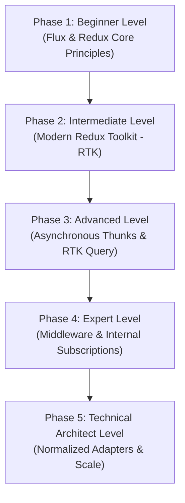

# Redux & State Management: The Complete Beginner-to-Architect Masterclass

**State Management** is one of the most critical aspects of frontend engineering. As applications grow in size, sharing data between far-apart user interface components becomes a massive bottleneck. 

**Redux** is a highly predictable, centralized state management container designed to solve this problem. Guided by strict unidirectional data flows, Redux ensures that your application state transitions are completely traceable, stable, and highly testable.

This guide is written in clear, simple language with rich real-world analogies, step-by-step code modernizations, concrete asynchronous thunks, and enterprise caching layers to take you from a beginner to a high-level Global State Architect.

---

## 🗺️ The Global State Roadmap



| Phase | Target Role | Key Focus Area | Capstone Project |
| :--- | :--- | :--- | :--- |
| **Phase 1: Beginner** | Junior Developer | Flux unidirectional data flows, Actions, Store, and Reducers. | Raw Redux Console Store (Pure JS dispatcher & listener) |
| **Phase 2: Intermediate** | Frontend Engineer | Redux Toolkit (RTK), Slices, Immer.js mutations, React-Redux hook bindings. | React + TS + RTK Task Manager |
| **Phase 3: Advanced** | Performance Engineer | Asynchronous thunks, middleware routing, RTK Query caching mechanics. | Real-time E-Commerce Product Catalog with Caching |
| **Phase 4: Expert** | Core Systems Engineer | Curried custom middlewares, intercepting dispatches, shallow comparison optimizations. | Custom LocalStorage Store Sync Middleware |
| **Phase 5: Architect** | Global State Architect | Normalized relational adaptions, memoized selector calculations, Module Federation sharing. | Enterprise Normalized Dashboard (Relational schemas & adapter hooks) |

---

## 🚀 Phase 1: Beginner Level (Flux & Redux Core Principles)

### 1. Why Do We Need Global State Management?

#### 💡 The Bank Ledger Analogy:
Imagine a small village of 5 people who frequently trade with each other. 
- **Prop Drilling (Standard React)**: Everyone carries physical cash in their pockets. If Person A wants to send \$10 to Person E, but they don't sit next to each other, Person A must hand the money to Person B, who hands it to Person C, who hands it to Person D, who finally hands it to Person E (Prop Drilling). If anyone along the chain drops the money, gets confused, or goes home, the transaction fails completely.
- **Centralized Store (Redux)**: The village establishes a **Central Bank**. Inside the bank sits a single, master paper ledger book (The Store). No one carries cash in their pockets anymore. When Person A wants to send \$10 to Person E, they write an instruction slip (Action) and hand it to the Bank Teller (Reducer). The Teller reads the slip, writes a fresh line in the ledger book updating Person A's balance to -\$10 and Person E's balance to +\$10, and broadcasts the new account values to everyone (Subscription). Centralized, safe, and completely transparent!

---

### 2. The Redux Holy Triad
To use Redux, you must master its three core structural components:

```
            +--------------------------------------------+
            |               THE ACTION SLIP              |
            |       "type": "DEPOSIT", "payload": 100    |
            +--------------------------------------------+
                                  |
                                  v (Dispatched)
            +--------------------------------------------+
            |               THE REDUCER TELLER           |
            |   Accepts: (Old State, Action Instruction) |
            |   Returns: Brand New, Immutable State      |
            +--------------------------------------------+
                                  |
                                  v (Replaces)
            +--------------------------------------------+
            |               THE CENTRAL STORE            |
            |      Single, Immutable Source of Truth     |
            +--------------------------------------------+
```

1. **The Store (The Bank Vault)**: A single JavaScript object that holds the entire state tree of your application. You cannot modify this object directly.
2. **The Action (The Transaction Slip)**: A plain JavaScript object that describes **what** type of change we want to make. It must have a `type` string, and optional `payload` data.
   ```javascript
   const action = {
     type: 'bank/deposit',
     payload: 100
   };
   ```
3. **The Reducer (The Bank Teller)**: A **Pure Function** that takes the `current state` and the `action instruction`, calculates the next state mathematically, and returns a **brand new state object**.
   *CRITICAL RULE*: Reducers must be pure. They cannot modify the existing state object directly, call APIs, or execute random logic. They must strictly output a fresh, immutable copy of the state.

---

### 3. Capstone Project: Raw Redux Console Store (Pure JS)
Let's build a fully functional Redux store from scratch in pure, framework-free JavaScript to understand the engine under the hood.

```javascript
// 1. Define the Initial State shape
const initialState = {
  balance: 500
};

// 2. Write the Reducer Function (Pure Bank Teller)
function bankReducer(state = initialState, action) {
  switch (action.type) {
    case 'bank/deposit':
      // ALWAYS return a brand new object. Do NOT write state.balance += action.payload!
      return {
        ...state,
        balance: state.balance + action.payload
      };
    case 'bank/withdraw':
      return {
        ...state,
        balance: state.balance - action.payload
      };
    default:
      return state; // Return unchanged state if action is unrecognized
  }
}

// 3. Simple custom Redux Store Creator
function createStore(reducer) {
  let state;
  let listeners = [];

  const getState = () => state;

  const dispatch = (action) => {
    state = reducer(state, action);
    // Notify all subscribed listeners immediately
    listeners.forEach(listener => listener());
  };

  const subscribe = (listener) => {
    listeners.push(listener);
    // Return an unsubscribe function
    return () => {
      listeners = listeners.filter(l => l !== listener);
    };
  };

  // Initialize the store state
  dispatch({ type: '@@INIT' });

  return { getState, dispatch, subscribe };
}

// --- Execution test ---
const store = createStore(bankReducer);

// Subscribe to track changes in real-time
const unsubscribe = store.subscribe(() => {
  console.log('[Store Subscription Alert] New balance:', store.getState().balance);
});

// Dispatch actions
store.dispatch({ type: 'bank/deposit', payload: 150 });  // Output: 650
store.dispatch({ type: 'bank/withdraw', payload: 50 });   // Output: 600

unsubscribe(); // Stop listening
```

---

## 🛠️ Phase 2: Intermediate Level (Modern Redux Toolkit - RTK)

Legacy Redux historically required writing massive amounts of boilerplate code across separate files (actions, constants, reducers, store setups). Modern development uses **Redux Toolkit (RTK)** to eliminate boilerplate and write elegant, safe state systems.

### 1. What is a Slice?
In RTK, we group state initializations, actions, and reducer cases together inside a single, modular structure called a **Slice**.

### 2. Slices and Immer.js
If you mutate state directly in React (e.g. `state.todos.push(newItem)`), React will fail to detect changes because the object reference remains identical.
RTK utilizes a library called **Immer.js** under the hood. Immer tracks your changes and automatically translates simple, easy-to-read "mutating" updates (like `.push()` or `.completed = true`) into perfectly compiled, clean immutable state copies!

---

### 3. Capstone Project: React + TypeScript + RTK Task Manager

#### Step 1: Install dependencies:
```bash
npm install @reduxjs/toolkit react-redux
```

#### Step 2: Create the Task Slice (`taskSlice.ts`):
```typescript
import { createSlice, PayloadAction } from '@reduxjs/toolkit';

export interface Task {
  id: string;
  title: string;
  completed: boolean;
}

interface TaskState {
  items: Task[];
}

const initialState: TaskState = {
  items: []
};

const taskSlice = createSlice({
  name: 'tasks',
  initialState,
  reducers: {
    // Thanks to Immer, we can write intuitive code!
    addTask: (state, action: PayloadAction<string>) => {
      state.items.push({
        id: Date.now().toString(),
        title: action.payload,
        completed: false
      });
    },
    toggleTask: (state, action: PayloadAction<string>) => {
      const task = state.items.find(t => t.id === action.payload);
      if (task) {
        task.completed = !task.completed; // Immer compiles this to an immutable swap!
      }
    },
    deleteTask: (state, action: PayloadAction<string>) => {
      state.items = state.items.filter(t => t.id !== action.payload);
    }
  }
});

// RTK automatically exports our actions as functions we can call!
export const { addTask, toggleTask, deleteTask } = taskSlice.actions;
export default taskSlice.reducer;
```

#### Step 3: Setup the Redux Store Configuration (`store.ts`):
```typescript
import { configureStore } from '@reduxjs/toolkit';
import taskReducer from './taskSlice';

export const store = configureStore({
  reducer: {
    tasks: taskReducer // Combine all feature reducers here
  }
});

// Export TypeScript helper typings for use inside components
export type RootState = ReturnType<typeof store.getState>;
export type AppDispatch = typeof store.dispatch;
```

#### Step 4: Bind Store to React & Connect Hooks (`App.tsx`):
```tsx
import React, { useState } from 'react';
import { Provider, useDispatch, useSelector } from 'react-redux';
import { store, RootState } from './store';
import { addTask, toggleTask, deleteTask } from './taskSlice';

// 1. Setup typed selector/dispatch hooks for safety
const useAppDispatch = () => useDispatch<typeof store.dispatch>();
const useAppSelector = <TSelected,>(selector: (state: RootState) => TSelected) => 
  useSelector<RootState, TSelected>(selector);

function TaskConsole() {
  const [input, setInput] = useState('');
  const dispatch = useAppDispatch();
  
  // Select ONLY the task items array
  const tasks = useAppSelector((state) => state.tasks.items);

  const handleSubmit = (e: React.FormEvent) => {
    e.preventDefault();
    if (input.trim() === '') return;
    dispatch(addTask(input));
    setInput('');
  };

  return (
    <div style={{ padding: '20px', maxWidth: '400px' }}>
      <h3>Enterprise Task Board</h3>
      <form onSubmit={handleSubmit}>
        <input value={input} onChange={e => setInput(e.target.value)} placeholder="New task..." />
        <button type="submit">Add Task</button>
      </form>

      <ul>
        {tasks.map(task => (
          <li key={task.id} style={{ textDecoration: task.completed ? 'line-through' : 'none', marginTop: '8px' }}>
            <span onClick={() => dispatch(toggleTask(task.id))} style={{ cursor: 'pointer' }}>
              {task.title}
            </span>
            <button onClick={() => dispatch(deleteTask(task.id))} style={{ marginLeft: '12px' }}>
              Remove
            </button>
          </li>
        ))}
      </ul>
    </div>
  );
}

// 2. Wrap the application inside the Provider
export default function App() {
  return (
    <Provider store={store}>
      <TaskConsole />
    </Provider>
  );
}
```

---

## ⚡ Phase 3: Advanced Level (Asynchronous Redux & RTK Query)

Real-world applications fetch data from asynchronous API endpoints. Redux Reducers are pure functions and cannot perform API calls directly. We use **Middleware** to handle asynchronous operations.

### 1. Redux Middleware

#### 💡 The Security Guard Analogy:
Think of the Central Bank again. 
Imagine a Person walks in and dispatches a withdraw slip (Action) requesting -\$5,000,000. 
Before the teller (Reducer) can process the request and deduct funds, a **Security Guard (Middleware)** steps in. The Guard grabs the action slip, checks the person's identity documents against an external server (API), verifies their signature, and logs the check. If the check passes, the Guard passes the slip to the Teller. If the check fails, the Guard discards the slip and flags a security violation.

---

### 2. Async Thunks with `createAsyncThunk`
A **Thunk** is a function that wraps an asynchronous operation. `createAsyncThunk` automatically dispatches actions based on the promise lifecycle: `pending`, `fulfilled`, or `rejected`.

```typescript
import { createSlice, createAsyncThunk } from '@reduxjs/toolkit';

interface User {
  id: number;
  name: string;
}

// 1. Create the asynchronous thunk action
export const fetchUsers = createAsyncThunk('users/fetchAll', async () => {
  const response = await fetch('https://jsonplaceholder.typicode.com/users');
  if (!response.ok) throw new Error('API fetch failed');
  return (await response.json()) as User[];
});

interface UserState {
  data: User[];
  loading: boolean;
  error: string | null;
}

const userSlice = createSlice({
  name: 'users',
  initialState: { data: [], loading: false, error: null } as UserState,
  reducers: {},
  // 2. Capture async promise statuses in extraReducers
  extraReducers: (builder) => {
    builder
      .addCase(fetchUsers.pending, (state) => {
        state.loading = true;
        state.error = null;
      })
      .addCase(fetchUsers.fulfilled, (state, action) => {
        state.loading = false;
        state.data = action.payload; // Immer handles safe insertion!
      })
      .addCase(fetchUsers.rejected, (state, action) => {
        state.loading = false;
        state.error = action.error.message || 'Unknown network error';
      });
  }
});
```

### 3. RTK Query (RTKQ) - Centralized API & Caching Engine
Managing API requests, loading indicators, error triggers, and browser caches manually requires thousands of lines of boilerplate code. 

**RTK Query (RTKQ)** is a powerful data-fetching, caching, and state synchronization tool built directly into Redux. It automatically generates custom React hooks for your endpoints, manages browser-side data caching, coordinates background refetching, and eliminates redundant server queries to save network bandwidth.

#### 💡 The Tag Invalidation Analogy:
Imagine a massive library. The librarian maintains a physical catalog card index with colored sticky notes (Tags) attached. 
- When a user requests: *"Show me all thriller books"* (Query), the librarian retrieves the cards and places a **[Product] tag** on the desk. 
- If a writer walks in and inserts a brand new thriller book on a shelf (Mutation), they tear off the **[Product] tag** from their deposit slip.
- The librarian looks at the desk: *"Aha! The [Product] tag has been declared out-of-date (invalidated) by a mutation! I must immediately scrap the current display list, query the main book vaults again (Refetch), and show the user the updated selection."*

This is how RTK Query handles automated cache updates. You don't write manual dispatch update arrays; you simply coordinate logical tags!

---

#### Step 1: Complete API Definition with CRUD and Tags (`productApi.ts`)
```typescript
import { createApi, fetchBaseQuery } from '@reduxjs/toolkit/query/react';

export interface Product {
  id: number;
  title: string;
  price: number;
}

export const productApi = createApi({
  reducerPath: 'productsApi',
  baseQuery: fetchBaseQuery({ baseUrl: 'https://dummyjson.com/' }),
  
  // 1. Declare the tag categories this API manages
  tagTypes: ['Product'],

  endpoints: (builder) => ({
    // A. QUERY: GET Request (Fetches list of products)
    getProducts: builder.query<Product[], void>({
      query: () => 'products?limit=5',
      transformResponse: (response: { products: Product[] }) => response.products,
      
      // B. PROVIDES TAGS: Binds these tags to the returned cache data list
      providesTags: (result) =>
        result
          ? [
              // Bind a tag for individual products in the list
              ...result.map(({ id }) => ({ type: 'Product' as const, id })),
              // Bind a catch-all tag for the entire list
              { type: 'Product', id: 'LIST' }
            ]
          : [{ type: 'Product', id: 'LIST' }]
    }),

    // C. MUTATION: POST Request (Creates a new product)
    createProduct: builder.mutation<Product, Partial<Product>>({
      query: (newProduct) => ({
        url: 'products/add',
        method: 'POST',
        body: newProduct
      }),
      // D. INVALIDATES TAGS: Declares the cache out of date, triggering automatic refetching of getProducts!
      invalidatesTags: [{ type: 'Product', id: 'LIST' }]
    }),

    // E. ADVANCED OPTIMISTIC UPDATE: Immediate UI update before server responds!
    toggleProductFavorite: builder.mutation<Product, { id: number; isFavorite: boolean }>({
      query: ({ id, isFavorite }) => ({
        url: `products/${id}`,
        method: 'PATCH',
        body: { isFavorite }
      }),
      // onQueryStarted executes the moment the action triggers, bypassing server latency!
      async onQueryStarted({ id, isFavorite }, { dispatch, queryFulfilled }) {
        // Step 1: Manually patch the active getProducts cache layout in Redux instantly
        const patchResult = dispatch(
          productApi.util.updateQueryData('getProducts', undefined, (draft) => {
            const product = draft.find((p) => p.id === id);
            if (product) {
              // Apply the change optimistically
              (product as any).isFavorite = isFavorite;
            }
          })
        );
        try {
          // Wait for the actual server response
          await queryFulfilled;
        } catch {
          // Step 2: Rollback the optimistic change instantly if the network call fails!
          patchResult.undo();
          console.error('Server sync failed! Reverting UI state...');
        }
      }
    })
  })
});

// Export auto-generated hooks for use inside React components
export const { 
  useGetProductsQuery, 
  useCreateProductMutation, 
  useToggleProductFavoriteMutation 
} = productApi;
```

---

#### Step 2: Registering API to the Root Redux Store (`store.ts`)
For RTK Query to run, you **MUST** register its custom slice reducer and network middleware helper inside your store configuration:

```typescript
import { configureStore } from '@reduxjs/toolkit';
import { productApi } from './productApi';
import taskReducer from './taskSlice';

export const store = configureStore({
  reducer: {
    tasks: taskReducer,
    // A. Add the auto-generated api reducer slice
    [productApi.reducerPath]: productApi.reducer
  },
  // B. Add the RTK Query network middleware to handle caching lifecycles and garbage collection
  middleware: (getDefaultMiddleware) =>
    getDefaultMiddleware().concat(productApi.middleware)
});

export type RootState = ReturnType<typeof store.getState>;
export type AppDispatch = typeof store.dispatch;
```

---

#### Step 3: Complete UI Orchestrator Component
```tsx
import React, { useState } from 'react';
import { 
  useGetProductsQuery, 
  useCreateProductMutation, 
  useToggleProductFavoriteMutation 
} from './productApi';

export function ProductDashboard() {
  const [newTitle, setNewTitle] = useState('');
  
  // 1. Consume the Query hook. RTKQ handles loading, error, and cached states automatically!
  const { data: products, error, isLoading } = useGetProductsQuery();
  
  // 2. Consume the Mutation hooks
  const [createProduct, { isLoading: isCreating }] = useCreateProductMutation();
  const [toggleFavorite] = useToggleProductFavoriteMutation();

  const handleAddProduct = async (e: React.FormEvent) => {
    e.preventDefault();
    if (newTitle.trim() === '') return;
    try {
      // Execute mutation. RTKQ will automatically refetch getProducts 
      // because we configured invalidatesTags: ['LIST']!
      await createProduct({ title: newTitle, price: 150 }).unwrap();
      setNewTitle('');
    } catch (err) {
      console.error('Failed to create product:', err);
    }
  };

  if (isLoading) return <div>Querying backend server...</div>;
  if (error) return <div>Network Error: {JSON.stringify(error)}</div>;

  return (
    <div style={{ padding: '24px', maxWidth: '500px', margin: '0 auto' }}>
      <h3>Product Catalog (RTK Query Caching Engine)</h3>
      
      {/* 3. Create Product Form */}
      <form onSubmit={handleAddProduct} style={{ display: 'flex', gap: '8px', marginBottom: '20px' }}>
        <input 
          value={newTitle} 
          onChange={(e) => setNewTitle(e.target.value)} 
          placeholder="Enter new product name..." 
          style={{ flexGrow: 1, padding: '8px' }}
        />
        <button type="submit" disabled={isCreating}>
          {isCreating ? 'Adding...' : 'Add Item'}
        </button>
      </form>

      {/* 4. Display Products List */}
      <div>
        {products?.map((product: any) => (
          <div 
            key={product.id} 
            style={{ 
              padding: '12px 0', 
              borderBottom: '1px solid #eee', 
              display: 'flex', 
              justifyContent: 'space-between',
              alignItems: 'center' 
            }}
          >
            <div>
              <strong>{product.title}</strong>
              <p style={{ margin: '4px 0 0 0', color: '#666' }}>Price: ${product.price}</p>
            </div>
            
            {/* Optimistic Favorite Toggle */}
            <button 
              onClick={() => toggleFavorite({ id: product.id, isFavorite: !product.isFavorite })}
              style={{ background: product.isFavorite ? '#ffc107' : '#e0e0e0', border: 'none', padding: '6px 12px', borderRadius: '4px', cursor: 'pointer' }}
            >
              {product.isFavorite ? '★ Starred' : '☆ Star'}
            </button>
          </div>
        ))}
      </div>
    </div>
  );
}
```

---

## 🧬 Phase 4: Expert Level (Under-the-Hood Engine Mechanics)

At this level, you build custom middleware and optimize store subscription checks to prevent unnecessary component re-renders.

### 1. Writing Custom Curried Middleware
A Redux middleware is structured using three curried function layers:
```javascript
const myMiddleware = (store) => (next) => (action) => {
  // 1. Code here runs BEFORE the action reaches the Reducer
  const result = next(action); // Pass action to the next middleware or reducer
  // 2. Code here runs AFTER the action has successfully updated the state
  return result;
};
```

Let's build a custom middleware that intercepts actions, audits them, and automatically serializes the updated store state to the browser's `localStorage` on every balance change.

```typescript
import { Middleware } from '@reduxjs/toolkit';

export const localStorageSyncMiddleware: Middleware = (storeApi) => (next) => (action: any) => {
  // 1. Pass the action along to update the store state first
  const result = next(action);

  // 2. Audit the dispatched action
  if (action.type.startsWith('bank/')) {
    const nextState = storeApi.getState();
    console.log(`[Custom Sync Middleware] Intercepted Action: ${action.type}. Auto-saving store state...`);
    
    // Save to local storage
    localStorage.setItem('bank_state_cache', JSON.stringify(nextState.bank));
  }

  return result;
};
```

---

### 2. Store Subscriptions and Shallow Equality Checks
When you call `useSelector(state => state.profile)`, React-Redux subscribes that component to the store. 

#### ⚠️ The Re-Render Loop Hazard
`useSelector` compares the returned value from the previous render using a strict reference equality check (`===`). If your selector returns a **brand new object or array instance on every run**, the reference check fails, forcing the component to re-render indefinitely!

*Example of bad code:*
```tsx
// BAD PRACTICE: Returns a new array reference every single time, causing infinite re-render loops!
const vipUsers = useSelector((state) => state.users.list.filter(u => u.isVip));
```

*Architect Solution (Memoized Selection or Shallow Equality):*
```tsx
import { shallowEqual, useSelector } from 'react-redux';

// Option A: Use shallowEqual to check array VALUES rather than raw memory reference
const vipUsers = useSelector(
  (state) => state.users.list.filter(u => u.isVip),
  shallowEqual
);
```

---

## 🏛️ Phase 5: Technical Architect Level (Enterprise State Scale)

At the highest enterprise level, you structure data models to prevent performance bottlenecks.

### 1. Normalized State Schemas (`createEntityAdapter`)
Storing relational data (e.g. users, posts, comments) as nested arrays inside a store is a performance nightmare:
- To update a comment deep inside user $A$'s post, you have to run deep nested map loops, slowing down your application.
- Searching for an item requires traversing an $O(n)$ array lookup.

**Normalized State** flattens the store into structured databases using a dictionary layout. This optimizes search and update performance to **instant $O(1)$ lookup time**.

#### Normalization Layout:
```json
{
  "ids": ["user_1", "user_2"],
  "entities": {
    "user_1": { "id": "user_1", "name": "Alice" },
    "user_2": { "id": "user_2", "name": "Bob" }
  }
}
```

#### Implementing `createEntityAdapter` with RTK:
```typescript
import { createSlice, createEntityAdapter, EntityState } from '@reduxjs/toolkit';

interface Book {
  isbn: string;
  title: string;
}

// 1. Create the adapter. Set the unique lookup primary key
const booksAdapter = createEntityAdapter<Book>({
  selectId: (book) => book.isbn,
  // Sort alphabetically by default
  sortComparer: (a, b) => a.title.localeCompare(b.title)
});

const booksSlice = createSlice({
  name: 'books',
  initialState: booksAdapter.getInitialState(), // Returns flat { ids: [], entities: {} } schema
  reducers: {
    // RTK Entity Adapter provides lightning fast lookup operators!
    addBook: booksAdapter.addOne,
    updateBook: booksAdapter.updateOne,
    deleteBook: booksAdapter.removeOne,
    upsertManyBooks: booksAdapter.upsertMany
  }
});

export const { addBook, updateBook, deleteBook, upsertManyBooks } = booksSlice.actions;
export default booksSlice.reducer;
```

---

### 2. Memoized Selection with Reselect
In enterprise apps, selectors often run heavy computations. If 10 components query a selector, you do not want to recalculate the heavy calculations 10 times. We use **Reselect** (`createSelector`) to cache selection queries.

```typescript
import { createSelector } from '@reduxjs/toolkit';
import { RootState } from './store';

// 1. Select raw slice paths
const selectAllTasks = (state: RootState) => state.tasks.items;
const selectFilter = (state: RootState) => state.tasks.activeFilter;

// 2. Build a memoized selector.
// The calculation callback will ONLY run again if selectAllTasks or selectFilter outputs change.
// Toggling unrelated global states will NOT trigger recalculation!
export const selectFilteredTasks = createSelector(
  [selectAllTasks, selectFilter],
  (tasks, filter) => {
    console.log('[Reselect Calculation] Recalculating task list...');
    switch (filter) {
      case 'completed': return tasks.filter(t => t.completed);
      case 'active': return tasks.filter(t => !t.completed);
      default: return tasks;
    }
  }
);
```

---

### 3. State Architecture in Monorepos & Micro-Frontends
When deploying multiple independent frontend applications (Micro-frontends) via Webpack Module Federation, managing state is a key architectural challenge.

To share global state safely, do not share a single, tightly coupled Redux store file. Implement the **Shared Registry Pattern**:

```
+---------------------------------------------------------------+
|                      HOST SHELL REDUX STORE                   |
|  - Dynamically registers feature reducers at runtime          |
|  - Exposes `injectReducer(key, featureReducer)` registry API  |
+---------------------------------------------------------------+
                               ^
                               | (Registers runtime slice)
+---------------------------------------------------------------+
|                   MICRO-FRONTEND DASHBOARD MODULE             |
|  - Exposes self-contained Redux Slices                        |
|  - Injects billing/metrics slices when mounted               |
+---------------------------------------------------------------+
```

This dynamic runtime modularity allows teams to build and deploy their features independently without redeploying the main host shell or polluting the root state tree.
