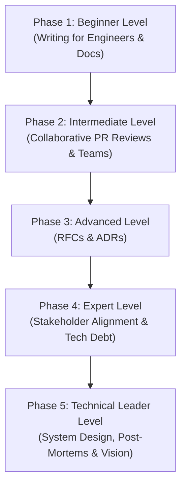

# Technical Communication: The Complete Beginner-to-Technical Leader Masterclass

Software engineering is rarely limited to writing code. At scale, the limiting factor of system development is not CPU performance or compiler speed—it is **human bandwidth**. How clearly engineers write, present, align, and document dictates how quickly teams can move, how robustly software is designed, and how easily production incidents are resolved.

This guide is written in clear, direct language with rich real-world analogies, complete production templates (PRs, RFCs, ADRs, Post-Mortems), and side-by-side phrasing examples to transform you from an individual programmer to a highly aligned Technical Leader and Architect.

---

## 🗺️ The Technical Leader Roadmap



| Phase | Target Role | Key Focus Area | Capstone Project |
| :--- | :--- | :--- | :--- |
| **Phase 1: Beginner** | Software Engineer | Conventional Commits, Pull Request templates, README files, inline comments. | Rewrite a messy commit history and PR description |
| **Phase 2: Intermediate** | Senior Engineer | Code review etiquettes, prefix tagging, async status updates on Slack. | Write a constructive review on a controversial codebase change |
| **Phase 3: Advanced** | Staff Engineer | Writing RFCs, architectural decision records (ADRs), driving team consensus. | Write an ADR selecting a core system technology |
| **Phase 4: Expert** | Principal Engineer / Tech Lead | Executive translation, pitch decks, business metrics translation, refactoring buy-in. | Write a 1-page business proposal for a major system upgrade |
| **Phase 5: Tech Leader** | Principal Architect / Director | C4 modeling diagrams, incident response coordination, blame-free post-mortems. | Write a comprehensive root-cause analysis (RCA) for an outage |

---

## 🚀 Phase 1: Beginner Level (Writing for Engineers & Documentation)

### 1. The Core Philosophy of Technical Writing

#### 💡 The Code vs. Comments Analogy:
Think of your written words like your codebase:
- **Code (Your Implementation)** explains the *how*. It is exact, rigid, and detailed.
- **Comments (Your Intent)** explain the *why*. It answers: *What problem does this solve? What assumptions are we making? Why did we pick this path over another?*

When you write technical documentation, commit messages, or emails, **never just repeat the "how."** The reader can read the codebase, look at your spreadsheet, or inspect the logs to see *what* happened. Your job as a writer is to provide the **intent, context, and rationale**—the *why*.

---

### 2. Conventional Commits Standard

Commit messages should read like a changelog for the project's history. The industry standard is **Conventional Commits**:

```
<type>(<optional scope>): <description>

[optional body]

[optional footer(s)]
```

#### Types:
- `feat`: A new feature for the user (increases minor version).
- `fix`: A bug fix for the user (increases patch version).
- `docs`: Documentation-only changes.
- `style`: Changes that do not affect the meaning of the code (white-space, formatting, missing semi-colons).
- `refactor`: A code change that neither fixes a bug nor adds a feature.
- `perf`: A code change that improves performance.
- `test`: Adding missing tests or correcting existing tests.
- `chore`: Updates to build scripts, auxiliary tools, or package dependencies.

#### Examples:
*   `feat(auth): add multi-factor authentication support via TOTP`
*   `fix(db): resolve connection pool exhaustion during peak traffic hours`
*   `refactor(search): simplify indexing logic to reduce memory allocation by 20%`

---

### 3. Structural Pull Request (PR) Descriptions

A great PR description lets code reviewers understand the context before looking at a single line of code.

#### 📝 The Production-Ready PR Template:
```markdown
## 📝 Summary
<!-- What did you change, and why? Focus on the problem solved, not just the code edit. -->

## 🚀 Key Changes
- <!-- Core change 1 -->
- <!-- Core change 2 -->

## 🔍 How to Test
<!-- Step-by-step instructions to verify your changes. -->
1. Run `npm run dev`
2. Navigate to `/login`
3. Enter credentials and verify TOTP screen prompts

## 📸 Visuals (Optional)
<!-- Attach screenshots, GIFs, or Loom recordings if this contains UI changes. -->
| Before | After |
| :--- | :--- |
| [Screenshot/GIF] | [Screenshot/GIF] |

## ⚠️ Notes / Context
<!-- Are there any migration steps, database updates, or background issues reviewers should know? -->
```

---

## 🛠️ Phase 2: Intermediate Level (Collaborative Code Reviews & Team Syncs)

### 1. Code Review Etiquette

#### 💡 The Collaborator, not Gatekeeper Analogy:
Imagine you are building a house. A **Gatekeeper** stands at the door with a checklist, checking boxes, shaking their head, and refusing entry if you used the wrong paint brand. It feels adversarial, slowing down construction.

A **Collaborator** walks onto the site, looks at the scaffolding, and says: *"Hey, if we run the plumbing through this wall instead, it'll make it much easier for the crew to wire the bathroom next week. What do you think?"*

A code review is not a security checkpoint; it is a **peer programming alignment session**. Keep reviews focused on readability, design correctness, scalability, and knowledge sharing—not on scoring points or enforcing personal aesthetic choices.

---

### 2. Prefix Tagging for Clear Feedback

Avoid ambiguous comments like *"Change this"* or *"This looks weird."* Reviewers should prefix their comments to clarify priority and intent:

| Prefix | Intent | Severity | Example |
| :--- | :--- | :--- | :--- |
| **`blocking:`** | A critical defect, architectural flaw, or security issue that must be fixed before merging. | High | `blocking: this query lacks pagination and will cause Out-Of-Memory errors on large user datasets.` |
| **`suggestion:`** | A clear improvement that is highly recommended, but doesn't block deployment if there is a tight deadline. | Medium | `suggestion: we could extract this inline map function into a helper utility to keep this component clean.` |
| **`nit:`** | A minor stylistic point (formatting, naming, spacing). Reviewers should explicitly state the author can merge without addressing it. | Low | `nit: we usually name boolean variables with an 'is' or 'has' prefix (e.g. 'isActive' instead of 'active'). Feel free to change or merge as-is.` |
| **`question:`** | Seeking clarity on a decision or code segment. | Informational | `question: why did we choose to parse this date manually instead of using the native date formatter here?` |
| **`praise:`** | Pointing out exceptionally clean code, clever solutions, or thorough test coverage. | Positive | `praise: this regex is extremely well-commented and easy to read. Excellent work.` |

---

### 3. Asynchronous Communication on Slack/Teams

When communicating with team members asynchronously, structure your messages to maximize response efficiency. **Never write just "Hello" or "Hey" and wait for a response.** Use the **TL;DR + Structured Update** format:

#### ❌ The Bad Way (High Interruption / Low Efficiency):
> *"Hey Bob"*
> *(waits 20 minutes for reply)*
> *"Are you free?"*
> *(waits 15 minutes)*
> *"The dev server is broken. I think it's the DB."*

#### ✅ The Better Way (High Clarity / Low Interruption):
> **TL;DR:** The staging database is returning `504 Gateway Timeout` errors. I'm investigating and need database credentials.
>
> **Details:**
> - Running `npm run staging` fails on connection handshake.
> - Logs show: `ETIMEDOUT 10.0.1.45:5432`.
> - Tested on local container: Works perfectly.
>
> **Action Item:** Bob, could you confirm if the staging database credentials rotated this morning? If so, where can I find the new values? Thanks!

---

## ⚡ Phase 3: Advanced Level (RFCs & Architecture Decision Records)

### 1. Structural Blueprints for Code

#### 💡 The Skyscraper Blueprint Analogy:
You do not build a 50-story skyscraper by hiring 200 builders, buying a pile of steel and concrete, pointing to a patch of ground, and shouting *"Start pouring!"* If you do, the building will collapse before you reach the 5th floor. You spend months creating **detailed blueprints**, calculating load tolerances, routing plumbing, and reviewing specs with engineers *before* breaking ground.

In software, **RFCs (Request for Comments)** and **ADRs (Architecture Decision Records)** are those blueprints. Writing them down saves weeks of refactoring, prevents architecture deadlocks, and aligns your engineering team before writing code.

---

### 2. Request for Comments (RFC) Template

An RFC is a document used to pitch a major technical change to the engineering team for feedback and consensus.

```markdown
# RFC: [Descriptive Title of Initiative]

**Author:** [Your Name]  
**Status:** [Draft | Under Review | Approved | Superseded]  
**Date:** [YYYY-MM-DD]  

## 1. Context & Problem Statement
<!-- What is the current system behavior? Why is this a problem? What business goals are impacted? -->

## 2. Proposed Solution
<!-- High-level architectural overview. How does this solve the problem? Include systems diagrams if needed. -->

## 3. Detailed Design
<!-- Deep dive technical design. Database schemas, API endpoints, key algorithms, libraries, modules. -->

## 4. Alternatives Considered
<!-- What other solutions did you look at? Why were they rejected? -->
- **Alternative A:** [Brief description & why rejected]
- **Alternative B:** [Brief description & why rejected]

## 5. Trade-offs & Risks
<!-- What are the downsides of this proposal? Think about security, performance, cost, and maintenance. -->

## 6. Implementation & Migration Plan
<!-- How do we roll this out without downtime? How do we migrate existing data? What is the timeline? -->
```

---

### 3. Architecture Decision Records (ADRs)

An ADR is a lightweight log of a major architectural decision made during a project. It serves as a historical archive so new team members understand *why* the system is designed the way it is.

```markdown
# ADR 007: Switch from DynamoDB to PostgreSQL for Core Billing System

## Status
Approved

## Context
Our core billing system requires complex transactional integrity (ACID compliance) and deep relations across invoices, line items, refunds, and user balances. 

Currently, this data is stored in DynamoDB (NoSQL). Because DynamoDB lacks native relational joins, our application code has become highly complex—performing manual multi-step joins and index lookups in memory. This has led to race conditions during bulk refund operations and high compute bills due to over-fetching.

## Decision
We will migrate our transactional billing schema from AWS DynamoDB to a managed PostgreSQL database (Amazon RDS).

## Consequences
- **Positive:** Full ACID compliance out-of-the-box. Simplified billing application code (using Postgres relational foreign keys and SQL joins). Safer financial record keeping.
- **Negative:** We must manage database schema migrations going forward. We will need to set up connection pooling (PgBouncer) to handle our high-concurrency request load.
- **Risks:** The migration of historical invoices requires a zero-downtime dual-write transition phase to prevent billing interruptions.
```

---

## 🧬 Phase 4: Expert Level (Translating Complexity & Stakeholder Alignment)

### 1. Translating Bytes to Business Outcomes

#### 💡 The Universal Translator Analogy:
Imagine you travel to a foreign country to pitch a business idea. The local investors do not speak your language. If you keep speaking your native tongue louder and slower, they will not understand you better; they will just get annoyed. You need a **translator** who converts your words into their currency, their market metrics, and their goals.

When speaking to Product Managers, Designers, and Executives, **stop speaking in bytes, indexes, memory bounds, and code lines.** They do not speak that language. You must translate technical metrics into **business outcomes**:

| Technical Issue | High-Level Technical Language (Bad) | Business Translation (Good) |
| :--- | :--- | :--- |
| **Missing database index** | *"The index on the user_orders table is missing, causing sequential scans on querying."* | *"Our product catalog is taking 8 seconds to load, which is causing a 12% drop in checkout conversions."* |
| **Refactoring technical debt** | *"We need to refactor the payment gateway wrapper because the classes are highly coupled and use legacy APIs."* | *"Adding a new payment provider currently takes us 4 weeks of development. If we spend 3 days refactoring this wrapper, we can deliver new integrations in 3 days going forward."* |
| **Resource constraint (Out-of-Memory)** | *"The Node heap memory is reaching 95% due to long-lived objects inside the array cache."* | *"Our servers are crashing during peak hours, preventing roughly 1,500 active users from placing orders."* |

---

### 2. Pitching a Refactoring Initiative
Product Managers are incentivized to ship user-facing features. To secure approval for technical maintenance, present your pitch in a structured 3-part framework:

1.  **The Current Friction:** How the technical debt directly slows down feature development, increases cloud costs, or compromises reliability today.
2.  **The Proposed Maintenance:** A scoped, realistic maintenance plan with a clear end-state.
3.  **The Future Velocity:** What new features can be shipped faster, cheaper, or with less risk once the maintenance is done.

---

## 🏛️ Phase 5: Technical Leader Level (System Design Alignment & Incident Response)

### 1. C4 Model for Visual Communication

When drawing architecture diagrams, do not create confusing sketches with random arrows. Use the **C4 Model** (Context, Containers, Components, Code) to organize visual information logically:

```
┌────────────────────────────────────────────────────────┐
│ LEVEL 1: SYSTEM CONTEXT                                │
│ How the system fits into the world.                     │
│ [Users] ──▶ [Our Enterprise System] ──▶ [Stripe API]   │
└────────────────────────────────────────────────────────┘
                           │
                           ▼
┌────────────────────────────────────────────────────────┐
│ LEVEL 2: CONTAINERS                                    │
│ The deployable applications, frontends, and databases.  │
│ [Web App] ──▶ [Node.js API Container] ──▶ [Postgres]   │
└────────────────────────────────────────────────────────┘
                           │
                           ▼
┌────────────────────────────────────────────────────────┐
│ LEVEL 3: COMPONENTS                                    │
│ The modular building blocks inside a container.        │
│ [Auth Module] ──▶ [Billing Controller] ──▶ [Prisma]    │
└────────────────────────────────────────────────────────┘
```

---

### 2. Live Incident Communication

During a critical production outage, communication is just as vital as debugging. Follow the **Incident Commander** framework:

*   **Establish a Commander:** One engineer leads the incident. They focus on orchestration and communication, not writing code fixes.
*   **Centralize Updates:** Use a dedicated Slack channel or bridge line.
*   **The Triage Broadcast:** Post regular updates every 15–30 minutes using a structured format:
    ```
    🚨 INCIDENT UPDATE - [Severity Level]
    • Status: Investigating / Identified / Mitigating / Resolved
    • User Impact: All user profile pages are returning 500 errors. Checkout is unaffected.
    • What We Know: The profile database CPU usage is at 100%.
    • Next Steps: 1. Restart read replica to shed load. 2. Inspect query logs for rogue queries.
    • Next Update: In 20 minutes (12:30 PM UTC).
    ```

---

### 3. Blame-Free Post-Mortems (RCA)

Once an incident is resolved, write a Post-Mortem (Root Cause Analysis). **A great post-mortem is blame-free.** If a human made a mistake, it means your tooling, scripts, tests, or processes allowed that mistake to reach production.

#### The "5 Whys" Root Cause Method:
*   *Why did the app crash?* -> The database ran out of disk space.
*   *Why did the database run out of space?* -> The query log file grew to 200GB.
*   *Why did the query log file grow to 200GB?* -> We enabled debug logging to troubleshoot a past issue and forgot to turn it off.
*   *Why did we forget to turn it off?* -> We have no automatic log rotation or disk space alerting.
*   *Why did we have no alerts?* -> We lacked a standardized database configuration template.

#### 📝 The Production Post-Mortem Template:
```markdown
# Incident Post-Mortem: Outage on [YYYY-MM-DD]

**Severity:** P1 (Critical Outage)  
**Lead Investigator:** [Name]  
**Incident Duration:** [X] minutes (e.g. 45 minutes)

## 🚨 Executive Summary
<!-- High-level non-technical summary of what happened, how it affected users, and how it was resolved. -->

## 📈 Timeline (UTC)
- **10:15** - Alert triggered: `Staging/Prod HTTP 5xx spikes`.
- **10:20** - Triage bridge opened; Incident Commander assigned.
- **10:35** - Root cause identified: Rogue query locked the `orders` table.
- **10:48** - Query killed; index added to prevent lock. Services recovered.

## 🔍 Root Cause Analysis (The 5 Whys)
1. <!-- Why 1 -->
2. <!-- Why 2 -->

## 🛡️ Corrective Action Items
| Action Item | Owner | Target Date | Status |
| :--- | :--- | :--- | :--- |
| Set up automatic query timeout rules (max 5s) | Infra Team | 2026-06-10 | Todo |
| Implement database disk space alerting threshold (80%) | Devops | 2026-06-05 | In Progress |
```
