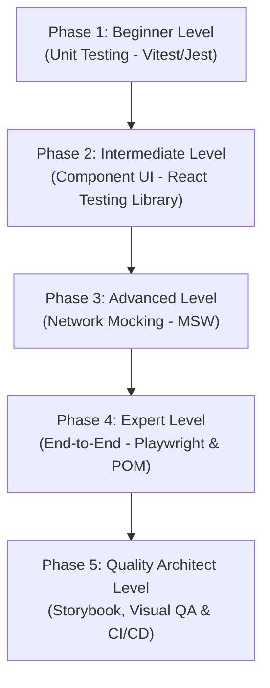

# Modern Frontend Testing: The Complete Beginner-to-Quality Architect Masterclass

In modern web development, **testing** is not an afterthought or a task delegated to a separate QA team. It is a core engineering practice that dictates your code architecture, prevents regressions, enables fearless refactoring, and ensures production stability. 

This guide covers the entire frontend testing stack: unit testing (Vitest/Jest), component testing (React Testing Library), network API mocking (Mock Service Worker), end-to-end user journeys (Playwright), isolated visual styling (Storybook), and automated pipeline execution in CI/CD.

---

## 🗺️ The Quality Architect Roadmap



| Phase | Target Role | Key Focus Area | Capstone Project |
| :--- | :--- | :--- | :--- |
| **Phase 1: Beginner** | Software Developer | Unit testing, assertions, mock functions, module spying, execution lifecycles. | Test suite for custom utility functions & state reducers |
| **Phase 2: Intermediate** | Frontend Engineer | RTL query hierarchies, user actions, custom hooks (`renderHook`), Context. | Dynamic search form test suite with loading skeletons |
| **Phase 3: Advanced** | Integration Engineer | Service Worker interception, MSW mock APIs, error states, network simulation. | Test dynamic dashboards on success, empty, and 500 error responses |
| **Phase 4: Expert** | Platform Engineer | E2E automation, Page Object Model (POM), login state caching, visual diffs. | Scoped checkout pipeline (Cart → Shipping → Success) |
| **Phase 5: Architect** | Quality Architect | Storybook stories (CSF3), interaction `play` functions, Visual QA, CI/CD pipeline setup. | Build a complex transaction card in Storybook with CI/CD specs |

---

## 📐 The Testing Pyramid

Before writing tests, understand the trade-offs of each test tier:

```
                  /\
                 /  \      E2E (Playwright) — High confidence, slow, expensive, brittle
                /----\
               /      \    Integration (RTL + MSW) — Balanced confidence & speed, isolates UI
              /--------\
             /          \  Unit (Vitest/Jest) — Extremely fast, cheap, tests isolated logic
            /____________\
```

| Tier | Focus | Speed | Cost | Flakiness Risk |
| :--- | :--- | :--- | :--- | :--- |
| **Unit** | Individual functions, math helpers, reducers | ⚡ Instant (<10ms) | Low | Very Low |
| **Integration** | Component trees, hooks, client-server sync | 🏃 Fast (<500ms) | Medium | Low |
| **E2E** | Full browser flows, database operations, auth | 🐢 Slow (>5s) | High | High |

---

## 🚀 Phase 1: Beginner Level (Unit Testing with Vitest & Jest)

### 1. The Core Philosophy of Testing

#### 💡 The Smoke Detector Analogy:
Imagine building a custom wooden house. You don't wait until the entire house is finished, invite guests over, light a match in the fireplace, and wait to see if the building burns down to determine if it is safe.

Instead, you install small **smoke detectors** in individual rooms (units). Each detector has one job: sense if there is smoke in its 10-foot radius and sound a high-pitched alarm immediately. If you change a wire in the living room and accidentally trigger a spark, the living room alarm screams immediately.

**Unit Testing** installs those local detectors in your codebase. You test a single utility function (a unit) in isolation. If a change to that function breaks a boundary condition, the unit test screams immediately—preventing a tiny spark from burning down your production app.

---

### 2. Assertions & Matchers

Unit tests compare the **actual** output of your code against the **expected** output using assertions.

```javascript
// src/utils/math.js
export function add(a, b) {
  return a + b;
}

export function formatCurrency(amount, currency = 'USD') {
  if (typeof amount !== 'number') throw new TypeError('Amount must be a number');
  return new Intl.NumberFormat('en-US', { style: 'currency', currency }).format(amount);
}
```

```javascript
// src/utils/math.test.js
import { describe, it, expect } from 'vitest';
import { add, formatCurrency } from './math';

describe('add()', () => {
  it('should correctly sum two positive integers', () => {
    expect(add(2, 3)).toBe(5); // .toBe checks strict equality (===)
  });

  it('should handle negative numbers', () => {
    expect(add(-1, -5)).toBe(-6);
  });
});

describe('formatCurrency()', () => {
  it('should format a number as USD by default', () => {
    expect(formatCurrency(1234.56)).toBe('$1,234.56');
  });

  it('should format other currencies correctly', () => {
    expect(formatCurrency(99.99, 'EUR')).toContain('99.99');
  });

  it('should throw an error if input is not a number', () => {
    expect(() => formatCurrency('invalid')).toThrow(TypeError);
  });
});
```

---

### 3. Mocking & Spying

Mocks replace actual functions or modules to control their returns, prevent external side-effects (like writing to disks or querying APIs), and assert how they were called.

```javascript
// src/utils/analytics.js
export const analytics = {
  trackEvent(name, payload) {
    // Imaginary analytics tracking sending data to server
    fetch('https://api.analytics.com/track', { method: 'POST', body: JSON.stringify({ name, payload }) });
  }
};
```

```javascript
// src/utils/checkout.js
import { analytics } from './analytics';

export function checkout(cart) {
  const total = cart.reduce((sum, item) => sum + item.price, 0);
  analytics.trackEvent('checkout_completed', { orderTotal: total });
  return total;
}
```

```javascript
// src/utils/checkout.test.js
import { describe, it, expect, vi, beforeEach } from 'vitest';
import { checkout } from './checkout';
import { analytics } from './analytics';

describe('checkout()', () => {
  beforeEach(() => {
    // 1. Clear all mocks before each test
    vi.restoreAllMocks();
  });

  it('should calculate the cart total and trigger analytics tracking', () => {
    const cart = [
      { id: 1, price: 10 },
      { id: 2, price: 25 }
    ];

    // 2. Spy on the trackEvent method and mock its implementation
    const trackSpy = vi.spyOn(analytics, 'trackEvent').mockImplementation(() => {});

    const total = checkout(cart);

    // 3. Assertions
    expect(total).toBe(35);
    expect(trackSpy).toHaveBeenCalledTimes(1);
    expect(trackSpy).toHaveBeenCalledWith('checkout_completed', { orderTotal: 35 });
  });
});
```

---

## 🛠️ Phase 2: Intermediate Level (Component Testing with React Testing Library)

### 1. RTL Philosophy

#### 💡 The Home Inspection Analogy:
Imagine you are a prospective buyer inspecting a newly built home. You want to verify that the **kitchen sink works**:
- **Implementation Detail approach (Bad)**: You take a wrench, crawl under the cabinet, check if the pipes are copper or PVC, measure the turn radius of the interior valves, and look up the manufacturer serial number.
- **User Behavior approach (Good)**: You stand in front of the sink, grasp the faucet handle, twist it to the left, and watch to see if clean, warm water streams into the basin.

The buyer doesn't care *how* the valves look; they care *that they can wash their hands*. 

**React Testing Library** operates on this exact user-centric philosophy: *"The more your tests resemble the way your software is used, the more confidence they can give you."* Test how your components render and react to user clicks and inputs in the DOM—not their internal component state variables or custom class helper names.

---

### 2. Query Hierarchy

RTL provides queries to select elements in the DOM. Choose the query that matches accessibility standards:

```
               ┌───────────────────────────────────────────────┐
               │              RTL QUERY HIERARCHY              │
               ├───────────────────────────────────────────────┤
               │  1. `getByRole` (button, heading, textbox)    │ ◀── Best: Enforces accessibility
               │  2. `getByLabelText` (form inputs)            │ ◀── Excellent for forms
               │  3. `getByPlaceholderText`                    │
               │  4. `getByText` (regular labels/paragraphs)   │
               │  5. `getByTestId` (escape hatch fallback)     │ ◀── Worst: User never sees this
               └───────────────────────────────────────────────┘
```

#### Selection Prefix Prefixes:
*   `getBy*`: Returns the matching node. Throws an error immediately if 0 or >1 matches are found. Use for elements that **should** exist synchronously.
*   `queryBy*`: Returns the matching node or `null`. Does not throw if 0 matches found. Use to assert that an element **does not exist** in the DOM.
*   `findBy*`: Returns a Promise that resolves when the element appears. Times out after 1000ms if not found. Use for **asynchronous elements** (appearing after fetching data).

---

### 3. RTL Form Component Test Suite

Let's test an interactive newsletter subscription form:

```tsx
// src/components/NewsletterForm.tsx
import React, { useState } from 'react';

export function NewsletterForm() {
  const [email, setEmail] = useState('');
  const [success, setSuccess] = useState(false);
  const [error, setError] = useState('');

  const handleSubmit = async (e: React.FormEvent) => {
    e.preventDefault();
    if (!email.includes('@')) {
      setError('Please enter a valid email address.');
      return;
    }
    setError('');
    
    // Simulate API fetch call
    await new Promise((resolve) => setTimeout(resolve, 100));
    setSuccess(true);
  };

  if (success) return <p>Thank you for subscribing!</p>;

  return (
    <form onSubmit={handleSubmit}>
      <h2>Subscribe to Newsletter</h2>
      
      {error && <p role="alert">{error}</p>}
      
      <label htmlFor="email-input">Email Address</label>
      <input
        id="email-input"
        type="email"
        placeholder="you@example.com"
        value={email}
        onChange={(e) => setEmail(e.target.value)}
      />
      
      <button type="submit">Subscribe</button>
    </form>
  );
}
```

```tsx
// src/components/NewsletterForm.test.tsx
import React from 'react';
import { describe, it, expect } from 'vitest';
import { render, screen } from '@testing-library/react';
import userEvent from '@testing-library/user-event';
import { NewsletterForm } from './NewsletterForm';

describe('<NewsletterForm />', () => {
  it('should render form elements with accessible roles', () => {
    render(<NewsletterForm />);

    expect(screen.getByRole('heading', { name: /subscribe to newsletter/i })).toBeInTheDocument();
    expect(screen.getByLabelText(/email address/i)).toBeInTheDocument();
    expect(screen.getByRole('button', { name: /subscribe/i })).toBeInTheDocument();
  });

  it('should display a validation error for invalid emails', async () => {
    render(<NewsletterForm />);
    const user = userEvent.setup();

    const input = screen.getByLabelText(/email address/i);
    const submitBtn = screen.getByRole('button', { name: /subscribe/i });

    // Type invalid email and click submit
    await user.type(input, 'invalidemail');
    await user.click(submitBtn);

    // Assert error role exists
    const errorMsg = screen.getByRole('alert');
    expect(errorMsg).toHaveTextContent(/please enter a valid email address/i);
  });

  it('should display a success message upon successful submission', async () => {
    render(<NewsletterForm />);
    const user = userEvent.setup();

    const input = screen.getByLabelText(/email address/i);
    const submitBtn = screen.getByRole('button', { name: /subscribe/i });

    await user.type(input, 'valid@example.com');
    await user.click(submitBtn);

    // Assert success message displays asynchronously
    const successMsg = await screen.findByText(/thank you for subscribing/i);
    expect(successMsg).toBeInTheDocument();
    
    // Assert old form elements are purged
    expect(screen.queryByLabelText(/email address/i)).not.toBeInTheDocument();
  });
});
```

---

## ⚡ Phase 3: Advanced Level (API Mocking with Mock Service Worker - MSW)

### 1. What is MSW?

#### 💡 The Stunt Double Analogy:
Imagine you are filming an action movie. The script requires your leading actor to jump off a 20-story building, crash through a glass ceiling, and land on a moving train. If you make your actual lead actor do this during daily practice runs, they will get severely injured or killed, completely shutting down the production.

Instead, you hire a highly trained **Stunt Double** who looks exactly like the actor, stands in their place in a controlled studio set with green screens and safety nets, and behaves exactly like them when the cameras roll.

In frontend testing, **MSW** is that stunt double. Instead of making your frontend hit real production databases or live servers (which can be down, rate-limited, slow, or mutate real user accounts), MSW interceptors catch your actual HTTP queries (`fetch`/`axios`) at the **browser network boundary** and immediately feed them mock data—allowing your components to act as if they were talking to a real API in a perfectly controlled sandbox.

---

### 2. MSW Setup & Handlers

Unlike simple `jest.spyOn(window, 'fetch')` mocks which leave your tests dependent on raw fetch configurations, MSW works by spinning up a local Service Worker that intercepts queries globally.

```typescript
// src/mocks/handlers.ts
import { http, HttpResponse } from 'msw';

export interface User {
  id: number;
  name: string;
}

// Define the mock handlers
export const handlers = [
  // Intercept GET /api/users
  http.get('/api/users', () => {
    return HttpResponse.json<User[]>([
      { id: 1, name: 'Alice' },
      { id: 2, name: 'Bob' }
    ]);
  }),

  // Intercept POST /api/users
  http.post('/api/users', async ({ request }) => {
    const body = (await request.json()) as { name: string };
    
    if (!body.name) {
      return new HttpResponse(
        JSON.stringify({ error: 'Name is required' }),
        { status: 400, headers: { 'Content-Type': 'application/json' } }
      );
    }

    return HttpResponse.json({ id: Date.now(), name: body.name }, { status: 201 });
  })
];
```

```typescript
// src/mocks/server.ts
import { setupServer } from 'msw/node';
import { handlers } from './handlers';

// Spin up node environment mock server
export const server = setupServer(...handlers);
```

#### Test Configuration:
```typescript
// src/test/setup.ts
import { beforeAll, afterEach, afterAll } from 'vitest';
import { server } from '../mocks/server';
import '@testing-library/jest-dom';

// Enable API mocking before all tests run
beforeAll(() => server.listen({ onUnhandledRequest: 'error' }));

// Reset handlers after each test (essential for test isolation)
afterEach(() => server.resetHandlers());

// Terminate mock server once done
afterAll(() => server.close());
```

---

### 3. Component Test with MSW Network Fetching

Let's test a dashboard widget that fetches a list of active users:

```tsx
// src/components/UserList.tsx
import React, { useState, useEffect } from 'react';

export function UserList() {
  const [users, setUsers] = useState<{ id: number; name: string }[]>([]);
  const [error, setError] = useState('');
  const [loading, setLoading] = useState(true);

  useEffect(() => {
    fetch('/api/users')
      .then((res) => {
        if (!res.ok) throw new Error('Failed to load users');
        return res.json();
      })
      .then((data) => {
        setUsers(data);
        setLoading(false);
      })
      .catch((err) => {
        setError(err.message);
        setLoading(false);
      });
  }, []);

  if (loading) return <p>Loading users...</p>;
  if (error) return <p role="alert">Error: {error}</p>;

  return (
    <ul>
      {users.map((user) => (
        <li key={user.id}>{user.name}</li>
      ))}
    </ul>
  );
}
```

```tsx
// src/components/UserList.test.tsx
import React from 'react';
import { describe, it, expect } from 'vitest';
import { render, screen } from '@testing-library/react';
import { http, HttpResponse } from 'msw';
import { server } from '../mocks/server';
import { UserList } from './UserList';

describe('<UserList />', () => {
  it('should render loading state, then load and display mocked MSW users', async () => {
    render(<UserList />);

    // Assert loading is visible
    expect(screen.getByText(/loading users/i)).toBeInTheDocument();

    // Assert data displays asynchronously after MSW intercept resolves
    const alice = await screen.findByText('Alice');
    const bob = screen.getByText('Bob');

    expect(alice).toBeInTheDocument();
    expect(bob).toBeInTheDocument();
    expect(screen.queryByText(/loading users/i)).not.toBeInTheDocument();
  });

  it('should display an error alert if the API returns a 500 error', async () => {
    // Override default handlers to simulate an api failure
    server.use(
      http.get('/api/users', () => {
        return new HttpResponse(null, { status: 500 });
      })
    );

    render(<UserList />);

    const errorAlert = await screen.findByRole('alert');
    expect(errorAlert).toHaveTextContent(/error: failed to load users/i);
  });
});
```

---

## 🧬 Phase 4: Expert Level (End-to-End Testing with Playwright)

### 1. What is Playwright?

#### 💡 The Automated Crash-Test Dummy Analogy:
Imagine you design safety systems for a new electric sports car. You don't test its safety features by writing code that estimates what happens if a crash occurs (unit testing). You also don't just inspect the airbags on a workbench (component testing).

Instead, you take a completed car, buckle a heavy **Automated Crash-Test Dummy** into the driver's seat, lock its hands onto the steering wheel, and use remote controls to drive the actual vehicle down a real asphalt track at 60 mph straight into a concrete barrier. Sensors measure actual forces, cameras capture real frames, and you see exactly how the entire system reacts as a cohesive unit.

**Playwright** is that crash-test dummy. It launches a **real, headless browser** (Chromium, WebKit, or Firefox), physically clicks links, types keys, scrolls pages, waits for actual servers, and captures snapshots. It tests your entire production-ready system as a complete vehicle.

---

### 2. Page Object Model (POM) Pattern

For large applications, writing raw selectors (like `page.locator('button.submit')`) directly in tests creates high maintenance costs. If a class name or label changes, dozens of tests break. 

The **Page Object Model** pattern abstracts pages into reusable class objects representing your selectors and user actions.

```typescript
// tests/pages/LoginPage.ts
import { Page, Locator } from '@playwright/test';

export class LoginPage {
  private page: Page;
  private usernameInput: Locator;
  private passwordInput: Locator;
  private loginButton: Locator;
  private errorMessage: Locator;

  constructor(page: Page) {
    this.page = page;
    this.usernameInput = page.locator('#username');
    this.passwordInput = page.locator('#password');
    this.loginButton = page.locator('button:has-text("Sign In")');
    this.errorMessage = page.locator('[role="alert"]');
  }

  async goto() {
    await this.page.goto('/login');
  }

  async login(username: string, password: string) {
    await this.usernameInput.fill(username);
    await this.passwordInput.fill(password);
    await this.loginButton.click();
  }

  async getErrorMessage() {
    return this.errorMessage.textContent();
  }
}
```

---

### 3. Writing E2E Tests with POM

```typescript
// tests/e2e/auth.spec.ts
import { test, expect } from '@playwright/test';
import { LoginPage } from '../pages/LoginPage';

test.describe('Authentication Pipeline', () => {
  test('should show validation error for incorrect credentials', async ({ page }) => {
    const loginPage = new LoginPage(page);
    await loginPage.goto();

    // Attempt login with incorrect credentials
    await loginPage.login('wronguser', 'wrongpass');

    // Assert validation error displays
    const errorText = await loginPage.getErrorMessage();
    expect(errorText).toContain('Invalid username or password');
  });

  test('should successfully log in and redirect to dashboard', async ({ page }) => {
    const loginPage = new LoginPage(page);
    await loginPage.goto();

    // Log in with correct credentials
    await loginPage.login('admin@example.com', 'securepassword123');

    // Assert navigation redirected to dashboard
    await expect(page).toHaveURL(/\/dashboard/);
    
    const welcomeHeader = page.locator('h1');
    await expect(welcomeHeader).toHaveText(/welcome back/i);
  });
});
```

#### Playwright Configuration Checklist (`playwright.config.ts`):
```typescript
import { defineConfig, devices } from '@playwright/test';

export default defineConfig({
  testDir: './tests/e2e',
  fullyParallel: true,
  forbidOnly: !!process.env.CI,
  retries: process.env.CI ? 2 : 0,
  workers: process.env.CI ? 1 : undefined,
  reporter: 'html',
  use: {
    baseURL: 'http://localhost:5173',
    trace: 'on-first-retry',
    screenshot: 'only-on-failure',
  },
  projects: [
    { name: 'chromium', use: { ...devices['Desktop Chrome'] } },
    { name: 'firefox', use: { ...devices['Desktop Firefox'] } },
    { name: 'webkit', use: { ...devices['Desktop Safari'] } },
  ],
  // Spin up local server automatically before E2E tests run
  webServer: {
    command: 'npm run dev',
    url: 'http://localhost:5173',
    reuseExistingServer: !process.env.CI,
  },
});
```

---

## 🏛️ Phase 5: Technical Architect Level (Storybook, Visual QA & CI/CD)

### 1. Storybook for Isolated Component Testing

#### 💡 The Lego Blueprint Analogy:
Imagine you want to build a **massive Lego castle** with 10,000 bricks, towers, drawbridges, and structural gates. You don't try to build the entire castle at once in your living room, searching through a giant pile of unsorted blocks.

Instead, you isolate each **individual Lego brick model**. You design a 2x4 red brick, run structural checks to ensure it fits onto other blocks perfectly, record its colors and tolerances in a catalog, and test it in isolation on a small desk workspace. Once you know every single block is perfectly modeled, assembling the giant castle is fast and risk-free.

**Storybook** is that catalog desk. It mounts and exposes your UI components in **complete isolation** outside your complex application logic, context wrappers, routing, and databases. You see and test how a card component acts under every visual state (loading, error, overflow, narrow screens) in a clean directory.

---

### 2. CSF3 Story Writing with Interaction Tests

Modern Storybook (v7+) uses Component Story Format 3 (CSF3). You can write **interaction tests** directly inside Storybook using the `play` function (powered by testing-library and Jest matchers).

```tsx
// src/components/CreditCardWidget.stories.tsx
import type { Meta, StoryObj } from '@storybook/react';
import { within, userEvent } from '@storybook/testing-library';
import { expect } from '@storybook/jest';
import { CreditCardWidget } from './CreditCardWidget';

const meta: Meta<typeof CreditCardWidget> = {
  title: 'Billing/CreditCardWidget',
  component: CreditCardWidget,
  tags: ['autodocs'],
};

export default meta;
type Story = StoryObj<typeof CreditCardWidget>;

// Story 1: Default Empty State
export const Empty: Story = {
  args: {
    defaultCardholder: '',
    onCardSubmit: (cardData) => console.log('Submitted', cardData),
  },
};

// Story 2: Interaction Test Simulation
export const AutoFillAndSubmit: Story = {
  args: {
    defaultCardholder: 'Alice Smith',
    onCardSubmit: (cardData) => console.log('Triggered Submit', cardData),
  },
  play: async ({ canvasElement }) => {
    const canvas = within(canvasElement);

    // 1. Get inputs
    const cardInput = canvas.getByPlaceholderText(/card number/i);
    const cvcInput = canvas.getByPlaceholderText(/cvc/i);
    const submitBtn = canvas.getByRole('button', { name: /save card/i });

    // 2. Simulate User typing
    await userEvent.type(cardInput, '4111111111111111');
    await userEvent.type(cvcInput, '123');

    // 3. Click Save
    await userEvent.click(submitBtn);

    // 4. Assert UI state has resolved to saving success
    const successMsg = await canvas.findByText(/card saved successfully/i);
    expect(successMsg).toBeInTheDocument();
  },
};
```

---

### 3. Designing a Production-Grade CI/CD Quality Pipeline

A resilient deployment workflow stops defects in the staging pipeline before they ever reach master.

```
Code Push ──▶ [1. LINT] ──▶ [2. UNIT] ──▶ [3. COMPONENT] ──▶ [4. E2E] ──▶ Deploy Production
                │             │             │                │
                ▼             ▼             ▼                ▼
             ESLint       Vitest / MSW   Storybook Play  Playwright
             Format Check Utility Check  Visual Audits   Browser Flow
```

#### GitHub Actions Workflow Specification:
```yaml
# .github/workflows/quality.yml
name: Quality & Testing Pipeline

on:
  push:
    branches: [main, develop]
  pull_request:
    branches: [main]

jobs:
  test:
    runs-on: ubuntu-latest
    steps:
      - name: Checkout Code
        uses: actions/checkout@v4

      - name: Setup Node.js
        uses: actions/setup-node@v4
        with:
          node-version: 20
          cache: 'npm'

      - name: Install Dependencies
        run: npm ci

      # 1. Static Code Analysis
      - name: Lint Code
        run: npm run lint

      # 2. Fast Unit & Integration Testing (Vitest + MSW)
      - name: Run Unit Tests
        run: npm run test:run

      # 3. Playwright E2E Setup & Test Run
      - name: Install Playwright Browsers
        run: npx playwright install --with-deps

      - name: Run E2E Tests
        run: npx playwright test

      # 4. Save test artifacts (screenshots/videos) on failure
      - name: Upload Test Report
        if: failure()
        uses: actions/upload-artifact@v4
        with:
          name: playwright-report
          path: playwright-report/
          retries: 3
```
