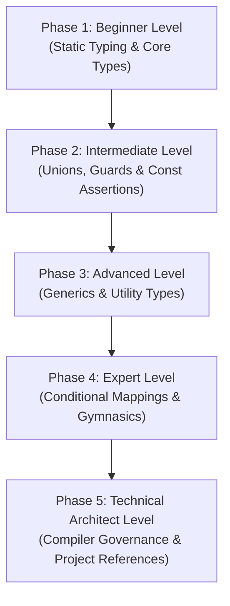

# TypeScript: The Complete Beginner-to-Architect Masterclass

**TypeScript (TS)** is a strongly typed, open-source programming language that builds on JavaScript by adding static type definitions. It acts as a safety harness for large-scale codebases. 

Rather than waiting to run your code in a browser to locate crashes or syntax errors (JavaScript), TypeScript's compiler evaluates your code in real-time, catching bugs before they ever touch production.

This guide is written in clear, simple language with rich real-world analogies, step-by-step code comparisons, advanced type gymnastics, and enterprise compiler designs to take you from a beginner to a high-level Type Systems Architect.

---

## 🗺️ The Type Systems Roadmap



| Phase | Target Role | Key Focus Area | Capstone Project |
| :--- | :--- | :--- | :--- |
| **Phase 1: Beginner** | Junior Developer | Basic types, Interfaces vs. Types, typed functions, tuples. | Typed Inventory Audit Suite |
| **Phase 2: Intermediate** | Software Engineer | Union & Intersection types, Type Narrowing guards, Const Assertions (`as const`). | Secure Account Access Gateway |
| **Phase 3: Advanced** | Performance Engineer | Reusable Generics (`<T>`), Utility types under the hood, constraints. | Generic REST API Fetcher Class |
| **Phase 4: Expert** | Core Systems Engineer | Conditional types (`extends ? :`), `infer` keyword, Mapped key remaps. | Runtime Schema Type Inference Mapper |
| **Phase 5: Architect** | Type Systems Architect | Strict `tsconfig` governance, Project References (`composite: true`), monorepos. | Scalable Multi-Package Monorepo Configuration |

---

## 🚀 Phase 1: Beginner Level (Static Typing & Core Types)

### 1. What is TypeScript?

#### 💡 The Architectural Blueprint Analogy:
Imagine you want to build a massive 50-story concrete skyscraper.
- **JavaScript (Vanilla)**: You order a pile of bricks, wood, and concrete, and immediately start stacking them on top of each other. You have no architectural drawings. If you accidentally place a toilet where an elevator shaft should go, or use weak wood beams for the foundation, you won't realize the disaster until the building collapses (runtime crashes).
- **TypeScript**: Before ordering any materials, you design a detailed **Architectural Blueprint**. The blueprint enforces strict safety rules: *"A door frame must only receive a door component. Beams must support 10 tons of load."* The blueprint engine checks every dimension. If you draw a door hanging in thin air, it immediately flags a warning. You solve all mistakes *on paper* before you ever lay a single physical brick.

---

### 2. Core Primitive Types
TypeScript checks variables by binding them to explicit types:

```typescript
let username: string = 'Alice';
let age: number = 30;
let isVip: boolean = true;

// Arrays
let scoreList: number[] = [85, 90, 95];

// Tuples (Arrays with fixed length and specific type positions)
let userRecord: [string, number] = ['Alice', 30]; // Exact: [Name, Age]
```

> [!WARNING]
> Avoid the `any` type at all costs. Using `any` tells the compiler: *"Turn off all type checking for this variable."* It turns your TypeScript project back into vanilla JavaScript, destroying all safety boundaries.

---

### 3. Interfaces vs. Type Aliases
Both interfaces and type aliases define the shape of an object. However, they have distinct differences:

```typescript
// 1. Interface: Extendable. Can merge declarations dynamically.
interface Point {
  x: number;
}
interface Point {
  y: number; // Declarations merge automatically! Point now has x and y.
}

// 2. Type Alias: Flat. Cannot be re-declared.
type Coordinates = {
  lat: number;
  lng: number;
};
// Re-declaring 'type Coordinates = ...' will throw a compile error!
```

---

### 4. Capstone Project: Typed Inventory Audit Suite
Let's build a simple inventory calculator using typed inputs, interfaces, and optional arguments.

```typescript
interface InventoryItem {
  id: string;
  name: string;
  price: number;
  quantity: number;
  description?: string; // Optional parameter
}

interface AuditReport {
  totalItems: number;
  totalValue: number;
  flaggedLowStock: string[];
}

function runInventoryAudit(
  items: InventoryItem[],
  lowStockThreshold: number = 5 // Default value
): AuditReport {
  let totalValue = 0;
  const flaggedLowStock: string[] = [];

  for (const item of items) {
    totalValue += item.price * item.quantity;
    if (item.quantity < lowStockThreshold) {
      flaggedLowStock.push(item.name);
    }
  }

  return {
    totalItems: items.length,
    totalValue,
    flaggedLowStock
  };
}

// Test compile run
const storeStock: InventoryItem[] = [
  { id: '1', name: 'Professional Keyboard', price: 120, quantity: 8 },
  { id: '2', name: 'Ergonomic Mouse', price: 60, quantity: 2 } // Low stock!
];

const report = runInventoryAudit(storeStock);
console.log(`Inventory Value: $${report.totalValue}`); // Output: $1080
```

---

## 🛠️ Phase 2: Intermediate Level (Unions, Narrowing, & Const Assertions)

At this level, you build dynamic models and narrow type scopes safely.

### 1. Union Types & Intersection Types
- **Union (`A | B`)**: The variable can be type $A$ **OR** type $B$ (e.g. `string | number`).
- **Intersection (`A & B`)**: The variable combines properties of type $A$ **AND** type $B$ (e.g., merging User fields with Billing fields).

---

### 2. Type Narrowing & Custom Type Guards
If a function accepts a union type (like `string | number`), you cannot call string methods (like `.toUpperCase()`) directly because the input might be a number. You must **narrow** the type using conditional checks.

#### Implementation of Type Guards:
```typescript
interface Admin {
  name: string;
  role: 'admin';
  clearanceLevel: number;
}

interface Customer {
  name: string;
  role: 'customer';
  loyaltyPoints: number;
}

// Custom Type Predicate: returns 'user is Admin' for runtime verification
function isAdmin(user: Admin | Customer): user is Admin {
  return user.role === 'admin';
}

function processUserProfile(user: Admin | Customer) {
  // A. Narrowing using primitive typeof
  let id: string | number = 101;
  if (typeof id === 'string') {
    console.log(id.toUpperCase()); // Safe! ID is guaranteed to be a string here.
  }

  // B. Narrowing using custom Type Predicate
  if (isAdmin(user)) {
    console.log(`Access granted. Clearance: ${user.clearanceLevel}`); // Safe Admin clearance!
  } else {
    console.log(`Welcome back, loyalty member. Points: ${user.loyaltyPoints}`); // Safe Customer points!
  }
}
```

---

### 3. Enums vs. Const Assertions (`as const`)
In legacy TypeScript, developers used `enum` to define configurations. However, Enums compile to heavy, confusing double-nested JavaScript dictionaries at runtime, bloating your production bundle.
Modern TypeScript uses **Const Assertions (`as const`)** with Union extraction. It is entirely erased at runtime, resulting in zero JavaScript bundle bloat!

```typescript
// ❌ BAD PRACTICE (Legacy Enum): Generates heavy runtime JS object dictionary
enum UserRoleEnum {
  ADMIN = 'ADMIN',
  USER = 'USER'
}

// ✅ EXCELLENT PRACTICE (Const Assertion): Erased entirely at runtime
const ROLES = {
  ADMIN: 'ADMIN',
  USER: 'USER'
} as const; // Makes all properties deeply readonly

// Extract type automatically: 'ADMIN' | 'USER'
type UserRole = typeof ROLES[keyof typeof ROLES];
```

---

## ⚡ Phase 3: Advanced Level (Generics & Utility Types)

### 1. Generics (`<T>`)

#### 💡 The Vending Machine Analogy:
Imagine a **Vending Machine Template**. 
- Without Generics, you would need to build a separate vending machine for every single product (a Soda Vending Machine that only returns Soda objects, a Chips Vending Machine that only returns Chips objects).
- With **Generics**, you design a single, highly flexible vending machine structure `<Product>`. When a customer requests slot A, the machine retrieves the slot, wraps it in the checkout pipeline, and returns the **exact product type** they paid for (e.g. returning a `Soda` or a `Chips` object) with complete type safety!

#### Complete Generic API Client Code:
```typescript
interface ApiResponse<T> {
  data: T;
  status: number;
  success: boolean;
}

export class ApiService {
  private baseUrl = 'https://api.example.com/';

  // Generic method: fetches any model type <T> safely
  async getRecord<T>(endpoint: string): Promise<ApiResponse<T>> {
    const response = await fetch(`${this.baseUrl}${endpoint}`);
    if (!response.ok) throw new Error('Network error querying endpoint');
    
    const data = await response.json();
    return {
      data: data as T, // Typecast to target Generic
      status: response.status,
      success: response.ok
    };
  }
}
```

---

### 2. Built-in Utility Types (Re-written from Scratch)
TypeScript includes built-in types to transform objects. Let's see how they work under the hood:

```typescript
interface UserProfile {
  id: string;
  name: string;
  email: string;
}

// 1. Partial: Makes all properties optional
// Under the hood: type Partial<T> = { [P in keyof T]?: T[P] };
type OptionalUser = Partial<UserProfile>; // Result: { id?, name?, email? }

// 2. Readonly: Makes all properties immutable
// Under the hood: type Readonly<T> = { readonly [P in keyof T]: T[P] };
type SealedUser = Readonly<UserProfile>;

// 3. Pick: Selects specific keys
// Under the hood: type Pick<T, K extends keyof T> = { [P in K]: T[P] };
type BasicUser = Pick<UserProfile, 'id' | 'name'>; // Result: { id, name }

// 4. Omit: Removes specific keys
// Under the hood: type Omit<T, K extends keyof any> = Pick<T, Exclude<keyof T, K>>;
type GuestUser = Omit<UserProfile, 'id'>; // Result: { name, email }
```

---

## 🧬 Phase 4: Expert Level (Conditional Mappings & Gymnastics)

At this level, you write dynamic, self-adapting type structures.

### 1. Conditional Types (`extends ? :`)
Conditional types calculate type outputs based on relationship criteria, mimicking ternary checks (`if/else`) inside typing declarations.

```typescript
// If T is a string, output 'TEXT'. Otherwise, output 'NUMBER'.
type CheckType<T> = T extends string ? 'TEXT' : 'NUMBER';

type A = CheckType<string>; // Result: 'TEXT'
type B = CheckType<number>; // Result: 'NUMBER'
```

---

### 2. The `infer` Keyword
The `infer` keyword allows you to extract type declarations from inside a generic interface or function parameter at compile time.

```typescript
// Extract the item type of an array dynamically
type FlattenArray<T> = T extends (infer U)[] ? U : T;

type StringList = string[];
type SingleItem = FlattenArray<StringList>; // Result: string

type NumberRecord = number;
type SingleNum = FlattenArray<NumberRecord>; // Result: number (ignores non-arrays)
```

---

### 3. Mapped Types & Key Remapping
We can dynamically rewrite property names inside a type using key remapping (`as`).

```typescript
interface CustomerActions {
  login: () => void;
  logout: () => void;
}

// Automatically convert all action properties into 'on*' triggers (onLogin, onLogout)
type EventListeners<T> = {
  [K in keyof T as `on${Capitalize<string & K>}`]: T[K];
};

type CustomerEvents = EventListeners<CustomerActions>;
/*
Result: {
  onLogin: () => void;
  onLogout: () => void;
}
*/
```

---

## 🏛️ Phase 5: Technical Architect Level (Compiler Governance & Scale)

As an enterprise architect, your role is to enforce strict compiler standards and scale compilation performance across massive code repositories.

### 1. TSConfig Strict Rules Governance
An Enterprise Architect must enforce a strict `tsconfig.json` compiler standard to prevent developers from checking buggy code into repository branches:

```json
{
  "compilerOptions": {
    "target": "ESNext",
    "module": "NodeNext",
    
    /* 1. Unconditional Strict Harness */
    "strict": true,                         // Turns on all strict checks
    "noImplicitAny": true,                  // Throws error if type falls back to any
    "strictNullChecks": true,               // Blocks assigning null/undefined to values
    
    /* 2. Code Quality Controls */
    "noUnusedLocals": true,                 // Flag variables declared but never used
    "noUnusedParameters": true,             // Flag function parameters never consumed
    "noImplicitReturns": true,              // Ensures all function execution paths return value
    "noFallthroughCasesInSwitch": true      // Blocks switch cases without breaks
  }
}
```

---

### 2. Monorepo Project References
In massive corporate monorepos (containing 50 packages or apps), running a single `tsc` compilation command over millions of files causes catastrophic compiler slowdowns, blocking CI/CD pipelines.

We solve this using **TypeScript Project References** (`composite: true` and `references`). 
Instead of compilation running as one massive block, we divide packages into self-contained sub-build boundaries. The compiler builds libraries individually, caches their output declarations (`.d.ts`), and compiles dependent apps using pre-compiled outputs without re-evaluating the underlying libraries.

#### Shared Monorepo Config Layout:
```
packages/
├── shared-types/                # Base types library
│   ├── tsconfig.json            # composite: true
│   └── index.ts
└── client-app/                  # Main Web Application
    ├── tsconfig.json            # references: [{ path: "../shared-types" }]
    └── src/
```

#### Shared Types config (`packages/shared-types/tsconfig.json`):
```json
{
  "compilerOptions": {
    "composite": true,                   // Enforces composite project constraints
    "declaration": true,                 // Generates typing files (.d.ts)
    "declarationMap": true,              // Map source files for editor navigation
    "outDir": "./dist"
  }
}
```

#### Client App config (`packages/client-app/tsconfig.json`):
```json
{
  "compilerOptions": {
    "outDir": "./dist"
  },
  "references": [
    // reference compile dependencies statically
    { "path": "../shared-types" }
  ]
}
```
Using Project References, large monorepo build speeds can accelerate by up to **$80\%$** while protecting module boundary integrity!
