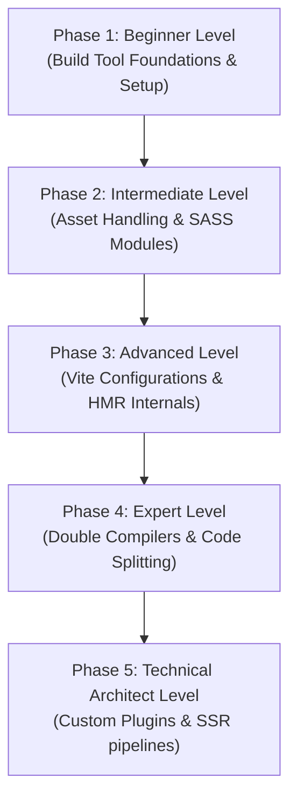

# Vite: The Complete Beginner-to-Architect Masterclass

**Vite** (pronounced "Veet", French for "fast") is a modern, next-generation frontend build tool and development server. It has revolutionized web development by addressing the compilation speed bottlenecks historically associated with legacy bundlers like Webpack, Rollup, and Parcel.

Vite splits development and production into two highly optimized pipelines, leveraging native browser capabilities to make project startups and code updates near-instantaneous.

This guide is written in clear, simple language with rich real-world analogies, step-by-step pipeline diagrams, advanced build configurations, and custom compiler plugins to take you from a beginner to a high-level Build Systems Architect.

---

## 🗺️ The Build Systems Roadmap



| Phase | Target Role | Key Focus Area | Capstone Project |
| :--- | :--- | :--- | :--- |
| **Phase 1: Beginner** | Junior Developer | Native ES Modules in dev, Vite scaffolding, folder structures. | Vite Multi-Page static sandbox |
| **Phase 2: Intermediate** | Frontend Engineer | CSS Modules, SASS integration, environmental variables. | Media Catalog App with SASS & Markdown assets |
| **Phase 3: Advanced** | Performance Engineer | Path aliases, custom SVG pipelines, HMR state lifecycles. | Customized SPA Configured Template |
| **Phase 4: Expert** | Release Engineer | Double-compilation (Esbuild + Rollup), custom chunk splits, tree-shaking. | Optimized Production Bundler with stats reporting |
| **Phase 5: Architect** | Build Systems Architect | Custom plugin writing, SSR configurations, SRI security pipelines. | Custom HTML asset tag stripper plugin |

---

## 🚀 Phase 1: Beginner Level (Build Tool Foundations & Setup)

### 1. What is a Build Tool & Bundler?

#### 💡 The Juice Blender Analogy:
Imagine you want to serve a delicious, smooth smoothie (compiled web page) to a customer (the browser).
- You have raw ingredients: whole apples, massive pineapples, unpeeled bananas (uncompiled TypeScript, raw SCSS files, nested JavaScript modules). A browser cannot eat a whole raw pineapple directly; it doesn't know what to do with it.
- **The Bundler / Build Tool** acts as the **Juice Blender**. It takes all your raw, complex ingredients, cuts away the garbage (tree-shaking), processes and blends them together, and outputs a smooth, uniform, drinkable liquid in a single glass (HTML/CSS/JS bundles) that the browser can consume instantly without getting choked!

---

### 2. Why is Vite so Fast? Dev Serving vs. Legacy Bundling
Legacy bundlers (like Webpack) require compiling, bundling, and wrapping **every single file** in your entire project *before* the local development server can start. If you have 5,000 files, cold startup times take minutes, and saving a file requires waiting seconds for re-compilation.

#### The Webpack Dev Flow (Compile first):
```
[Start Dev Server] ──> [Traverse & Bundle 5,000 files] ──> [Draw to browser]
```

Vite leverages **Native ES Modules (ESM)**. Modern browsers natively support `import` statements. During development, Vite does not bundle your code at all! It instantly boots the server, and let the browser request files dynamically as needed. 

#### The Vite Dev Flow (Dynamic ESM serving):
```
[Start Dev Server (Instant)] ──> [Browser requests /src/main.ts] ──> [Vite compiles main.ts dynamically]
```

---

### 3. Project Scaffolding
Initialize a fresh Vite workspace instantly using standard scaffolding scripts:

```bash
# Bootstrap Vite with React and TypeScript template
npm create vite@latest enterprise-app -- --template react-ts

cd enterprise-app
npm install
npm run dev # Instant server boot!
```

---

## 🛠️ Phase 2: Intermediate Level (Asset Handling & CSS Modules)

At this level, you manage assets, styling pipelines, and environment configs.

### 1. Importing Assets & Static Assets
Vite resolves static assets intelligently:
- Importing an asset inside JS returns its resolved URL pointer (e.g. `import logo from './logo.png'`).
- Assets larger than 4KB are copied to the build folder with a unique **content hash** appended (e.g. `logo-a1b2c3d4.png`) to prevent browser cache problems when you update images.
- Assets smaller than 4KB are automatically converted to **Base64 Data URLs** and embedded directly inside the compiled JavaScript bundle, saving extra HTTP requests.

---

### 2. Styling Pipelines (SCSS & CSS Modules)
Vite includes built-in support for CSS Modules. Any style sheet ending with `.module.css` or `.module.scss` automatically exports local class mappings, preventing naming collisions.

#### Step 1: Install SASS compiler
```bash
npm install -D sass
```

#### Step 2: Write the SCSS Module (`Card.module.scss`):
```scss
// Card.module.scss
.cardContainer {
  background-color: #fafafa;
  padding: 16px;
  border-radius: 8px;
  
  .title {
    font-size: 20px;
    color: #646cff;
  }
}
```

#### Step 3: Consume inside Component:
```tsx
import React from 'react';
import styles from './Card.module.scss';

export function Card() {
  // Styles are mapped to unique generated hashes (e.g. _cardContainer_a1b2c_1)
  return (
    <div className={styles.cardContainer}>
      <h2 className={styles.title}>Vite CSS Module</h2>
    </div>
  );
}
```

---

### 3. Environmental Variable Governance
In Vite, environment variables are managed inside `.env` files and exposed via `import.meta.env`.

```
# .env.development
VITE_API_BASE_URL="https://dev-api.example.com"
DB_PASSWORD="super-secret-password" # Will NOT be exposed to browser!
```
> [!IMPORTANT]
> To prevent accidental leakage of database secrets or private credentials to the browser, Vite **only** exposes variables prefixed with `VITE_`.

```typescript
// Read variables securely inside React/TS code
const apiEndpoint = import.meta.env.VITE_API_BASE_URL;
console.log('API Target:', apiEndpoint);
```

---

## ⚡ Phase 3: Advanced Level (Configurations & HMR Internals)

Configure aliases and master Hot Module Replacement lifecycles.

### 1. Custom Paths Aliases
Avoid writing ugly, confusing relative path directories (e.g. `import Button from '../../../../components/Button'`).
Use path aliasing to reference the root `src` folder cleanly.

#### Vite Configuration (`vite.config.ts`):
```typescript
import { defineConfig } from 'vite';
import react from '@vitejs/plugin-react';
import path from 'path';

export default defineConfig({
  plugins: [react()],
  resolve: {
    alias: {
      // Map '@' to compile directly to absolute '/src' directory
      '@': path.resolve(__dirname, './src')
    }
  }
});
```

#### Consumption:
```typescript
// Clean, readable imports from anywhere in the codebase!
import { Button } from '@/components/Button';
```

---

### 2. Hot Module Replacement (HMR)

#### 💡 The Active Controller Analogy:
Imagine you are playing a highly complex, 4-hour video game campaign. You are in the middle of a massive boss battle.
- **Legacy Page Reload (F5)**: The console crashes, shuts down, and reboots. You lose all game progress, return to the main title screen, and have to navigate menus for 5 minutes to get back to the fight.
- **Hot Module Replacement (HMR)**: You decide you want to swap your standard plastic game controller for an ergonomic pro controller. You unplug controller A and plug in controller B. The game doesn't crash; it doesn't even pause. The console swaps the controller hardware drivers (code module) instantly in memory, and you continue the boss battle exactly where you left off, keeping all active points and health states!

Vite implements a high-performance HMR API on top of native ES modules. When you save a file, Vite compiles only that specific file, notifies the browser via WebSockets, and dynamically fetches the updated module via a query string, swapping it in memory.

#### Low-Level HMR API (`import.meta.hot`):
While framework plugins (like `@vitejs/plugin-react`) handle HMR automatically, custom applications can tap into the low-level HMR API to handle custom state preservation or cleanup.

```javascript
// src/components/Counter.js
let count = 0;

export function renderCounter() {
  document.getElementById('counter-btn').innerText = `Clicks: ${count}`;
}

// 1. Check if HMR is active in this environment
if (import.meta.hot) {
  // 2. Accept self-updates: when this file changes, do not reload the page
  import.meta.hot.accept((newModule) => {
    // 3. Preserve the counter state from the old module
    newModule.setCount(count);
    newModule.renderCounter();
  });

  // 4. Clean up side effects (e.g. interval loops or event listeners) before replacing
  import.meta.hot.dispose(() => {
    console.log('Cleaning up old counter component...');
  });
}

export function setCount(newCount) {
  count = newCount;
}
```

---

## 🧬 Phase 4: Expert Level (Production Bundling & Compilers)

At this level, you optimize compilation pipelines for production releases.

### 1. Vite's Double-Compiler Architecture
Vite splits its compilation work between two entirely different compiler tools to achieve optimal speed and size trade-offs:

```
+---------------------------------------------------------------------------------+
|                       VITE DOUBLE-COMPILER ENGINE DESIGN                        |
+---------------------------------------------------------------------------------+
|  1. DEVELOPMENT RUNS ON: ESBUILD (Written in Go)                                 |
|     - Fast transpilations of TypeScript & modules.                              |
|     - Focus: Instant startup speed.                                             |
|     - Pre-bundles dependencies (lodash, react) to flatten hundreds of imports.  |
+---------------------------------------------------------------------------------+
|  2. PRODUCTION RUNS ON: ROLLUP (Written in JS)                                  |
|     - Highly optimized bundle compression, code-splitting, and minification.    |
|     - Focus: Tiny asset outputs, tree-shaking performance.                      |
|     - Generates static hashes for perfect browser caching.                      |
+---------------------------------------------------------------------------------+
```

#### Why Esbuild in Development?
Esbuild is written in Go and compiles to native machine code. It parses, links, and generates source maps up to **100x faster** than traditional JavaScript-based compilers. Since dev mode requires rapid iteration and near-instant HMR, Esbuild is the perfect fit.

#### Why Rollup in Production?
While Esbuild is fast, it lacks advanced bundle optimization features. Production deployment requires **Tree-Shaking** (removing dead/unused code), CSS code-splitting, custom chunk segregation, and advanced asset hashes. Rollup is highly mature, features an exceptionally robust plugin system, and yields far smaller, more stable production bundles.

---

### 2. Custom Chunking & Code Splitting
By default, Vite bundles your application code and third-party `node_modules` vendor packages into single files, causing massive initial page loading delays. We configure custom chunk splits to segregate code.

#### Advanced Production Bundling Config (`vite.config.ts`):
```typescript
import { defineConfig } from 'vite';
import react from '@vitejs/plugin-react';

export default defineConfig({
  plugins: [react()],
  build: {
    // 1. Enforce CSS code splitting
    cssCodeSplit: true,
    
    // 2. Adjust assets size thresholds
    assetsInlineLimit: 4096, // 4KB

    // 3. Customize Rollup bundling output
    rollupOptions: {
      output: {
        // Segregate node_modules vendors into separate cached chunks
        manualChunks(id) {
          if (id.includes('node_modules')) {
            if (id.includes('react')) return 'vendor-react';
            if (id.includes('lodash') || id.includes('axios')) return 'vendor-utils';
            return 'vendor-core'; // All other packages
          }
        },
        // Setup clean hashed naming conventions for browser caching
        entryFileNames: 'assets/js/[name]-[hash].js',
        chunkFileNames: 'assets/js/[name]-[hash].js',
        assetFileNames: 'assets/[ext]/[name]-[hash].[ext]'
      }
    }
  }
});
```

---

## 🏛️ Phase 5: Technical Architect Level (Custom Pipelines & SSR)

### 1. Writing a Custom Vite Plugin
Vite plugins are built on top of Rollup's standard compiler hook lifecycle. You can write custom plugins to manipulate files during compilation.

#### The Compiler Hook Lifecycle:
- **`options`**: Read and modify general project configurations.
- **`buildStart`**: Fired at the beginning of the compilation process. Excellent for initializing caches.
- **`resolveId`**: Customize how import path strings map to files on disk.
- **`load`**: Read target file contents from the disk.
- **`transform`**: Modify raw file text programmatically before compiling.
- **`buildEnd`**: Fired when the compiler finishes gathering assets.

Let's build a custom Vite plugin that programmatically strips development testing attributes (e.g. `data-testid="button-audit"`) from HTML/JSX files before packaging production assets.

```typescript
import { Plugin } from 'vite';

export function stripTestIdPlugin(): Plugin {
  return {
    name: 'vite-plugin-strip-testid',
    
    // Enforce execution during production build phase only
    apply: 'build',

    // Execute text transform during file compilation
    transform(code, id) {
      // Only target JSX or TSX code files
      if (id.endsWith('.tsx') || id.endsWith('.jsx')) {
        console.log(`[Plugin Transform] Scrubbing test IDs from: ${id}`);
        
        // Remove data-testid="..." attributes using clean regex match
        const cleanedCode = code.replace(/data-testid=["'][^"']*["']/g, '');
        
        return {
          code: cleanedCode,
          map: null // Skip source-map rebuilds for speed
        };
      }
    }
  };
}
```

#### Integrating inside `vite.config.ts`:
```typescript
import { defineConfig } from 'vite';
import react from '@vitejs/plugin-react';
import { stripTestIdPlugin } from './stripTestIdPlugin';

export default defineConfig({
  plugins: [react(), stripTestIdPlugin()] // Registered successfully!
});
```

---

### 2. Server-Side Rendering (SSR) in Vite
To implement highly scalable Server-Side Rendering systems, a Technical Architect designs custom Node.js Express servers that query Vite's dev server programmatically, compile assets on the fly, and hydrate them dynamically.

#### The SSR Architecture:
1. **Express Server** catches the incoming request.
2. The server loads the **`index.html`** template from the disk.
3. The server invokes **`vite.ssrLoadModule`** to dynamically import the backend React entry point (`entry-server.tsx`).
4. The React tree is compiled to a static HTML string using `renderToString`.
5. The markup is injected into `index.html` (replacing `<!--ssr-outlet-->`) and streamed back to the browser.
6. The browser loads the client-side JavaScript bundle, which **hydrates** the static elements, binding event listeners seamlessly.

#### Custom SSR Express server setup (`server.js`):
```javascript
import fs from 'fs';
import path from 'path';
import express from 'express';
import { createServer as createViteServer } from 'vite';

async function startSsrServer() {
  const app = express();

  // 1. Create a custom Vite server in middleware mode
  const vite = await createViteServer({
    server: { middlewareMode: true },
    appType: 'custom'
  });

  // Use Vite's connect instance as middleware
  app.use(vite.middlewares);

  app.use('*', async (req, res) => {
    const url = req.originalUrl;

    try {
      // 2. Read index.html template from disk
      let template = fs.readFileSync(
        path.resolve(__dirname, 'index.html'),
        'utf-8'
      );

      // 3. Inject Hot Module Replacement script headers dynamically
      template = await vite.transformIndexHtml(url, template);

      // 4. Statically import target SSR entry point module
      const { render } = await vite.ssrLoadModule('/src/entry-server.tsx');

      // 5. Render React component tree to static HTML string
      const appHtml = await render(url);

      // 6. Inject app markup into the HTML template
      const html = template.replace(`<!--ssr-outlet-->`, appHtml);

      // 7. Stream the compiled HTML back to the browser
      res.status(200).set({ 'Content-Type': 'text/html' }).end(html);
    } catch (e) {
      // If error occurs, let Vite rebuild stack traces for debugging
      vite.ssrFixStacktrace(e);
      console.error(e);
      res.status(500).end(e.message);
    }
  });

  app.listen(5173, () => {
    console.log('Enterprise SSR Server active at http://localhost:5173');
  });
}

startSsrServer();
```
